# 🐍 Python Tuples: The Complete Guide
## Section 1: Introduction & Fundamentals

---

## 📑 Table of Contents

- [🎯 Overview](#-overview)
- [🚫 The Common Misconception](#-the-common-misconception)
- [🔍 What Tuples Really Are](#-what-tuples-really-are)
- [📦 Role 1: Tuples as Immutable Sequences](#-role-1-tuples-as-immutable-sequences)
  - [Immutability Benefits](#immutability-benefits)
  - [Safety and Intent Communication](#safety-and-intent-communication)
  - [Hashability and Dictionary Keys](#hashability-and-dictionary-keys)
- [🏗️ Tuple vs List Architecture](#️-tuple-vs-list-architecture)
- [💻 Creating Tuples: Syntax Deep Dive](#-creating-tuples-syntax-deep-dive)
  - [Standard Tuple Creation](#standard-tuple-creation)
  - [The Parentheses Paradox](#the-parentheses-paradox)
  - [Single Element Tuples](#single-element-tuples)
  - [Empty Tuples](#empty-tuples)
- [⚡ Performance Characteristics](#-performance-characteristics)
- [🎓 Section Summary](#-section-summary)

---

## 🎯 Overview

If you've learned Python from traditional sources, you've likely encountered the oversimplified definition: **"A tuple is an immutable list."** While technically accurate, this definition is dangerously incomplete—like describing a database as "organized storage" or a car as "a bicycle with more wheels."

This reductive view obscures the tuple's **primary and most powerful role**: serving as a **structured data record**. Understanding tuples' dual nature—as both immutable sequences AND data records—is essential for writing truly Pythonic code.

**In this section, we'll cover:**

- ✅ Why the "immutable list" definition is misleading
- ✅ The dual nature of tuples in Python
- ✅ Role 1: Tuples as immutable sequences (the familiar role)
- ✅ Safety, hashability, and dictionary key capabilities
- ✅ Performance characteristics and memory efficiency
- ✅ Proper tuple creation syntax and common pitfalls

[↑ Back to TOC](#-table-of-contents)

---

## 🚫 The Common Misconception

Most Python tutorials introduce tuples like this:

```python
# Lists use square brackets and are mutable
my_list = [1, 2, 3]
my_list[0] = 999  # ✅ Works fine

# Tuples use parentheses and are immutable
my_tuple = (1, 2, 3)
my_tuple[0] = 999  # ❌ TypeError: 'tuple' object does not support item assignment
```

**The typical explanation:** "See? Tuples can't be changed. That's it. Moving on..."

**The problem with this approach:**

1. **It misses the primary use case**: Tuples excel at representing structured data records
2. **It creates confusion**: Developers wonder "Why would I ever want an unchangeable list?"
3. **It leads to poor design choices**: Using lists everywhere because "they're more flexible"
4. **It obscures Pythonic patterns**: Missing opportunities for elegant tuple unpacking

**The truth:** Tuples aren't just "read-only lists"—they're **heterogeneous data structures** designed to group related but different pieces of information into a single, coherent record.

[↑ Back to TOC](#-table-of-contents)

---

## 🔍 What Tuples Really Are

Tuples serve **two distinct roles** in Python:

### 🔸 Role 1: Immutable Sequences (The Familiar)
Sometimes you need a collection that absolutely cannot change—configuration values, constants, fixed coordinates. The immutability provides safety and enables special capabilities like hashability.

### 🔹 Role 2: Data Records (The Primary Purpose)
A tuple represents a **single entity with multiple, distinct fields**. Think of it as a lightweight object or a database row:

```python
# ❌ Poor understanding: "A tuple of random values"
data = ("Alice", 30, "Data Scientist")

# ✅ Correct understanding: "A person record with name, age, and profession"
person = ("Alice", 30, "Data Scientist")
name, age, profession = person  # Unpacking reveals the structure
```

**Key insight:** The **position matters** in a tuple because each position has a **semantic meaning**. This is fundamentally different from a list where all elements are typically homogeneous.

| Characteristic | List | Tuple |
|---------------|------|-------|
| **Mutability** | Mutable | Immutable |
| **Typical Content** | Homogeneous (same type) | Heterogeneous (different types) |
| **Purpose** | Collection of items | Single data record |
| **Size** | Variable, dynamic | Fixed, predetermined |
| **Access Pattern** | Iteration, indexing | Unpacking, structured access |
| **Semantic** | "Give me all temperatures" | "Give me this person's details" |

[↑ Back to TOC](#-table-of-contents)

---

## 📦 Role 1: Tuples as Immutable Sequences

Let's explore the familiar role first—tuples as unchangeable collections. While this isn't their primary purpose, it's an important capability with real benefits.

### Immutability Benefits

**Immutability** means that once a tuple is created, you cannot:
- Change individual elements
- Add new elements
- Remove existing elements
- Reorder elements

```python
# ✅ Creating a tuple with constant values
RGB_RED = (255, 0, 0)
COORDINATES_EIFFEL_TOWER = (48.8584, 2.2945)
HTTP_SUCCESS_CODES = (200, 201, 202, 204)

# ❌ All these operations will fail
try:
    RGB_RED[0] = 128
except TypeError as e:
    print(f"Cannot modify: {e}")

try:
    COORDINATES_EIFFEL_TOWER.append(100)
except AttributeError as e:
    print(f"No append method: {e}")

try:
    HTTP_SUCCESS_CODES.remove(202)
except AttributeError as e:
    print(f"No remove method: {e}")
```

### Safety and Intent Communication

**1. Protection Against Accidental Modification**

When you use a tuple, you're telling Python (and other developers): "This data structure should never change." This prevents bugs from accidental modifications:

```python
def process_coordinates(coords):
    """
    Process geographic coordinates.
    
    Args:
        coords: Tuple of (latitude, longitude)
    """
    # You can confidently pass this around without worry
    # No function can accidentally corrupt the coordinates
    lat, lon = coords
    
    # Even if someone tries to be "helpful" and modify it...
    # coords[0] = coords[0] + 0.001  # ❌ This will fail immediately
    
    return calculate_distance(coords)

# Usage
location = (40.7128, -74.0060)
result = process_coordinates(location)
# 'location' is guaranteed to be unchanged
```

**2. Thread Safety**

Immutable objects are inherently thread-safe. Multiple threads can read a tuple simultaneously without any synchronization overhead:

```python
import threading

# Shared constant across threads
DEFAULT_CONFIG = (
    "localhost",  # host
    5432,         # port
    "postgres",   # database
    10,           # connection_pool_size
)

def worker_thread(config):
    """Multiple threads can safely access the same tuple."""
    host, port, db, pool_size = config
    # No locks needed—tuple is immutable
    connect_to_database(host, port, db)

# Launch multiple threads
threads = [
    threading.Thread(target=worker_thread, args=(DEFAULT_CONFIG,))
    for _ in range(5)
]
```

### Hashability and Dictionary Keys

One of the most practical benefits of tuples is their **hashability**. A hashable object can be used as a dictionary key or added to a set. Lists cannot do this because they're mutable.

**Why hashability matters:**

```python
# ❌ Lists cannot be dictionary keys
try:
    location_cache = {
        [40.7128, -74.0060]: "New York City"  # Lists are unhashable
    }
except TypeError as e:
    print(f"Error: {e}")
    # Output: unhashable type: 'list'

# ✅ Tuples work perfectly as dictionary keys
location_cache = {
    (40.7128, -74.0060): "New York City",
    (34.0522, -118.2437): "Los Angeles",
    (41.8781, -87.6298): "Chicago",
}

# Lookup is fast and convenient
coords = (40.7128, -74.0060)
city = location_cache.get(coords, "Unknown")
print(f"City: {city}")  # Output: City: New York City
```

**Practical use cases for tuple keys:**

**1. Multi-Dimensional Caching**

```python
# Cache results based on multiple parameters
fibonacci_cache = {}

def fibonacci(n, modulo=None):
    """Calculate Fibonacci with optional modulo."""
    key = (n, modulo)  # Compound key
    
    if key in fibonacci_cache:
        return fibonacci_cache[key]
    
    if n <= 1:
        result = n
    else:
        result = fibonacci(n-1, modulo) + fibonacci(n-2, modulo)
    
    if modulo:
        result %= modulo
    
    fibonacci_cache[key] = result
    return result

# Each combination of parameters is cached separately
print(fibonacci(10))        # Normal Fibonacci
print(fibonacci(10, 1000))  # Fibonacci mod 1000
```

**2. Database Query Results**

```python
# Map database composite keys to records
user_cache = {
    ("users", 1001): {"name": "Alice", "email": "alice@example.com"},
    ("users", 1002): {"name": "Bob", "email": "bob@example.com"},
    ("orders", 5001): {"user_id": 1001, "total": 150.00},
}

def get_record(table, record_id):
    """Retrieve cached record using composite key."""
    key = (table, record_id)
    return user_cache.get(key)

alice = get_record("users", 1001)
print(f"User: {alice['name']}")
```

**3. Grid/Matrix Coordinates**

```python
# Game board or spreadsheet cells
game_board = {
    (0, 0): "X",
    (0, 1): "O",
    (1, 1): "X",
    (2, 0): "O",
}

def make_move(row, col, player):
    """Place player's mark on the board."""
    position = (row, col)
    if position not in game_board:
        game_board[position] = player
        return True
    return False

make_move(1, 0, "X")
```

[↑ Back to TOC](#-table-of-contents)

---

## 🏗️ Tuple vs List Architecture

Let's visualize the fundamental differences between tuples and lists in Python's memory model and their intended use patterns.


**Key architectural differences:**

| Aspect | Tuple | List |
|--------|-------|------|
| **Memory Layout** | Contiguous, fixed-size allocation | Dynamic array with over-allocation |
| **Reference Model** | Immutable array of object references | Mutable array of object references |
| **Resize Strategy** | Cannot resize | Grows by ~12.5% when full |
| **Method Count** | 2 methods (count, index) | 11+ methods (append, extend, etc.) |
| **Type Checking** | Often heterogeneous | Usually homogeneous |
| **Hash Capability** | Hashable (if contents hashable) | Never hashable |

[↑ Back to TOC](#-table-of-contents)

---

## 💻 Creating Tuples: Syntax Deep Dive

Understanding tuple creation syntax is crucial because tuples have some surprising quirks that trip up even experienced Python developers.

### Standard Tuple Creation

```python
# ✅ Standard tuple with parentheses
coordinates = (48.8584, 2.2945)
person = ("Alice", 30, "Engineer")
rgb_color = (255, 0, 128)

# ✅ Tuple without parentheses (tuple packing)
point = 10, 20, 30
status_code = 200, "OK"

# These are identical
assert (1, 2, 3) == 1, 2, 3  # True
```

### The Parentheses Paradox

**Important:** Parentheses **don't create tuples**—the **comma** does!

```python
# ⚠️ This is NOT a tuple—it's just a grouped expression
not_a_tuple = (42)
print(type(not_a_tuple))  # <class 'int'>

# ✅ The comma makes it a tuple
actual_tuple = (42,)
print(type(actual_tuple))  # <class 'tuple'>

# Mathematical grouping vs tuple creation
math_result = (2 + 3) * 4  # = 20 (parentheses for math)
tuple_result = (2 + 3,) * 4  # = (5, 5, 5, 5) (tuple repetition)
```

**When parentheses ARE required:**

```python
# 1. Empty tuples
empty = ()

# 2. Function calls (to avoid ambiguity)
print((1, 2, 3))  # Print a tuple
# print(1, 2, 3)  # Print three separate arguments

# 3. Nested tuples
nested = ((1, 2), (3, 4), (5, 6))

# 4. Tuple comprehensions (actually generator expressions)
# Must use tuple() constructor
squares = tuple(x**2 for x in range(5))
```

### Single Element Tuples

The trailing comma requirement for single-element tuples is a common source of bugs:

```python
# ❌ Common mistake: forgetting the comma
single_wrong = (42)     # This is int, not tuple!
single_right = (42,)    # This is a tuple

# Without parentheses (comma still required)
single_packed = 42,     # Valid tuple
print(type(single_packed))  # <class 'tuple'>

# Real-world example: database operations
def execute_query(params):
    """Expects params to be a tuple."""
    if not isinstance(params, tuple):
        raise TypeError("params must be tuple")
    # ... execute query

# ❌ This will fail
user_id = 1001
execute_query((user_id))    # Passes int, not tuple!

# ✅ Correct: include the comma
execute_query((user_id,))   # Passes (1001,)
```

### Empty Tuples

```python
# ✅ Empty tuple (parentheses required)
empty = ()
print(len(empty))  # 0

# ❌ You cannot create an empty tuple without parentheses
# empty_wrong = ,  # SyntaxError

# Practical use: placeholder for optional data
def process_data(items=()):
    """Process items, defaults to empty tuple if not provided."""
    if not items:
        print("No items to process")
        return
    for item in items:
        print(f"Processing: {item}")

process_data()           # Uses default empty tuple
process_data((1, 2, 3))  # Processes provided tuple
```

**Common tuple creation patterns:**

```python
# 1. From list conversion
my_list = [1, 2, 3, 4, 5]
my_tuple = tuple(my_list)

# 2. From string (each character becomes element)
char_tuple = tuple("hello")  # ('h', 'e', 'l', 'l', 'o')

# 3. From generator expression
even_numbers = tuple(x for x in range(10) if x % 2 == 0)
# (0, 2, 4, 6, 8)

# 4. From range
number_range = tuple(range(5, 10))  # (5, 6, 7, 8, 9)

# 5. Unpacking and repacking
original = (1, 2, 3, 4, 5)
first, *middle, last = original
modified = (first, *middle, 99, last)  # (1, 2, 3, 4, 99, 5)
```

[↑ Back to TOC](#-table-of-contents)

---

## ⚡ Performance Characteristics

Tuples have several performance advantages over lists due to their immutability:

### 1. Memory Efficiency

```python
import sys

# Compare memory footprint
my_list = [1, 2, 3, 4, 5]
my_tuple = (1, 2, 3, 4, 5)

print(f"List size: {sys.getsizeof(my_list)} bytes")    # ~104 bytes
print(f"Tuple size: {sys.getsizeof(my_tuple)} bytes")  # ~88 bytes

# Tuples are typically 10-20% smaller
```

**Why tuples are smaller:**
- No over-allocation for growth
- Simpler object structure
- No methods for mutation operations

### 2. Creation Speed

```python
import timeit

# List creation
list_time = timeit.timeit(
    stmt='[1, 2, 3, 4, 5]',
    number=1000000
)

# Tuple creation
tuple_time = timeit.timeit(
    stmt='(1, 2, 3, 4, 5)',
    number=1000000
)

print(f"List creation: {list_time:.4f} seconds")
print(f"Tuple creation: {tuple_time:.4f} seconds")
print(f"Tuple is {list_time/tuple_time:.2f}x faster")

# Typical result: Tuples are 1.5-2x faster to create
```

### 3. Access Speed

```python
# Element access is comparable (both use O(1) indexing)
# But tuple constant optimization can provide slight edge

# Tuple constant folding
def get_coordinates():
    return (48.8584, 2.2945)  # Compiled as single constant

# List cannot be optimized the same way
def get_coordinates_list():
    return [48.8584, 2.2945]  # Created fresh each call
```

### 4. Iteration Performance

```python
import timeit

tuple_data = tuple(range(1000))
list_data = list(range(1000))

# Iterate tuple
tuple_iter = timeit.timeit(
    stmt='for x in data: pass',
    setup='data = tuple(range(1000))',
    number=10000
)

# Iterate list
list_iter = timeit.timeit(
    stmt='for x in data: pass',
    setup='data = list(range(1000))',
    number=10000
)

print(f"Tuple iteration: {tuple_iter:.4f}s")
print(f"List iteration: {list_iter:.4f}s")
# Tuples are typically 5-10% faster for iteration
```

### 5. Hashability Performance

```python
import timeit

# Dictionary lookup with tuple keys
coord_dict = {(x, y): f"Point {x},{y}" for x in range(100) for y in range(100)}

lookup_time = timeit.timeit(
    stmt='result = coord_dict[(50, 50)]',
    setup=f'coord_dict = {coord_dict}',
    number=100000
)

print(f"Tuple key lookup: {lookup_time:.6f}s")
# O(1) average case, very fast
```

**Performance summary:**

| Operation | Tuple | List | Winner |
|-----------|-------|------|--------|
| Creation | Faster | Slower | Tuple |
| Memory usage | Smaller | Larger | Tuple |
| Element access | Fast | Fast | Tie |
| Iteration | Faster | Slower | Tuple |
| Append/Extend | N/A | Fast | List |
| Dictionary key | Yes | No | Tuple |
| Thread safety | Native | Needs locks | Tuple |

**When performance matters:**
- Use tuples for **constants and configuration**
- Use tuples for **return values** from functions
- Use tuples for **dictionary keys** instead of string concatenation
- Use lists when you need **frequent modifications**

[↑ Back to TOC](#-table-of-contents)

---

## 🎓 Section Summary

In this section, we've established the foundation for understanding Python tuples beyond the oversimplified "immutable list" definition.

**Key takeaways:**

✅ **Tuples have dual nature:** They serve as both immutable sequences AND structured data records

✅ **Immutability provides benefits:** Safety, thread-safety, hashability, and performance advantages

✅ **Hashability enables powerful patterns:** Tuples can be dictionary keys and set members, enabling multi-dimensional caching and composite key lookups

✅ **Syntax has quirks:** The comma creates the tuple, not parentheses; single-element tuples require trailing commas

✅ **Performance advantages:** Tuples are faster to create, smaller in memory, and more efficient to iterate

✅ **Architecture differs from lists:** Fixed memory layout vs. dynamic arrays, minimal methods vs. rich mutation API

**What's next:**

In **Section 2**, we'll explore the **primary and most powerful role of tuples**: serving as structured data records. You'll learn:
- How to think of tuples as lightweight objects
- The magic of tuple unpacking and its patterns
- Why unpacking makes code self-documenting
- Advanced unpacking techniques with `*` operator
- Real-world patterns for working with tuple records

This is where tuples truly shine and where Pythonic code separates itself from merely functional code.

[↑ Back to TOC](#-table-of-contents)

---

**📝 End of Section 1**

# 🐍 Python Tuples: The Complete Guide
## Section 2: Tuples as Data Records & Unpacking

---

## 📑 Table of Contents

- [🎯 Overview](#-overview)
- [📊 Role 2: Tuples as Data Records](#-role-2-tuples-as-data-records)
  - [The Record Paradigm](#the-record-paradigm)
  - [Position Equals Meaning](#position-equals-meaning)
  - [Tuples vs Classes](#tuples-vs-classes)
- [🎁 The Magic of Tuple Unpacking](#-the-magic-of-tuple-unpacking)
  - [Basic Unpacking Syntax](#basic-unpacking-syntax)
  - [Why Unpacking Matters](#why-unpacking-matters)
  - [Unpacking in Function Returns](#unpacking-in-function-returns)
- [🔄 Unpacking Patterns & Idioms](#-unpacking-patterns--idioms)
  - [Swapping Variables](#swapping-variables)
  - [Multiple Assignment](#multiple-assignment)
  - [Unpacking in For Loops](#unpacking-in-for-loops)
  - [Ignoring Values with Underscore](#ignoring-values-with-underscore)
- [⭐ Advanced Unpacking Techniques](#-advanced-unpacking-techniques)
  - [Extended Unpacking with Asterisk](#extended-unpacking-with-asterisk)
  - [Nested Unpacking](#nested-unpacking)
  - [Unpacking in Function Signatures](#unpacking-in-function-signatures)
- [🏗️ Unpacking Workflow Architecture](#️-unpacking-workflow-architecture)
- [💼 Real-World Unpacking Patterns](#-real-world-unpacking-patterns)
  - [Database Query Results](#database-query-results)
  - [CSV and Data Processing](#csv-and-data-processing)
  - [API Response Handling](#api-response-handling)
  - [Configuration Management](#configuration-management)
- [🎓 Section Summary](#-section-summary)

---

## 🎯 Overview

In Section 1, we explored tuples as immutable sequences. Now we dive into their **primary and most powerful role**: serving as **structured data records**.

This is where tuples truly shine in Python. Understanding tuple unpacking transforms how you write code—making it more readable, maintainable, and Pythonic.

**In this section, we'll cover:**

- ✅ Tuples as lightweight data records (the primary use case)
- ✅ How position creates semantic meaning
- ✅ The elegance and power of tuple unpacking
- ✅ Common unpacking patterns and idioms
- ✅ Advanced unpacking with `*` operator
- ✅ Nested unpacking for complex structures
- ✅ Real-world patterns for data processing

By the end of this section, you'll understand why experienced Python developers reach for tuples when representing structured data and how unpacking eliminates "magic number" indexing.

[↑ Back to TOC](#-table-of-contents)

---

## 📊 Role 2: Tuples as Data Records

### The Record Paradigm

Think of a tuple as a **lightweight database row** or a **struct** from C. It's a single entity composed of multiple, distinct fields where:

1. **Each position has a specific, semantic meaning**
2. **The number of elements is predetermined**
3. **The order is critical and defines the structure**
4. **Elements are typically heterogeneous (different types)**

```python
# ❌ Poor mental model: "A tuple of random values"
data = ("Alice", 30, "alice@example.com", True)

# ✅ Correct mental model: "A user record with specific fields"
user_record = (
    "Alice",              # name: str
    30,                   # age: int
    "alice@example.com",  # email: str
    True                  # is_active: bool
)
```

**This is fundamentally different from a list:**

```python
# List: Homogeneous collection (all same type/purpose)
temperatures = [72.5, 73.1, 71.8, 74.2, 72.9]
# All elements represent the same concept: temperature readings

# Tuple: Heterogeneous record (different types/purposes)
weather_observation = (
    "2025-12-18",    # date
    72.5,            # temperature
    "New York",      # location
    45.2,            # humidity percentage
    "Clear"          # conditions
)
# Each position has a unique meaning
```

### Position Equals Meaning

In a properly designed tuple, **position is not arbitrary**—it carries semantic meaning:

```python
# Geographic coordinate record
# Position 0: latitude (float)
# Position 1: longitude (float)
location = (40.7128, -74.0060)

# RGB color record
# Position 0: red (0-255)
# Position 1: green (0-255)
# Position 2: blue (0-255)
color = (255, 128, 0)

# HTTP response record
# Position 0: status_code (int)
# Position 1: body (str)
# Position 2: headers (dict)
response = (200, "Success", {"Content-Type": "application/json"})
```

**The anti-pattern: Using indexes**

```python
# ❌ BAD: Using numeric indexes (not self-documenting)
person = ("Bob", 45, "Engineer", "New York")

# What does person[2] mean? You have to look back at definition
job = person[2]  
city = person[3]

# If structure changes, all indexes break
# What if someone adds "middle_name" at position 1?
```

**The Pythonic way: Unpacking**

```python
# ✅ GOOD: Unpacking makes meaning explicit
person = ("Bob", 45, "Engineer", "New York")
name, age, occupation, city = person

# Now the code is self-documenting
print(f"{name} is a {age}-year-old {occupation} from {city}")
# Output: Bob is a 45-year-old Engineer from New York
```

### Tuples vs Classes

You might wonder: "Why not just use a class or dataclass?" Great question!

**When to use a tuple:**
- ✅ Simple, temporary data structures
- ✅ Function return values with multiple components
- ✅ Intermediate data in pipelines
- ✅ Performance-critical code (tuples are faster/lighter)
- ✅ When you need hashability (dictionary keys)

**When to use a class/dataclass:**
- ✅ Complex data with methods/behavior
- ✅ Data that needs validation
- ✅ Public APIs where field names are important
- ✅ When you need default values or optional fields
- ✅ Structures that might evolve over time

```python
# ✅ Tuple: Simple coordinate pair
def get_mouse_position():
    """Returns current mouse (x, y) coordinates."""
    return (450, 320)  # Simple, temporary, no methods needed

x, y = get_mouse_position()

# ✅ Class: Complex user with behavior
from dataclasses import dataclass
from datetime import datetime

@dataclass
class User:
    """User with validation and methods."""
    name: str
    email: str
    created_at: datetime
    
    def is_admin(self) -> bool:
        """Check if user has admin privileges."""
        return self.email.endswith("@admin.company.com")
    
    def days_since_creation(self) -> int:
        """Calculate account age in days."""
        return (datetime.now() - self.created_at).days

# Complex behavior justifies a class
user = User("Alice", "alice@admin.company.com", datetime.now())
```

**The sweet spot for tuples:**

```python
# Perfect tuple use cases

# 1. Database query results (before ORM mapping)
def fetch_user(user_id: int):
    """Return raw database row as tuple."""
    cursor.execute("SELECT name, email, created_at FROM users WHERE id = %s", (user_id,))
    return cursor.fetchone()  # Returns: ("Alice", "alice@example.com", datetime(...))

# 2. Function multiple return values
def divide_with_remainder(dividend: int, divisor: int):
    """Return quotient and remainder."""
    return divmod(dividend, divisor)  # Returns tuple: (quotient, remainder)

quotient, remainder = divide_with_remainder(17, 5)  # (3, 2)

# 3. Data pipeline transformations
def parse_log_line(line: str):
    """Extract structured data from log line."""
    parts = line.split("|")
    timestamp = parts[0].strip()
    level = parts[1].strip()
    message = parts[2].strip()
    return (timestamp, level, message)  # Tuple for immediate unpacking

for timestamp, level, message in map(parse_log_line, log_lines):
    if level == "ERROR":
        print(f"[{timestamp}] {message}")
```

[↑ Back to TOC](#-table-of-contents)

---

## 🎁 The Magic of Tuple Unpacking

Tuple unpacking is one of Python's most elegant features. It transforms tuples from "sequences you can't modify" into "self-documenting data structures."

### Basic Unpacking Syntax

**Unpacking** means assigning each element of a tuple to a separate variable in a single statement:

```python
# Without unpacking (the clunky way)
coordinates = (40.7128, -74.0060)
latitude = coordinates[0]   # Magic number
longitude = coordinates[1]  # Magic number

# With unpacking (the Pythonic way)
coordinates = (40.7128, -74.0060)
latitude, longitude = coordinates  # Clear and explicit

# Even more concise
latitude, longitude = (40.7128, -74.0060)

# Parentheses optional for tuple packing
latitude, longitude = 40.7128, -74.0060
```

**The unpacking must match the tuple length:**

```python
# ✅ Correct: Same number of variables as tuple elements
person = ("Alice", 30, "Engineer")
name, age, job = person  # Works perfectly

# ❌ Too few variables
try:
    name, age = person  # ValueError: too many values to unpack
except ValueError as e:
    print(f"Error: {e}")

# ❌ Too many variables
try:
    name, age, job, city = person  # ValueError: not enough values to unpack
except ValueError as e:
    print(f"Error: {e}")
```

### Why Unpacking Matters

Unpacking eliminates the need for numeric indexing, making code **self-documenting** and **resistant to refactoring errors**.

**Example: Processing student records**

```python
# Student record: (name, grade, class, gpa)
students = [
    ("Alice Johnson", 12, "A", 3.95),
    ("Bob Smith", 11, "B", 3.42),
    ("Charlie Brown", 12, "A", 3.87),
]

# ❌ BAD: Using indexes (what does [2] mean?)
for student in students:
    if student[2] == "A" and student[3] >= 3.8:
        print(f"{student[0]} is an honor student")

# ✅ GOOD: Using unpacking (crystal clear)
for name, grade, class_section, gpa in students:
    if class_section == "A" and gpa >= 3.8:
        print(f"{name} is an honor student")
```

**The difference is dramatic:**
- **Readability**: Variable names document what each field represents
- **Maintainability**: If tuple structure changes, variable names remain clear
- **Error detection**: Wrong number of variables causes immediate failure

### Unpacking in Function Returns

One of the most common uses of tuples is returning multiple values from a function:

```python
import math

def calculate_circle_properties(radius: float):
    """Calculate area and circumference of a circle.
    
    Returns:
        tuple: (area, circumference)
    """
    area = math.pi * radius ** 2
    circumference = 2 * math.pi * radius
    return (area, circumference)  # Return tuple

# ✅ Unpack the results directly
area, circumference = calculate_circle_properties(5.0)
print(f"Area: {area:.2f}, Circumference: {circumference:.2f}")

# Also works without parentheses
def get_min_max(numbers):
    """Return minimum and maximum values."""
    return min(numbers), max(numbers)  # Implicit tuple packing

min_val, max_val = get_min_max([3, 7, 2, 9, 1, 5])
print(f"Range: {min_val} to {max_val}")
```

**Multiple return values pattern:**

```python
def parse_email_address(email: str):
    """Split email into username and domain.
    
    Args:
        email: Email address string
        
    Returns:
        tuple: (username, domain) or (None, None) if invalid
    """
    if "@" not in email:
        return (None, None)  # Error tuple
    
    parts = email.split("@")
    return (parts[0], parts[1])  # Success tuple

# Unpacking with error handling
username, domain = parse_email_address("alice@example.com")
if username is None:
    print("Invalid email")
else:
    print(f"User: {username}, Domain: {domain}")
```

[↑ Back to TOC](#-table-of-contents)

---

## 🔄 Unpacking Patterns & Idioms

Python developers use unpacking in many elegant patterns. Let's explore the most common and useful ones.

### Swapping Variables

The classic use case that showcases Python's elegance:

```python
# ❌ Other languages (C, Java, etc.)
temp = a
a = b
b = temp

# ✅ Python: One elegant line
a, b = b, a

# Real example: Sorting algorithm
def bubble_sort(arr):
    """Sort array in place using bubble sort."""
    n = len(arr)
    for i in range(n):
        for j in range(0, n-i-1):
            if arr[j] > arr[j+1]:
                # Pythonic swap without temporary variable
                arr[j], arr[j+1] = arr[j+1], arr[j]
    return arr

numbers = [64, 34, 25, 12, 22, 11, 90]
bubble_sort(numbers)
print(numbers)  # [11, 12, 22, 25, 34, 64, 90]
```

### Multiple Assignment

Assign multiple variables in one statement:

```python
# ✅ Initialize multiple variables from tuple
x, y, z = 0, 0, 0
name, age, city = "Alice", 30, "New York"

# ✅ Function that returns multiple computed values
def calculate_stats(numbers):
    """Calculate basic statistics."""
    total = sum(numbers)
    count = len(numbers)
    mean = total / count if count > 0 else 0
    return total, count, mean  # Return tuple

# Unpack all three values
total, count, average = calculate_stats([10, 20, 30, 40, 50])
print(f"Total: {total}, Count: {count}, Average: {average}")

# ✅ Chain unpacking
def get_user_info():
    """Return nested user data."""
    return ("Alice", (30, "alice@example.com"))

# Unpack nested structure
name, (age, email) = get_user_info()
```

### Unpacking in For Loops

This is where tuple unpacking truly shines—iterating over collections of records:

```python
# List of user records (each is a tuple)
users = [
    ("alice", "Alice Johnson", "alice@example.com"),
    ("bob", "Bob Smith", "bob@example.com"),
    ("charlie", "Charlie Brown", "charlie@example.com"),
]

# ✅ Unpack each tuple in the loop
for username, full_name, email in users:
    print(f"Username: {username}")
    print(f"Full Name: {full_name}")
    print(f"Email: {email}")
    print("-" * 40)

# ❌ Compare to index access (ugly and unclear)
for user in users:
    print(f"Username: {user[0]}")
    print(f"Full Name: {user[1]}")
    print(f"Email: {user[2]}")
    print("-" * 40)
```

**Dictionary iteration with unpacking:**

```python
# Dictionary .items() returns tuples of (key, value)
scores = {
    "Alice": 95,
    "Bob": 87,
    "Charlie": 92,
}

# ✅ Unpack key and value
for name, score in scores.items():
    print(f"{name} scored {score}")

# ✅ With enumerate (returns index, value tuples)
students = ["Alice", "Bob", "Charlie"]
for index, student in enumerate(students, start=1):
    print(f"Student #{index}: {student}")
```

**Zip with unpacking:**

```python
# Combine multiple lists element-wise
names = ["Alice", "Bob", "Charlie"]
ages = [30, 25, 35]
cities = ["New York", "Los Angeles", "Chicago"]

# zip creates tuples: ("Alice", 30, "New York"), etc.
for name, age, city in zip(names, ages, cities):
    print(f"{name} ({age}) lives in {city}")
```

### Ignoring Values with Underscore

Sometimes you only need some fields from a tuple. Use `_` as a conventional "throwaway" variable:

```python
# Tuple with many fields, but we only need a few
user_record = ("alice123", "Alice Johnson", "alice@example.com", "2023-01-15", True)

# ✅ Ignore fields we don't need
username, full_name, email, _, _ = user_record
# We explicitly ignore created_date and is_active

# Or just the ones at the end
username, full_name, email, *_ = user_record
# Ignore everything after email

# ❌ Don't do this (creates unused variables)
username, full_name, email, created_date, is_active = user_record
# Unless you actually use created_date and is_active later
```

**Real example: Processing CSV data**

```python
import csv

# CSV row: username,full_name,email,phone,address,city,state,zip
# We only care about username and email

def process_users(csv_file):
    """Extract usernames and emails from CSV."""
    with open(csv_file, 'r') as f:
        reader = csv.reader(f)
        next(reader)  # Skip header
        
        for username, _, email, *_ in reader:
            # Ignore full_name and everything after email
            print(f"Processing user: {username} ({email})")
            send_welcome_email(username, email)
```

**Multiple underscores for clarity:**

```python
# When ignoring multiple distinct fields
def parse_log_entry(entry):
    """Parse log entry tuple."""
    # Log format: (timestamp, level, module, thread, message)
    timestamp, level, _, _, message = entry
    # Two underscores show two ignored fields
    return timestamp, level, message

# Or use descriptive ignored names if it helps readability
timestamp, level, _module, _thread, message = log_entry
```

[↑ Back to TOC](#-table-of-contents)

---

## ⭐ Advanced Unpacking Techniques

Python 3 introduced extended unpacking with the `*` operator, enabling powerful patterns for working with sequences.

### Extended Unpacking with Asterisk

The `*` operator captures "the rest" of the elements into a list:

```python
# Basic extended unpacking
numbers = (1, 2, 3, 4, 5)

# ✅ Capture first and rest
first, *rest = numbers
print(f"First: {first}")      # First: 1
print(f"Rest: {rest}")         # Rest: [2, 3, 4, 5]

# ✅ Capture last and rest
*beginning, last = numbers
print(f"Beginning: {beginning}")  # Beginning: [1, 2, 3, 4]
print(f"Last: {last}")            # Last: 5

# ✅ Capture middle
first, *middle, last = numbers
print(f"First: {first}")       # First: 1
print(f"Middle: {middle}")     # Middle: [2, 3, 4]
print(f"Last: {last}")         # Last: 5
```

**Important notes about `*` unpacking:**
1. Can only use **one** `*` expression per unpacking
2. The `*` variable becomes a **list** (not a tuple)
3. Can be used anywhere in the sequence
4. Can capture zero or more elements

```python
# ❌ Multiple * not allowed
try:
    *a, *b = (1, 2, 3, 4)
except SyntaxError:
    print("Cannot use multiple * in one unpacking")

# ✅ The * variable is a list, even with tuple input
first, *rest = (1, 2, 3)
print(type(rest))  # <class 'list'>

# ✅ Can capture zero elements
first, *rest, last = (1, 2)
print(rest)  # []  (empty list)
```

**Practical examples:**

```python
# 1. Processing variable-length records
def process_student_scores(record):
    """
    Process student record with variable number of test scores.
    Format: (name, student_id, score1, score2, ...)
    """
    name, student_id, *scores = record
    
    if not scores:
        print(f"{name} has no scores recorded")
        return
    
    average = sum(scores) / len(scores)
    print(f"{name} (ID: {student_id})")
    print(f"  Scores: {scores}")
    print(f"  Average: {average:.2f}")

# Variable-length tuples
process_student_scores(("Alice", "A123", 95, 87, 92))
process_student_scores(("Bob", "B456", 78, 85, 90, 88, 92))
process_student_scores(("Charlie", "C789"))  # No scores

# 2. Separating header from data
def parse_data_file(lines):
    """Process file with header and data lines."""
    header, *data_lines = lines
    
    print(f"Header: {header}")
    print(f"Processing {len(data_lines)} data lines...")
    
    for line in data_lines:
        process_line(line)

# 3. Getting first and last, ignoring middle
def get_range_info(data):
    """Get first and last elements, calculate range."""
    if len(data) < 2:
        return None
    
    first, *_, last = data
    data_range = last - first
    return first, last, data_range

print(get_range_info((10, 25, 30, 15, 50)))  # (10, 50, 40)
```

### Nested Unpacking

You can unpack nested tuples in a single statement:

```python
# Nested tuple structure
person_data = (
    "Alice",
    30,
    ("alice@example.com", "alice.work@company.com"),
    ("123 Main St", "New York", "NY", "10001")
)

# ✅ Nested unpacking
name, age, (personal_email, work_email), (street, city, state, zip_code) = person_data

print(f"Name: {name}")
print(f"Age: {age}")
print(f"Personal Email: {personal_email}")
print(f"Work Email: {work_email}")
print(f"Address: {street}, {city}, {state} {zip_code}")
```

**Complex nested structures:**

```python
# Geographic hierarchy: (country, (state, (city, (lat, lon))))
location = (
    "USA",
    ("New York", 
     ("New York City", (40.7128, -74.0060)))
)

# Unpack all levels
country, (state, (city, (latitude, longitude))) = location

print(f"{city}, {state}, {country}")
print(f"Coordinates: ({latitude}, {longitude})")

# Combine with * for variable-length nested structures
data = ("header", (1, 2, 3, 4, 5), "footer")
header, (*numbers,), footer = data
print(f"Numbers: {numbers}")  # [1, 2, 3, 4, 5]
```

**Real-world nested unpacking:**

```python
# Database join result: (user_info, address_info)
query_result = (
    (1001, "Alice", "alice@example.com"),
    ("123 Main St", "New York", "NY", "10001")
)

# Unpack both related tables
(user_id, name, email), (street, city, state, zip_code) = query_result

print(f"User #{user_id}: {name}")
print(f"Email: {email}")
print(f"Address: {street}, {city}, {state} {zip_code}")
```

### Unpacking in Function Signatures

You can unpack tuples directly in function parameters:

```python
# ✅ Unpack tuple argument in function signature
def calculate_distance(point1, point2):
    """Calculate Euclidean distance between two points."""
    x1, y1 = point1
    x2, y2 = point2
    return ((x2 - x1)**2 + (y2 - y1)**2)**0.5

# Or unpack directly in parameters (less common, but valid)
def print_coordinates((x, y)):  # Python 2 syntax - removed in Python 3
    print(f"X: {x}, Y: {y}")

# ✅ Python 3 way: Unpack in function body
def print_coordinates(point):
    """Print coordinate tuple."""
    x, y = point
    print(f"X: {x}, Y: {y}")

# ✅ Or use lambda
points = [(1, 2), (3, 4), (5, 6)]
distances = list(map(lambda p: (p[0]**2 + p[1]**2)**0.5, points))

# Better with unpacking in lambda
distances = list(map(lambda point: (
    (lambda x, y: (x**2 + y**2)**0.5)(*point)
), points))

# Most readable: Use list comprehension with unpacking
distances = [(x**2 + y**2)**0.5 for x, y in points]
```

**Unpacking with `*args`:**

```python
def process_records(*records):
    """Process multiple record tuples."""
    for name, age, city in records:
        print(f"{name} ({age}) from {city}")

# Pass multiple tuples
process_records(
    ("Alice", 30, "New York"),
    ("Bob", 25, "Los Angeles"),
    ("Charlie", 35, "Chicago")
)
```

[↑ Back to TOC](#-table-of-contents)

---

## 🏗️ Unpacking Workflow Architecture

Let's visualize how tuple unpacking works in a data processing pipeline:


[↑ Back to TOC](#-table-of-contents)

---

## 💼 Real-World Unpacking Patterns

Let's explore practical patterns you'll encounter in production code.

### Database Query Results

```python
import psycopg2
from typing import List, Tuple

# Database connection
conn = psycopg2.connect("dbname=mydb user=postgres")
cursor = conn.cursor()

# ✅ Fetch single row and unpack
cursor.execute("""
    SELECT user_id, username, email, created_at 
    FROM users 
    WHERE user_id = %s
""", (1001,))

# Unpack the single row
user_id, username, email, created_at = cursor.fetchone()
print(f"User: {username} ({email})")

# ✅ Fetch multiple rows and unpack in loop
cursor.execute("""
    SELECT product_name, price, stock_quantity
    FROM products
    WHERE category = %s
    ORDER BY price DESC
""", ("Electronics",))

print("Products in Electronics:")
for product_name, price, stock_quantity in cursor.fetchall():
    print(f"  {product_name}: ${price:.2f} ({stock_quantity} in stock)")

# ✅ Join results with nested unpacking
cursor.execute("""
    SELECT 
        u.user_id, u.username, u.email,
        a.street, a.city, a.state, a.zip_code
    FROM users u
    LEFT JOIN addresses a ON u.user_id = a.user_id
    WHERE u.user_id = %s
""", (1001,))

# Unpack combined result
user_id, username, email, street, city, state, zip_code = cursor.fetchone()

print(f"User: {username}")
print(f"Address: {street}, {city}, {state} {zip_code}")
```

### CSV and Data Processing

```python
import csv
from datetime import datetime
from typing import Iterator, Tuple

def parse_transaction_file(filename: str) -> Iterator[Tuple]:
    """
    Parse transaction CSV and yield tuples.
    
    CSV format: transaction_id,user_id,amount,currency,timestamp,status
    """
    with open(filename, 'r') as f:
        reader = csv.reader(f)
        next(reader)  # Skip header
        
        for row in reader:
            # Parse and convert types
            trans_id = int(row[0])
            user_id = int(row[1])
            amount = float(row[2])
            currency = row[3]
            timestamp = datetime.fromisoformat(row[4])
            status = row[5]
            
            # Yield tuple
            yield (trans_id, user_id, amount, currency, timestamp, status)

# ✅ Process with unpacking
def process_transactions(filename: str):
    """Process transactions and generate report."""
    total_amount = 0.0
    failed_count = 0
    
    for trans_id, user_id, amount, currency, timestamp, status in parse_transaction_file(filename):
        if status == "failed":
            failed_count += 1
            print(f"Transaction {trans_id} failed for user {user_id}")
        elif status == "completed":
            total_amount += amount
    
    print(f"\nTotal processed: ${total_amount:.2f}")
    print(f"Failed transactions: {failed_count}")

# ✅ Filter and transform
def get_large_transactions(filename: str, threshold: float = 1000.0):
    """Extract transactions above threshold."""
    large_trans = []
    
    for trans_id, user_id, amount, currency, *_ in parse_transaction_file(filename):
        # Ignore timestamp and status with *_
        if amount >= threshold:
            large_trans.append((trans_id, user_id, amount, currency))
    
    return large_trans
```

### API Response Handling

```python
import requests
from typing import Tuple, Optional

def fetch_user_data(user_id: int) -> Tuple[bool, Optional[dict], Optional[str]]:
    """
    Fetch user data from API.
    
    Returns:
        tuple: (success, data, error_message)
    """
    try:
        response = requests.get(f"https://api.example.com/users/{user_id}")
        
        if response.status_code == 200:
            return (True, response.json(), None)
        else:
            return (False, None, f"HTTP {response.status_code}")
    
    except requests.RequestException as e:
        return (False, None, str(e))

# ✅ Unpack result and handle errors
success, data, error = fetch_user_data(1001)

if success:
    # Further unpack the data dict
    user_id = data["id"]
    name = data["name"]
    email = data["email"]
    print(f"User: {name} ({email})")
else:
    print(f"Error: {error}")

# ✅ Process multiple API calls
def sync_users(user_ids: List[int]):
    """Synchronize multiple users from API."""
    results = {
        "success": [],
        "failed": []
    }
    
    for user_id in user_ids:
        success, data, error = fetch_user_data(user_id)
        
        if success:
            results["success"].append((user_id, data))
        else:
            results["failed"].append((user_id, error))
    
    return results
```

### Configuration Management

```python
from typing import Tuple, Dict

# Configuration as tuples
DATABASE_CONFIG = (
    "localhost",     # host
    5432,           # port
    "mydb",         # database
    "postgres",     # user
    "password123",  # password
    10,             # pool_size
    30              # timeout
)

def connect_database(config: Tuple) -> None:
    """Connect to database using configuration tuple."""
    host, port, database, user, password, pool_size, timeout = config
    
    print(f"Connecting to {database} at {host}:{port}")
    print(f"Pool size: {pool_size}, Timeout: {timeout}s")
    
    # Create connection with unpacked values
    conn = create_connection(
        host=host,
        port=port,
        database=database,
        user=user,
        password=password,
        pool_size=pool_size,
        timeout=timeout
    )
    
    return conn

# ✅ Environment-specific configs
DEV_CONFIG = ("localhost", 5432, "dev_db", "postgres", "dev_pass", 5, 10)
PROD_CONFIG = ("prod.example.com", 5432, "prod_db", "prod_user", "prod_pass", 50, 60)

# Select config based on environment
import os
config = PROD_CONFIG if os.getenv("ENV") == "production" else DEV_CONFIG

# Unpack and use
host, port, db_name, *_ = config
print(f"Using database: {db_name} at {host}:{port}")
```

[↑ Back to TOC](#-table-of-contents)

---

## 🎓 Section Summary

In this section, we've explored the **primary and most powerful use of tuples**: serving as structured data records with the elegance of tuple unpacking.

**Key takeaways:**

✅ **Tuples as records**: Each position has semantic meaning, representing a field in a structured entity

✅ **Unpacking is transformative**: Converts numeric indexing into self-documenting variable names

✅ **Common patterns**: For loops, function returns, variable swapping, and dictionary iteration

✅ **Extended unpacking**: The `*` operator captures variable-length sequences elegantly

✅ **Nested unpacking**: Handle complex structures in a single, readable statement

✅ **Real-world applications**: Database results, CSV processing, API responses, and configuration management

✅ **Code quality benefits**: Self-documenting code, no magic numbers, refactor-safe, clear intent

**The Pythonic principle:**

```python
# ❌ Index-based access (works but not Pythonic)
person = ("Alice", 30, "Engineer")
print(f"{person[0]} is a {person[2]}")

# ✅ Unpacking (Pythonic and self-documenting)
name, age, profession = person
print(f"{name} is a {profession}")
```

**What's next:**

In **Section 3**, we'll dive deep into **tuple immutability**, including:
- True vs. "relative" immutability
- How tuples handle mutable objects
- Hashability implications and gotchas
- When tuples containing lists break dictionary keys
- Memory and reference models

Understanding immutability's nuances is crucial for avoiding subtle bugs with tuples.

[↑ Back to TOC](#-table-of-contents)

---

**📝 End of Section 2**

**Previous:** [Section 1: Introduction & Fundamentals](#)  
# 🐍 Python Tuples: The Complete Guide
## Section 3: Immutability Deep Dive

---

## 📑 Table of Contents

- [🎯 Overview](#-overview)
- [🔒 Understanding True Immutability](#-understanding-true-immutability)
  - [What Immutability Really Means](#what-immutability-really-means)
  - [The Object Reference Model](#the-object-reference-model)
  - [Tuples Store References, Not Values](#tuples-store-references-not-values)
- [⚠️ The Relative Immutability Caveat](#️-the-relative-immutability-caveat)
  - [Mutable Objects Inside Tuples](#mutable-objects-inside-tuples)
  - [The Classic List-in-Tuple Problem](#the-classic-list-in-tuple-problem)
  - [Why This Matters](#why-this-matters)
- [🔑 Hashability and Its Implications](#-hashability-and-its-implications)
  - [What Makes an Object Hashable](#what-makes-an-object-hashable)
  - [Hashable vs Unhashable Tuples](#hashable-vs-unhashable-tuples)
  - [The Dictionary Key Requirement](#the-dictionary-key-requirement)
- [🧪 Testing Mutability and Hashability](#-testing-mutability-and-hashability)
  - [Using id() to Track Identity](#using-id-to-track-identity)
  - [Testing Hashability](#testing-hashability)
  - [Detecting Mutable Contents](#detecting-mutable-contents)
- [🏗️ Memory and Reference Architecture](#️-memory-and-reference-architecture)
- [💡 Practical Implications](#-practical-implications)
  - [Safe Tuple Patterns](#safe-tuple-patterns)
  - [Dangerous Tuple Patterns](#dangerous-tuple-patterns)
  - [Defensive Copying](#defensive-copying)
- [🛡️ Best Practices for Immutable Tuples](#️-best-practices-for-immutable-tuples)
- [🎓 Section Summary](#-section-summary)

---

## 🎯 Overview

In previous sections, we've referred to tuples as "immutable." While this is fundamentally true, the reality is more nuanced. Understanding the difference between **true immutability** and **relative immutability** is critical for writing bug-free Python code.

This section explores the subtle but important distinction: **a tuple's structure is immutable, but the objects it references might not be.**

**In this section, we'll cover:**

- ✅ What tuple immutability really means (and doesn't mean)
- ✅ How Python's reference model affects tuple behavior
- ✅ The "relative immutability" problem with mutable contents
- ✅ Hashability requirements and implications
- ✅ When tuples can (and cannot) be dictionary keys
- ✅ Memory models and object identity tracking
- ✅ Practical patterns for safe tuple usage

By understanding these nuances, you'll avoid common pitfalls and write more robust, predictable code.

[↑ Back to TOC](#-table-of-contents)

---

## 🔒 Understanding True Immutability

### What Immutability Really Means

**Immutability** means that once an object is created, its **state cannot be modified**. For tuples, this specifically means:

```python
# ✅ What you CAN'T do with tuples
my_tuple = (1, 2, 3)

# Cannot modify existing elements
# my_tuple[0] = 99  # TypeError: 'tuple' object does not support item assignment

# Cannot add elements
# my_tuple.append(4)  # AttributeError: 'tuple' object has no attribute 'append'

# Cannot remove elements
# my_tuple.remove(2)  # AttributeError: 'tuple' object has no attribute 'remove'

# Cannot extend
# my_tuple.extend([4, 5])  # AttributeError

# Cannot sort in place
# my_tuple.sort()  # AttributeError
```

**What IS allowed:**

```python
# ✅ You CAN create a new tuple with modifications
my_tuple = (1, 2, 3)

# Create new tuple with concatenation
new_tuple = my_tuple + (4, 5)  # (1, 2, 3, 4, 5)

# Create new tuple with slicing
subset = my_tuple[1:]  # (2, 3)

# Create new tuple with repetition
repeated = my_tuple * 2  # (1, 2, 3, 1, 2, 3)

# Original tuple is unchanged
print(my_tuple)  # (1, 2, 3)
```

**Key insight:** Operations that appear to "modify" a tuple actually create **new tuple objects**, leaving the original unchanged.

### The Object Reference Model

Understanding Python's object model is crucial to understanding tuple immutability. In Python:

1. **Everything is an object** (including integers, strings, lists, tuples)
2. **Variables are references** to objects, not the objects themselves
3. **Assignment creates references**, not copies

```python
# Integer object example
x = 42
y = x  # y now references the same object as x

print(id(x))  # Memory address of the integer object 42
print(id(y))  # Same memory address

# Both variables point to the same object
assert id(x) == id(y)
```

**Visual representation:**

```
Memory:
  Address 0x1234: Integer object with value 42
  
Variables:
  x --> 0x1234
  y --> 0x1234
```

### Tuples Store References, Not Values

This is the critical concept: **A tuple doesn't store the actual objects—it stores references (memory addresses) to objects.**

```python
# Create some objects
name = "Alice"
age = 30
scores = [95, 87, 92]

# Create a tuple referencing these objects
person = (name, age, scores)

# The tuple stores three references:
# Reference 1: to the string "Alice"
# Reference 2: to the integer 30
# Reference 3: to the list [95, 87, 92]

print(f"Tuple ID: {id(person)}")
print(f"String ID: {id(person[0])}")
print(f"Integer ID: {id(person[1])}")
print(f"List ID: {id(person[2])}")
```

**What immutability guarantees:**

```python
person = ("Alice", 30, [95, 87, 92])

# ❌ Cannot change WHICH objects the tuple references
# person[0] = "Bob"  # TypeError

# ❌ Cannot change the tuple structure
# person.append("new_field")  # AttributeError

# ✅ The tuple's references are frozen
original_list_id = id(person[2])
# person[2] cannot be changed to reference a different list
```

**What immutability DOESN'T guarantee:**

```python
person = ("Alice", 30, [95, 87, 92])

# ⚠️ CAN modify the contents of mutable objects
person[2].append(88)  # This works!

print(person)  # ("Alice", 30, [95, 87, 92, 88])

# The tuple still references the SAME list object
assert id(person[2]) == original_list_id  # True!

# The list object changed, but the tuple's reference to it did not
```

**The crucial distinction:**

| Immutable | The tuple's **structure** (which objects it references) |
| Mutable | The **contents** of the objects the tuple references |

[↑ Back to TOC](#-table-of-contents)

---

## ⚠️ The Relative Immutability Caveat

### Mutable Objects Inside Tuples

Python allows you to put **any object** inside a tuple, including mutable objects like lists, dictionaries, and sets. This creates the concept of **"relative immutability."**

```python
# Tuple containing only immutable objects (strings, integers)
fully_immutable = ("Alice", 30, "Engineer")

# Tuple containing mutable objects (list, dict, set)
partially_mutable = (
    "Alice",              # Immutable: string
    30,                   # Immutable: integer
    [95, 87, 92],        # Mutable: list
    {"role": "admin"},   # Mutable: dict
    {1, 2, 3}           # Mutable: set
)
```

### The Classic List-in-Tuple Problem

This is the most common source of confusion about tuple immutability:

```python
# Create a tuple with a list inside
student = ("John Doe", 95, ["math", "history"])

print(f"Original: {student}")
# Output: ('John Doe', 95, ['math', 'history'])

# ❌ This fails (as expected)
try:
    student[0] = "Jane Doe"
except TypeError as e:
    print(f"Cannot modify tuple element: {e}")

# ⚠️ But THIS works (surprising!)
student[2].append("science")

print(f"Modified: {student}")
# Output: ('John Doe', 95, ['math', 'history', 'science'])
```

**What happened?**

1. The tuple's **structure** didn't change—it still has exactly 3 elements
2. The tuple still references the **same list object** (same memory address)
3. The **list object itself** was modified (not the tuple)
4. From the tuple's perspective, its references haven't changed

**Verification with identity:**

```python
student = ("John Doe", 95, ["math", "history"])

# Capture the identity of the list
original_list_id = id(student[2])

# Modify the list
student[2].append("science")
student[2].append("english")

# The list object is still the SAME object
assert id(student[2]) == original_list_id  # True!

# But its contents have changed
print(student[2])  # ['math', 'history', 'science', 'english']
```

### Why This Matters

**Problem 1: Unexpected mutations**

```python
# Create configuration tuple
DEFAULT_SETTINGS = (
    "MyApp",           # app_name
    "1.0.0",          # version
    ["feature_a", "feature_b"]  # enabled_features (mutable!)
)

def initialize_app(settings):
    """Initialize app with settings."""
    app_name, version, features = settings
    
    # Developer thinks: "I'll just add a feature"
    features.append("feature_c")
    
    print(f"Initialized {app_name} with features: {features}")

# First call
initialize_app(DEFAULT_SETTINGS)
# Output: Initialized MyApp with features: ['feature_a', 'feature_b', 'feature_c']

# Second call (expects same defaults!)
initialize_app(DEFAULT_SETTINGS)
# Output: Initialized MyApp with features: ['feature_a', 'feature_b', 'feature_c', 'feature_c']
# ❌ Oops! The "immutable" tuple was modified!

print(DEFAULT_SETTINGS)
# ('MyApp', '1.0.0', ['feature_a', 'feature_b', 'feature_c', 'feature_c'])
```

**Problem 2: Thread safety assumptions**

```python
import threading

# Shared tuple (assumed safe because "tuples are immutable")
SHARED_DATA = ("config", [1, 2, 3])

def worker_thread(data):
    """Worker that modifies the shared list."""
    name, numbers = data
    numbers.append(threading.current_thread().name)

# Multiple threads modify the "immutable" tuple's list
threads = [threading.Thread(target=worker_thread, args=(SHARED_DATA,)) for _ in range(5)]

for t in threads:
    t.start()
for t in threads:
    t.join()

# ❌ Race condition! List was modified by multiple threads
print(SHARED_DATA)
# ('config', [1, 2, 3, 'Thread-1', 'Thread-2', 'Thread-3', 'Thread-4', 'Thread-5'])
```

**Problem 3: Function side effects**

```python
def process_student_record(record):
    """Process student record tuple."""
    name, grade, subjects = record
    
    # Add a computed subject
    subjects.append("GPA: 3.8")  # ❌ Modifies the original!
    
    return f"{name} is in grade {grade}"

student = ("Alice", 12, ["Math", "Science"])
result = process_student_record(student)

print(result)    # Alice is in grade 12
print(student)   # ('Alice', 12, ['Math', 'Science', 'GPA: 3.8'])
# ❌ The function had an unintended side effect!
```

[↑ Back to TOC](#-table-of-contents)

---

## 🔑 Hashability and Its Implications

### What Makes an Object Hashable

**Hashable** means an object has a **hash value** that:
1. Never changes during the object's lifetime
2. Allows the object to be used as a dictionary key or set member
3. Can be compared to other objects for equality

```python
# ✅ Hashable objects
hash(42)           # Integers
hash("hello")      # Strings
hash((1, 2, 3))   # Tuples (if contents are hashable)
hash(True)        # Booleans
hash(None)        # None

# ❌ Unhashable objects
try:
    hash([1, 2, 3])  # Lists
except TypeError as e:
    print(f"Lists are unhashable: {e}")

try:
    hash({"key": "value"})  # Dictionaries
except TypeError as e:
    print(f"Dicts are unhashable: {e}")

try:
    hash({1, 2, 3})  # Sets
except TypeError as e:
    print(f"Sets are unhashable: {e}")
```

**Why mutability prevents hashing:**

```python
# Hypothetical: What if lists were hashable?
my_list = [1, 2, 3]
my_dict = {my_list: "value"}  # Imagine this worked

# Get the hash
original_hash = hash(my_list)

# Modify the list
my_list.append(4)

# Now the hash would be different!
new_hash = hash(my_list)

# ❌ Dictionary lookup would break
# The dictionary stored the key under original_hash,
# but lookup now uses new_hash - key would be "lost"
```

### Hashable vs Unhashable Tuples

**A tuple is hashable ONLY if all its contents are hashable:**

```python
# ✅ Hashable tuple (all contents immutable)
hashable_tuple = (1, 2, "hello", True)
print(f"Hash: {hash(hashable_tuple)}")  # Works!

# Can be used as dictionary key
cache = {hashable_tuple: "some value"}

# ❌ Unhashable tuple (contains mutable list)
unhashable_tuple = (1, 2, [3, 4])

try:
    hash(unhashable_tuple)
except TypeError as e:
    print(f"Cannot hash: {e}")
    # Output: unhashable type: 'list'

# Cannot be used as dictionary key
try:
    cache = {unhashable_tuple: "value"}
except TypeError as e:
    print(f"Cannot use as key: {e}")
```

**Mixed content example:**

```python
# Tuple with various content types
mixed = (
    42,                    # Hashable: int
    "text",               # Hashable: str
    (1, 2),               # Hashable: tuple (if contents hashable)
    True,                 # Hashable: bool
    None,                 # Hashable: NoneType
    frozenset([1, 2]),   # Hashable: frozenset
)

# ✅ This tuple is hashable
print(f"Hash: {hash(mixed)}")

# Now add a mutable object
mixed_with_list = (
    42,
    "text",
    [1, 2, 3],  # ❌ Unhashable: list
)

# ❌ Now the tuple is unhashable
try:
    hash(mixed_with_list)
except TypeError as e:
    print(f"Error: {e}")
```

### The Dictionary Key Requirement

Dictionary keys **must be hashable** because dictionaries use hash tables internally:

```python
# ✅ Tuples as compound keys (when hashable)
location_data = {
    (40.7128, -74.0060): "New York City",
    (34.0522, -118.2437): "Los Angeles",
    (41.8781, -87.6298): "Chicago",
}

# Fast O(1) lookup
city = location_data[(40.7128, -74.0060)]
print(city)  # New York City

# ❌ Tuple with mutable content cannot be a key
try:
    invalid_dict = {
        ("user", [1, 2, 3]): "some value"  # List inside tuple
    }
except TypeError as e:
    print(f"Cannot use as key: {e}")

# ✅ Solution: Convert mutable to immutable
valid_dict = {
    ("user", tuple([1, 2, 3])): "some value"  # Tuple of values
}
```

**Real-world impact:**

```python
# Multi-dimensional caching with tuples
@functools.lru_cache(maxsize=128)
def expensive_calculation(x: int, y: int, config: tuple) -> float:
    """
    Cached function using tuple as part of cache key.
    
    Args:
        x, y: Numeric parameters
        config: Configuration tuple (must be hashable!)
    """
    # ... expensive computation ...
    return result

# ✅ Works: hashable config tuple
result1 = expensive_calculation(10, 20, ("mode_a", 100, True))

# ❌ Would fail: unhashable config tuple
# result2 = expensive_calculation(10, 20, ("mode_a", [1, 2, 3]))
# TypeError: unhashable type: 'list'

# ✅ Solution: Use immutable alternatives
result2 = expensive_calculation(10, 20, ("mode_a", (1, 2, 3), True))
```

[↑ Back to TOC](#-table-of-contents)

---

## 🧪 Testing Mutability and Hashability

### Using id() to Track Identity

The `id()` function returns an object's unique identifier (memory address):

```python
# Demonstrate immutability with id()
original_tuple = (1, 2, 3)
print(f"Original tuple ID: {id(original_tuple)}")

# "Modify" by creating new tuple
new_tuple = original_tuple + (4,)
print(f"New tuple ID: {id(new_tuple)}")

# ✅ Different IDs = different objects
assert id(original_tuple) != id(new_tuple)

# Original is unchanged
print(original_tuple)  # (1, 2, 3)
```

**Tracking mutable contents:**

```python
# Tuple with mutable list
data = ("header", [1, 2, 3])

# Capture IDs
tuple_id = id(data)
list_id = id(data[1])

print(f"Tuple ID: {tuple_id}")
print(f"List ID: {list_id}")

# Modify the list
data[1].append(4)

# Check IDs again
print(f"Tuple ID after: {id(data)}")  # Same!
print(f"List ID after: {id(data[1])}")  # Same!

# ✅ Same IDs = same objects (but list contents changed)
assert id(data) == tuple_id
assert id(data[1]) == list_id
```

### Testing Hashability

Create a utility function to test if an object is hashable:

```python
def is_hashable(obj) -> bool:
    """
    Test if an object is hashable.
    
    Args:
        obj: Object to test
        
    Returns:
        bool: True if hashable, False otherwise
    """
    try:
        hash(obj)
        return True
    except TypeError:
        return False

# Test various objects
test_objects = [
    (1, 2, 3),                    # Hashable tuple
    [1, 2, 3],                    # Unhashable list
    (1, [2, 3]),                  # Unhashable tuple (contains list)
    {"key": "value"},             # Unhashable dict
    "string",                     # Hashable string
    42,                           # Hashable int
    frozenset([1, 2, 3]),        # Hashable frozenset
]

for obj in test_objects:
    hashable = is_hashable(obj)
    print(f"{str(obj):30} -> Hashable: {hashable}")
```

**Output:**

```
(1, 2, 3)                      -> Hashable: True
[1, 2, 3]                      -> Hashable: False
(1, [2, 3])                    -> Hashable: False
{'key': 'value'}               -> Hashable: False
string                         -> Hashable: True
42                             -> Hashable: True
frozenset({1, 2, 3})          -> Hashable: True
```

### Detecting Mutable Contents

Create a function to check if a tuple contains mutable objects:

```python
def contains_mutable(t: tuple) -> bool:
    """
    Check if tuple contains any mutable objects.
    
    Args:
        t: Tuple to check
        
    Returns:
        bool: True if tuple contains mutable objects
    """
    for item in t:
        # Check if item is hashable
        try:
            hash(item)
        except TypeError:
            return True  # Found unhashable (mutable) item
        
        # Recursively check nested tuples
        if isinstance(item, tuple):
            if contains_mutable(item):
                return True
    
    return False

# Test cases
test_tuples = [
    (1, 2, 3),                           # Fully immutable
    (1, "text", True),                   # Fully immutable
    (1, [2, 3]),                         # Contains list
    (1, (2, [3, 4])),                   # Nested list in tuple
    (1, {"key": "value"}),               # Contains dict
    ("text", frozenset([1, 2])),        # Fully immutable
]

for t in test_tuples:
    mutable = contains_mutable(t)
    print(f"{str(t):40} -> Contains mutable: {mutable}")
```

**Output:**

```
(1, 2, 3)                                -> Contains mutable: False
(1, 'text', True)                        -> Contains mutable: False
(1, [2, 3])                              -> Contains mutable: True
(1, (2, [3, 4]))                         -> Contains mutable: True
(1, {'key': 'value'})                    -> Contains mutable: False
('text', frozenset({1, 2}))              -> Contains mutable: False
```

[↑ Back to TOC](#-table-of-contents)

---

## 🏗️ Memory and Reference Architecture

Let's visualize how tuples store references and what happens with mutable contents:

```mermaid
graph TB
    subgraph IMMUTABLE_MODEL ["🔒    Fully    Immutable    Tuple    Model"]
        A1[Tuple Object]
        A2[Reference to String]
        A3[Reference to Integer]
        A4[Reference to Boolean]
        A5[String Object: 'Alice']
        A6[Integer Object: 30]
        A7[Boolean Object: True]
    end
    
    subgraph MUTABLE_MODEL ["⚠️    Tuple    with    Mutable    Contents"]
        B1[Tuple Object]
        B2[Reference to String]
        B3[Reference to Integer]
        B4[Reference to List]
        B5[String Object: 'Bob']
        B6[Integer Object: 25]
        B7[List Object: References Array]
        B8[Integer: 95]
        B9[Integer: 87]
        B10[Integer: 92]
    end
    
    subgraph MUTATION_PROCESS ["🔄    Mutation    Process    Tracking"]
        C1[Original Tuple State]
        C2{List Modified?}
        C3[List Object Changes]
        C4[Tuple Reference Unchanged]
        C5[List Identity Same]
        C6[Contents Different]
    end
    
    subgraph HASHABILITY ["🔑    Hashability    Determination"]
        D1{All Contents Hashable?}
        D2[Tuple is Hashable]
        D3[Can Use as Dict Key]
        D4[Tuple is Unhashable]
        D5[Cannot Use as Dict Key]
        D6[Hash Computation Fails]
    end
    
    subgraph IMPLICATIONS ["📊    Practical    Implications"]
        E1[Thread Safety Concern]
        E2[Side Effect Risk]
        E3[Caching Limitation]
        E4[Defensive Copy Needed]
        E5[Type Hint Complexity]
    end
    
    subgraph OUTPUT ["📤    Design    Decisions"]
        F1[Use Fully Immutable]
        F2[Accept Mutable Risk]
        F3[Implement Safeguards]
    end
    
    %% Immutable model connections - Blue
    A1 --> A2
    A1 --> A3
    A1 --> A4
    A2 --> A5
    A3 --> A6
    A4 --> A7
    linkStyle 0,1,2,3,4,5 stroke:#1976d2,stroke-width:3px
    
    %% Mutable model connections - Orange
    B1 --> B2
    B1 --> B3
    B1 --> B4
    B2 --> B5
    B3 --> B6
    B4 --> B7
    B7 --> B8
    B7 --> B9
    B7 --> B10
    linkStyle 6,7,8,9,10,11,12,13,14 stroke:#f57c00,stroke-width:3px
    
    %% Mutation tracking - Purple
    C1 --> C2
    C2 -->|Yes| C3
    C3 --> C4
    C3 --> C5
    C5 --> C6
    linkStyle 15,16,17,18,19 stroke:#7b1fa2,stroke-width:3px
    
    %% Hashability logic - Teal
    D1 -->|Yes| D2
    D2 --> D3
    D1 -->|No| D4
    D4 --> D5
    D4 --> D6
    linkStyle 20,21,22,23,24 stroke:#00695c,stroke-width:3px
    
    %% Implications flow - Pink (dashed for warnings)
    B7 -.-> E1
    B7 -.-> E2
    D4 -.-> E3
    E1 -.-> E4
    E2 -.-> E4
    E3 -.-> E5
    linkStyle 25,26,27,28,29,30 stroke:#c2185b,stroke-width:2px
    
    %% Design decisions - Indigo
    A1 --> F1
    E4 --> F2
    E5 --> F3
    F1 --> F3
    F2 --> F3
    linkStyle 31,32,33,34,35 stroke:#3f51b5,stroke-width:4px
    
    %% Subgraph styling
    style IMMUTABLE_MODEL fill:#f0f8f0,stroke:#388e3c,stroke-width:3px,color:#000
    style MUTABLE_MODEL fill:#fff4e6,stroke:#f57c00,stroke-width:3px,color:#000
    style MUTATION_PROCESS fill:#f8f0ff,stroke:#7b1fa2,stroke-width:3px,color:#000
    style HASHABILITY fill:#f0fffe,stroke:#00695c,stroke-width:3px,color:#000
    style IMPLICATIONS fill:#fef7f7,stroke:#c2185b,stroke-width:3px,color:#000
    style OUTPUT fill:#e8eaf6,stroke:#3f51b5,stroke-width:3px,color:#000
    
    %% Node styling - Immutable model
    style A1 fill:#e8f5e8,stroke:#388e3c,stroke-width:2px,color:#000
    style A2 fill:#e8f5e8,stroke:#388e3c,stroke-width:2px,color:#000
    style A3 fill:#e8f5e8,stroke:#388e3c,stroke-width:2px,color:#000
    style A4 fill:#e8f5e8,stroke:#388e3c,stroke-width:2px,color:#000
    style A5 fill:#e8f5e8,stroke:#388e3c,stroke-width:2px,color:#000
    style A6 fill:#e8f5e8,stroke:#388e3c,stroke-width:2px,color:#000
    style A7 fill:#e8f5e8,stroke:#388e3c,stroke-width:2px,color:#000
    
    %% Node styling - Mutable model
    style B1 fill:#fff8e1,stroke:#f57c00,stroke-width:2px,color:#000
    style B2 fill:#fff8e1,stroke:#f57c00,stroke-width:2px,color:#000
    style B3 fill:#fff8e1,stroke:#f57c00,stroke-width:2px,color:#000
    style B4 fill:#fff8e1,stroke:#f57c00,stroke-width:3px,color:#000
    style B5 fill:#fff8e1,stroke:#f57c00,stroke-width:2px,color:#000
    style B6 fill:#fff8e1,stroke:#f57c00,stroke-width:2px,color:#000
    style B7 fill:#fff8e1,stroke:#f57c00,stroke-width:3px,color:#000
    style B8 fill:#fff8e1,stroke:#f57c00,stroke-width:2px,color:#000
    style B9 fill:#fff8e1,stroke:#f57c00,stroke-width:2px,color:#000
    style B10 fill:#fff8e1,stroke:#f57c00,stroke-width:2px,color:#000
    
    %% Node styling - Mutation process
    style C1 fill:#f3e5f5,stroke:#7b1fa2,stroke-width:2px,color:#000
    style C2 fill:#f3e5f5,stroke:#7b1fa2,stroke-width:2px,color:#000
    style C3 fill:#f3e5f5,stroke:#7b1fa2,stroke-width:2px,color:#000
    style C4 fill:#f3e5f5,stroke:#7b1fa2,stroke-width:2px,color:#000
    style C5 fill:#f3e5f5,stroke:#7b1fa2,stroke-width:2px,color:#000
    style C6 fill:#f3e5f5,stroke:#7b1fa2,stroke-width:2px,color:#000
    
    %% Node styling - Hashability
    style D1 fill:#e0f2f1,stroke:#00695c,stroke-width:2px,color:#000
    style D2 fill:#e0f2f1,stroke:#00695c,stroke-width:2px,color:#000
    style D3 fill:#e0f2f1,stroke:#00695c,stroke-width:2px,color:#000
    style D4 fill:#e0f2f1,stroke:#00695c,stroke-width:2px,color:#000
    style D5 fill:#e0f2f1,stroke:#00695c,stroke-width:2px,color:#000
    style D6 fill:#e0f2f1,stroke:#00695c,stroke-width:2px,color:#000
    
    %% Node styling - Implications
    style E1 fill:#fce4ec,stroke:#c2185b,stroke-width:2px,color:#000
    style E2 fill:#fce4ec,stroke:#c2185b,stroke-width:2px,color:#000
    style E3 fill:#fce4ec,stroke:#c2185b,stroke-width:2px,color:#000
    style E4 fill:#fce4ec,stroke:#c2185b,stroke-width:2px,color:#000
    style E5 fill:#fce4ec,stroke:#c2185b,stroke-width:2px,color:#000
    
    %% Node styling - Output
    style F1 fill:#e8eaf6,stroke:#3f51b5,stroke-width:3px,color:#000
    style F2 fill:#e8eaf6,stroke:#3f51b5,stroke-width:3px,color:#000
    style F3 fill:#e8eaf6,stroke:#3f51b5,stroke-width:3px,color:#000
```



[↑ Back to TOC](#-table-of-contents)

---

## 💡 Practical Implications

### Safe Tuple Patterns

**Pattern 1: Use only immutable contents**

```python
# ✅ BEST: Fully immutable tuple
person = (
    "Alice",                    # str (immutable)
    30,                         # int (immutable)
    "engineer@company.com",     # str (immutable)
    True,                       # bool (immutable)
    (40.7128, -74.0060)        # tuple (immutable)
)

# Safe to use as dictionary key
cache = {person: "cached_data"}

# Safe to share across threads
# Safe from unintended modifications
```

**Pattern 2: Convert mutable to immutable**

```python
# ❌ Mutable list in tuple
scores_bad = ("Alice", [95, 87, 92])

# ✅ Convert list to tuple
scores_good = ("Alice", tuple([95, 87, 92]))
# or
scores_good = ("Alice", (95, 87, 92))

# Now hashable and safe
cache = {scores_good: "grade_A"}
```

**Pattern 3: Use frozenset instead of set**

```python
# ❌ Set in tuple (unhashable)
data_bad = ("config", {1, 2, 3})

# ✅ Frozenset in tuple (hashable)
data_good = ("config", frozenset([1, 2, 3]))

# Can be used as dictionary key
config_cache = {data_good: "settings"}
```

**Pattern 4: Defensive tuple creation**

```python
def create_safe_config(name: str, features: list) -> tuple:
    """
    Create a configuration tuple with immutable contents.
    
    Args:
        name: Configuration name
        features: List of features (will be converted to tuple)
        
    Returns:
        tuple: Fully immutable configuration tuple
    """
    # Convert mutable list to immutable tuple
    immutable_features = tuple(features)
    
    return (name, immutable_features)

# Usage
config = create_safe_config("app_config", ["feature_a", "feature_b"])
print(config)  # ('app_config', ('feature_a', 'feature_b'))

# Now hashable
hash(config)  # Works!
```

### Dangerous Tuple Patterns

**Anti-pattern 1: Mutable defaults**

```python
# ❌ BAD: Mutable list in "constant" tuple
DEFAULT_CONFIG = ("app", "1.0", ["feature_a"])

def setup_app(config=DEFAULT_CONFIG):
    """Setup with default config."""
    name, version, features = config
    features.append("feature_b")  # ❌ Modifies the default!

setup_app()
setup_app()

print(DEFAULT_CONFIG)
# ('app', '1.0', ['feature_a', 'feature_b', 'feature_b'])
# ❌ Default was corrupted!

# ✅ GOOD: Use immutable tuple
DEFAULT_CONFIG = ("app", "1.0", ("feature_a",))
```

**Anti-pattern 2: Returning mutable internals**

```python
class DataStore:
    def __init__(self):
        self._data = ("header", [1, 2, 3])
    
    # ❌ BAD: Returns reference to internal mutable data
    def get_data(self):
        return self._data
    
# Client code
store = DataStore()
data = store.get_data()

# Modify the returned tuple's list
data[1].append(999)

# ❌ Internal state was corrupted!
print(store.get_data())  # ('header', [1, 2, 3, 999])

# ✅ GOOD: Return a deep copy or convert to immutable
class SafeDataStore:
    def __init__(self):
        self._data = ("header", [1, 2, 3])
    
    def get_data(self):
        """Return immutable copy of data."""
        header, numbers = self._data
        return (header, tuple(numbers))  # Convert list to tuple
```

**Anti-pattern 3: Sharing mutable tuples across threads**

```python
import threading

# ❌ BAD: Shared mutable tuple
SHARED_STATE = ("counter", [0])

def increment_counter():
    """Increment the shared counter."""
    name, counter_list = SHARED_STATE
    counter_list[0] += 1

# Race condition!
threads = [threading.Thread(target=increment_counter) for _ in range(100)]
for t in threads:
    t.start()
for t in threads:
    t.join()

print(SHARED_STATE[1])  # May not be 100!

# ✅ GOOD: Use proper thread-safe structures
import threading

class ThreadSafeCounter:
    def __init__(self):
        self._value = 0
        self._lock = threading.Lock()
    
    def increment(self):
        with self._lock:
            self._value += 1
    
    def get_value(self):
        with self._lock:
            return self._value
```

### Defensive Copying

When you must work with tuples containing mutable objects, use defensive copying:

```python
import copy

# Original tuple with mutable content
original = ("data", [1, 2, 3], {"key": "value"})

# ✅ Shallow copy (creates new tuple, but references same objects)
shallow = copy.copy(original)

# Modifying mutable contents affects both
original[1].append(4)
print(shallow)  # ('data', [1, 2, 3, 4], {'key': 'value'})

# ✅ Deep copy (creates new tuple AND new mutable objects)
deep = copy.deepcopy(original)

# Modifying original doesn't affect deep copy
original[1].append(5)
print(original)  # ('data', [1, 2, 3, 4, 5], {'key': 'value'})
print(deep)      # ('data', [1, 2, 3, 4], {'key': 'value'})

# ✅ Manual defensive copy with conversion
def make_safe_tuple(t: tuple) -> tuple:
    """
    Create a fully immutable version of tuple.
    
    Converts mutable contents to immutable equivalents.
    """
    safe_elements = []
    
    for item in t:
        if isinstance(item, list):
            # Convert list to tuple
            safe_elements.append(tuple(item))
        elif isinstance(item, dict):
            # Convert dict to frozenset of items
            safe_elements.append(frozenset(item.items()))
        elif isinstance(item, set):
            # Convert set to frozenset
            safe_elements.append(frozenset(item))
        elif isinstance(item, tuple):
            # Recursively process nested tuples
            safe_elements.append(make_safe_tuple(item))
        else:
            safe_elements.append(item)
    
    return tuple(safe_elements)

# Usage
unsafe = ("config", [1, 2, 3], {"mode": "dev"})
safe = make_safe_tuple(unsafe)

print(safe)  # ('config', (1, 2, 3), frozenset({('mode', 'dev')}))
hash(safe)   # Now hashable!
```

[↑ Back to TOC](#-table-of-contents)

---

## 🛡️ Best Practices for Immutable Tuples

**1. Design tuples to be fully immutable**

```python
# ✅ GOOD: All immutable contents
user_record = (
    "alice123",                    # username: str
    "alice@example.com",          # email: str
    30,                           # age: int
    True,                         # is_active: bool
    (40.7128, -74.0060),         # location: tuple[float, float]
)
```

**2. Document mutability in docstrings**

```python
def process_data(data: tuple) -> None:
    """
    Process data tuple.
    
    Args:
        data: Tuple containing (name, scores, metadata).
              WARNING: scores is a list and will be modified in-place.
    
    Note:
        This function has side effects on the scores list.
    """
    name, scores, metadata = data
    scores.sort()  # Modifies the original list
```

**3. Use type hints to signal intent**

```python
from typing import Tuple, List, FrozenSet

# Explicitly show mutable contents
UserRecord = Tuple[str, int, List[str]]  # Contains mutable list

# Or use fully immutable
SafeUserRecord = Tuple[str, int, Tuple[str, ...]]  # Fully immutable

def get_user() -> SafeUserRecord:
    """Return fully immutable user record."""
    return ("alice", 30, ("admin", "user"))
```

**4. Convert at boundaries**

```python
def api_endpoint(user_data: dict) -> tuple:
    """
    API endpoint that returns user data.
    
    Converts mutable structures to immutable for safe transmission.
    """
    # Extract data
    name = user_data["name"]
    roles = user_data["roles"]  # This is a list
    
    # ✅ Convert to immutable before returning
    return (name, tuple(roles))

def database_insert(record: tuple) -> None:
    """
    Insert record into database.
    
    Ensures tuple is fully immutable before caching.
    """
    # Validate tuple is hashable
    try:
        hash(record)
    except TypeError:
        raise ValueError("Record must be fully immutable (hashable)")
    
    # Safe to cache with tuple as key
    cache[record] = "processed"
```

**5. Provide conversion utilities**

```python
def to_hashable_tuple(obj: any) -> tuple:
    """
    Convert object to a hashable tuple recursively.
    
    Args:
        obj: Object to convert
        
    Returns:
        tuple: Fully hashable tuple representation
        
    Raises:
        TypeError: If object contains unhashable types that cannot be converted
    """
    if isinstance(obj, tuple):
        return tuple(to_hashable_tuple(item) for item in obj)
    elif isinstance(obj, list):
        return tuple(to_hashable_tuple(item) for item in obj)
    elif isinstance(obj, dict):
        return tuple(sorted((k, to_hashable_tuple(v)) for k, v in obj.items()))
    elif isinstance(obj, set):
        return tuple(sorted(to_hashable_tuple(item) for item in obj))
    elif isinstance(obj, (str, int, float, bool, type(None))):
        return obj
    else:
        raise TypeError(f"Cannot convert {type(obj)} to hashable tuple")

# Usage
data = {
    "name": "Alice",
    "scores": [95, 87, 92],
    "metadata": {"role": "admin", "tags": ["vip", "early_adopter"]}
}

hashable = to_hashable_tuple(data)
print(hashable)
# (('metadata', (('role', 'admin'), ('tags', ('early_adopter', 'vip')))), 
#  ('name', 'Alice'), 
#  ('scores', (87, 92, 95)))

hash(hashable)  # Works!
```

[↑ Back to TOC](#-table-of-contents)

---

## 🎓 Section Summary

In this section, we've explored the nuances of tuple immutability—moving beyond the simple "tuples can't be changed" definition to understand what immutability really means in Python.

**Key takeaways:**

✅ **True immutability**: A tuple's structure (which objects it references) cannot change

✅ **Relative immutability**: The objects a tuple references might themselves be mutable

✅ **Reference model**: Tuples store references to objects, not the objects themselves

✅ **Hashability requirement**: A tuple is hashable only if all its contents are hashable

✅ **Dictionary key limitation**: Tuples with mutable contents cannot be used as dictionary keys

✅ **Side effect risks**: Mutable contents create unexpected mutations, thread safety issues, and caching problems

✅ **Best practices**: Design tuples with immutable contents, use defensive copying when necessary, convert mutable to immutable at boundaries

**The critical distinction:**

```python
# ❌ Surprising behavior
student = ("Alice", [95, 87])
student[1].append(92)  # Works! List was modified
# Tuple structure unchanged, but contents changed

# ✅ Safe, predictable behavior
student = ("Alice", (95, 87))  # All immutable
# student[1].append(92)  # AttributeError
# True immutability throughout
```

**What's next:**

In **Section 4**, we'll explore **practical decision-making**:
- When to use tuples vs. lists vs. dataclasses
- Decision trees for choosing the right structure
- Named tuples and modern alternatives
- Performance considerations and benchmarks
- Real-world design patterns
- Integration with type systems and validation

Understanding when to apply your knowledge of tuples is just as important as understanding the tuples themselves.

[↑ Back to TOC](#-table-of-contents)

---

**📝 End of Section 3**

**Previous:** [Section 2: Tuples as Data Records & Unpacking](#)  
# 🐍 Python Tuples: The Complete Guide
## Section 4: Practical Decision Making & Best Practices

---

## 📑 Table of Contents

- [🎯 Overview](#-overview)
- [🤔 The Decision Framework](#-the-decision-framework)
  - [Key Questions to Ask](#key-questions-to-ask)
  - [Decision Tree Walkthrough](#decision-tree-walkthrough)
- [📊 Tuples vs Lists: The Complete Comparison](#-tuples-vs-lists-the-complete-comparison)
  - [When to Use Tuples](#when-to-use-tuples)
  - [When to Use Lists](#when-to-use-lists)
  - [Common Misconceptions](#common-misconceptions)
- [🏗️ Data Structure Decision Architecture](#️-data-structure-decision-architecture)
- [✨ Named Tuples: Bridging Tuples and Classes](#-named-tuples-bridging-tuples-and-classes)
  - [The namedtuple Factory](#the-namedtuple-factory)
  - [Benefits Over Regular Tuples](#benefits-over-regular-tuples)
  - [Limitations of Named Tuples](#limitations-of-named-tuples)
- [🚀 Modern Alternatives to Tuples](#-modern-alternatives-to-tuples)
  - [Dataclasses (Python 3.7+)](#dataclasses-python-37)
  - [Pydantic Models (with Validation)](#pydantic-models-with-validation)
  - [TypedDict (for Dictionaries)](#typeddict-for-dictionaries)
  - [Comparison Matrix](#comparison-matrix)
- [⚡ Performance Considerations](#-performance-considerations)
  - [Creation Speed Benchmarks](#creation-speed-benchmarks)
  - [Memory Footprint Analysis](#memory-footprint-analysis)
  - [Access and Iteration Performance](#access-and-iteration-performance)
- [🎨 Real-World Design Patterns](#-real-world-design-patterns)
- [📚 Integration with Type Systems](#-integration-with-type-systems)
- [🎓 Section Summary](#-section-summary)

---

## 🎯 Overview

You now understand what tuples are, how they work, and their nuances. But the most important question remains: **When should you actually use them?**

This section provides a practical framework for deciding between tuples, lists, named tuples, dataclasses, and other Python data structures. We'll explore real-world scenarios, performance trade-offs, and modern alternatives that might better suit your needs.

**In this section, we'll cover:**

- ✅ A decision framework for choosing the right data structure
- ✅ Complete comparison: tuples vs lists vs alternatives
- ✅ Named tuples and when they shine
- ✅ Modern alternatives (dataclasses, Pydantic, TypedDict)
- ✅ Performance benchmarks and memory analysis
- ✅ Real-world design patterns and best practices
- ✅ Type system integration and validation strategies

By the end, you'll have clear criteria for making informed decisions about data structures in your Python projects.

[↑ Back to TOC](#-table-of-contents)

---

## 🤔 The Decision Framework

### Key Questions to Ask

When deciding on a data structure, systematically ask yourself these questions:

**1. What is the data's nature?**
- Is it a **single record** with distinct fields? → Consider tuple/dataclass
- Is it a **collection of similar items**? → Consider list/set
- Does each position have **specific meaning**? → Favor tuple
- Are all items **homogeneous** (same type)? → Favor list

**2. Will the data change?**
- Is the size **fixed and predetermined**? → Favor tuple
- Will you **add/remove items**? → Use list
- Should the structure be **immutable**? → Use tuple
- Do you need **in-place modifications**? → Use list

**3. How will the data be used?**
- Need to use as **dictionary key**? → Must be hashable tuple
- Primarily **iterate** over items? → Either works, slight edge to tuple
- Need **named access** to fields? → Consider named tuple/dataclass
- Require **validation** of contents? → Consider Pydantic/dataclass
- Is this a **temporary intermediary**? → Tuple often sufficient

**4. What's the scope and lifetime?**
- **Function return** with multiple values? → Tuple is ideal
- **Long-lived application state**? → Consider dataclass
- **API response** structure? → Consider TypedDict/Pydantic
- **Configuration constants**? → Tuple or frozen dataclass

**5. Who will use this code?**
- **Personal script**? → Simple tuple is fine
- **Team codebase**? → Named tuple/dataclass for clarity
- **Public API**? → Dataclass with documentation
- **Library interface**? → Consider backwards compatibility

### Decision Tree Walkthrough

Let's walk through the decision process with examples:

**Example 1: Geographic Coordinates**

```python
# Question 1: What is the data's nature?
# → A pair of numbers (latitude, longitude), fixed structure, specific meaning per position

# Question 2: Will the data change?
# → No, coordinates are immutable once set

# Question 3: How will it be used?
# → As dictionary keys for location lookups, passed to functions

# Question 4: Scope and lifetime?
# → Used throughout application, returned from API calls

# Decision: Regular tuple (simple, hashable, efficient)
location = (40.7128, -74.0060)

# Can be used as dict key
location_cache = {location: "New York City"}
```

**Example 2: Student Information**

```python
# Question 1: What is the data's nature?
# → A record with multiple distinct fields (name, id, grades, etc.)

# Question 2: Will the data change?
# → Grades might be updated, but structure is stable

# Question 3: How will it be used?
# → Need to access fields by name, not position. Need validation.

# Question 4: Scope and lifetime?
# → Long-lived objects, part of core domain model

# Question 5: Who will use this?
# → Team codebase, needs to be maintainable

# Decision: Dataclass or Pydantic model (named fields, validation, methods)
from dataclasses import dataclass
from typing import List

@dataclass
class Student:
    student_id: str
    name: str
    email: str
    grades: List[float]
    
    def average_grade(self) -> float:
        return sum(self.grades) / len(self.grades) if self.grades else 0.0
    
    def is_passing(self, threshold: float = 60.0) -> bool:
        return self.average_grade() >= threshold
```

**Example 3: Function Return Values**

```python
# Question 1: What is the data's nature?
# → Multiple related return values from calculation

# Question 2: Will the data change?
# → No, just computed results

# Question 3: How will it be used?
# → Unpacked immediately by caller

# Question 4: Scope and lifetime?
# → Very short-lived, just to return multiple values

# Decision: Regular tuple (simple, gets unpacked immediately)
def calculate_statistics(numbers: List[float]) -> tuple:
    """Calculate mean, median, and standard deviation."""
    mean = sum(numbers) / len(numbers)
    sorted_nums = sorted(numbers)
    median = sorted_nums[len(sorted_nums) // 2]
    variance = sum((x - mean) ** 2 for x in numbers) / len(numbers)
    std_dev = variance ** 0.5
    
    return (mean, median, std_dev)  # Simple tuple, gets unpacked

# Usage
mean, median, std_dev = calculate_statistics([1.0, 2.0, 3.0, 4.0, 5.0])
```

**Example 4: Dynamic List of Items**

```python
# Question 1: What is the data's nature?
# → Collection of homogeneous items (all temperatures)

# Question 2: Will the data change?
# → Yes, continuously adding new readings

# Question 3: How will it be used?
# → Need to append, sort, filter, etc.

# Question 4: Scope and lifetime?
# → Maintained during program execution

# Decision: List (mutable, dynamic, homogeneous collection)
temperature_readings = []

def record_temperature(temp: float) -> None:
    temperature_readings.append(temp)
    
    # Keep only last 100 readings
    if len(temperature_readings) > 100:
        temperature_readings.pop(0)

def get_average_temperature() -> float:
    return sum(temperature_readings) / len(temperature_readings)
```

[↑ Back to TOC](#-table-of-contents)

---

## 📊 Tuples vs Lists: The Complete Comparison

### When to Use Tuples

**✅ Use tuples when:**

**1. Representing a single record with heterogeneous fields**

```python
# ✅ GOOD: Each position has distinct meaning
person = ("Alice Johnson", 30, "alice@example.com", True)
name, age, email, is_active = person

# Product record: (sku, name, price, category)
product = ("SKU-12345", "Laptop", 999.99, "Electronics")
```

**2. Returning multiple values from functions**

```python
# ✅ GOOD: Natural idiom for multiple returns
def get_user_stats(user_id: int):
    """Return user statistics as tuple."""
    return (user_id, total_posts, follower_count, join_date)

# Unpacking is clean and natural
user_id, posts, followers, joined = get_user_stats(1001)
```

**3. Using as dictionary keys or set members**

```python
# ✅ GOOD: Compound keys for multi-dimensional lookups
cache = {
    ("GET", "/api/users", 1001): {"name": "Alice", "age": 30},
    ("POST", "/api/posts", None): {"status": "processing"},
}

# Geographic grid
grid_data = {
    (0, 0): "cell_a",
    (0, 1): "cell_b",
    (1, 0): "cell_c",
}
```

**4. Ensuring data cannot be accidentally modified**

```python
# ✅ GOOD: Configuration that should never change
DATABASE_CONFIG = (
    "prod.db.example.com",  # host
    5432,                   # port
    "production_db",        # database
    50,                     # pool_size
)

# RGB color constants
BRAND_COLORS = {
    "primary": (0, 123, 255),
    "success": (40, 167, 69),
    "danger": (220, 53, 69),
}
```

**5. Small, fixed-size data that gets unpacked**

```python
# ✅ GOOD: Coordinates, ranges, pairs
def get_bounding_box(image):
    """Return (min_x, min_y, max_x, max_y)."""
    return (0, 0, image.width, image.height)

min_x, min_y, max_x, max_y = get_bounding_box(img)
```

### When to Use Lists

**✅ Use lists when:**

**1. Collection of homogeneous items**

```python
# ✅ GOOD: All items are the same type and purpose
temperatures = [72.5, 73.1, 71.8, 74.2, 72.9]
usernames = ["alice", "bob", "charlie", "david"]
scores = [95, 87, 92, 88, 91]
```

**2. Size is not fixed and will change**

```python
# ✅ GOOD: Dynamic collection
shopping_cart = []

def add_to_cart(item):
    shopping_cart.append(item)

def remove_from_cart(item):
    shopping_cart.remove(item)

def clear_cart():
    shopping_cart.clear()
```

**3. Need to modify elements in place**

```python
# ✅ GOOD: List allows in-place modifications
scores = [85, 90, 75, 88, 92]

# Apply curve to all scores
for i in range(len(scores)):
    scores[i] = min(100, scores[i] + 5)

# Sort in place
scores.sort()

# Remove outliers
scores = [s for s in scores if s >= 70]
```

**4. Order might change (sorting, shuffling)**

```python
# ✅ GOOD: List supports reordering
import random

deck = list(range(1, 53))  # 52 cards
random.shuffle(deck)        # Shuffle in place

contestants = ["Alice", "Bob", "Charlie", "Diana"]
contestants.sort()          # Sort alphabetically
```

**5. Primary operation is iteration, not unpacking**

```python
# ✅ GOOD: Iterating over collection
log_entries = [
    "2024-01-01 10:00:00 INFO Server started",
    "2024-01-01 10:01:15 WARN High memory usage",
    "2024-01-01 10:02:30 ERROR Connection failed",
]

# Process each entry
for entry in log_entries:
    parse_and_store(entry)

# Filter entries
errors = [entry for entry in log_entries if "ERROR" in entry]
```

### Common Misconceptions

**❌ Misconception 1: "Always use tuples for better performance"**

```python
# ❌ BAD: Using tuple when list is more appropriate
# Just because tuples are slightly faster doesn't mean use them everywhere
user_ids = (1001, 1002, 1003, 1004)  # Wrong! This will grow

# Need to add a user? Now you have to recreate the entire tuple
user_ids = user_ids + (1005,)  # Inefficient!

# ✅ GOOD: Use list for dynamic collections
user_ids = [1001, 1002, 1003, 1004]
user_ids.append(1005)  # Efficient!
```

**❌ Misconception 2: "Tuples are just for small data"**

```python
# ✅ GOOD: Tuples can represent complex records
database_row = (
    1001,                           # user_id
    "alice@example.com",           # email
    "Alice Johnson",                # full_name
    "2023-01-15T10:30:00Z",       # created_at
    True,                          # is_active
    ("admin", "moderator"),        # roles (nested tuple)
    {"preferences": "dark_mode"},  # metadata
)

# Size doesn't matter; structure and immutability do
```

**❌ Misconception 3: "Never put mutable objects in tuples"**

```python
# Sometimes it's acceptable if the pattern is clear and documented
# ⚠️ ACCEPTABLE: When mutation is intentional and documented
def create_accumulator():
    """
    Create a tuple with mutable accumulator.
    
    Returns:
        tuple: (name, values_list) where values_list can be modified
    """
    return ("accumulator", [])

# Usage is clear and intentional
name, values = create_accumulator()
values.append(1)
values.append(2)

# The tuple structure is immutable, the list is the accumulation point
```

**❌ Misconception 4: "Tuples can't be compared or sorted"**

```python
# ✅ Tuples support comparison and sorting!
points = [(1, 5), (1, 2), (3, 1), (2, 4)]

# Sort by x-coordinate, then y-coordinate
points.sort()
print(points)  # [(1, 2), (1, 5), (2, 4), (3, 1)]

# Comparison works element-by-element
assert (1, 2) < (1, 3)  # True (compare second element)
assert (1, 5) < (2, 1)  # True (first element decides)
```

[↑ Back to TOC](#-table-of-contents)

---

## 🏗️ Data Structure Decision Architecture


[↑ Back to TOC](#-table-of-contents)

---

## ✨ Named Tuples: Bridging Tuples and Classes

### The namedtuple Factory

Named tuples provide the benefits of both tuples (immutability, performance) and classes (named field access) without the boilerplate:

```python
from collections import namedtuple

# Define a named tuple type
Point = namedtuple('Point', ['x', 'y'])

# Create instances
p1 = Point(10, 20)
p2 = Point(x=5, y=15)  # Can use keyword arguments

# Access by name (readable!)
print(f"X coordinate: {p1.x}")  # 10
print(f"Y coordinate: {p1.y}")  # 20

# Still works with unpacking
x, y = p1

# Still immutable
try:
    p1.x = 30  # AttributeError
except AttributeError as e:
    print(f"Immutable: {e}")

# Still hashable
cache = {p1: "origin_area", p2: "quadrant_1"}
```

**Alternative syntax (Python 3.6+ with typing):**

```python
from typing import NamedTuple

class Point(NamedTuple):
    x: float
    y: float
    
    def distance_from_origin(self) -> float:
        """Calculate distance from origin."""
        return (self.x**2 + self.y**2)**0.5

# Usage
p = Point(3.0, 4.0)
print(p.distance_from_origin())  # 5.0
```

### Benefits Over Regular Tuples

**1. Self-documenting code**

```python
# ❌ Regular tuple (what does [1] mean?)
person = ("Alice", 30, "alice@example.com")
age = person[1]  # Magic number!

# ✅ Named tuple (crystal clear)
from collections import namedtuple

Person = namedtuple('Person', ['name', 'age', 'email'])
person = Person("Alice", 30, "alice@example.com")
age = person.age  # Self-documenting!
```

**2. IDE autocomplete support**

```python
# With named tuples, IDEs can provide autocomplete
person = Person("Alice", 30, "alice@example.com")
# Typing "person." shows: name, age, email

# Regular tuples have no such support
person_tuple = ("Alice", 30, "alice@example.com")
# Typing "person_tuple." shows: only tuple methods
```

**3. Backwards compatible with regular tuples**

```python
# Named tuples can be used anywhere regular tuples work
Point = namedtuple('Point', ['x', 'y'])

points = [Point(0, 0), Point(1, 1), Point(2, 2)]

# Works with unpacking
for x, y in points:
    print(f"({x}, {y})")

# Works with indexing
first_point = points[0]
x_coord = first_point[0]  # Can still use index if needed

# Works as dictionary keys
cache = {Point(0, 0): "origin"}
```

**4. Helpful repr and comparison**

```python
Person = namedtuple('Person', ['name', 'age'])

p1 = Person("Alice", 30)
p2 = Person("Alice", 30)

# Beautiful repr
print(p1)  # Person(name='Alice', age=30)

# Works with comparison
assert p1 == p2  # True

# Sortable
people = [
    Person("Charlie", 35),
    Person("Alice", 30),
    Person("Bob", 25),
]
people.sort()  # Sorts by name, then age
```

**5. Convert to dictionary**

```python
Person = namedtuple('Person', ['name', 'age', 'email'])
person = Person("Alice", 30, "alice@example.com")

# Convert to dict
person_dict = person._asdict()
print(person_dict)
# {'name': 'Alice', 'age': 30, 'email': 'alice@example.com'}

# Useful for JSON serialization
import json
json_str = json.dumps(person._asdict())
```

### Limitations of Named Tuples

**1. Still immutable (can't modify fields)**

```python
Person = namedtuple('Person', ['name', 'age'])
person = Person("Alice", 30)

# ❌ Cannot modify
# person.age = 31  # AttributeError

# Must create new instance
person = Person(person.name, 31)  # Awkward
person = person._replace(age=31)  # Better, but still creates new object
```

**2. No default values (in basic form)**

```python
# ❌ Basic namedtuple doesn't support defaults
Person = namedtuple('Person', ['name', 'age', 'email'])
# person = Person("Alice", 30)  # TypeError: missing email

# ✅ Workaround with defaults (Python 3.7+)
Person = namedtuple('Person', ['name', 'age', 'email'], defaults=[None])
person = Person("Alice", 30)  # email defaults to None

# ✅ Better: Use NamedTuple with typing
from typing import NamedTuple, Optional

class Person(NamedTuple):
    name: str
    age: int
    email: Optional[str] = None  # Default value
```

**3. No validation**

```python
Person = namedtuple('Person', ['name', 'age', 'email'])

# ❌ No validation - accepts invalid data
invalid_person = Person("", -5, "not_an_email")  # No error!

# For validation, need dataclass or Pydantic
```

**4. No methods in basic form**

```python
# ❌ Basic namedtuple doesn't support methods
Person = namedtuple('Person', ['name', 'age'])
# Can't add methods directly

# ✅ Use NamedTuple subclass
from typing import NamedTuple

class Person(NamedTuple):
    name: str
    age: int
    
    def is_adult(self) -> bool:
        return self.age >= 18
    
    def greet(self) -> str:
        return f"Hello, I'm {self.name}"
```

[↑ Back to TOC](#-table-of-contents)

---

## 🚀 Modern Alternatives to Tuples

### Dataclasses (Python 3.7+)

Dataclasses provide a modern, feature-rich alternative with minimal boilerplate:

```python
from dataclasses import dataclass, field
from typing import List, Optional
from datetime import datetime

@dataclass
class Student:
    """Student record with validation and methods."""
    student_id: str
    name: str
    email: str
    grades: List[float] = field(default_factory=list)
    enrolled_date: datetime = field(default_factory=datetime.now)
    is_active: bool = True
    
    def average_grade(self) -> float:
        """Calculate average grade."""
        if not self.grades:
            return 0.0
        return sum(self.grades) / len(self.grades)
    
    def add_grade(self, grade: float) -> None:
        """Add a new grade."""
        if not 0 <= grade <= 100:
            raise ValueError("Grade must be between 0 and 100")
        self.grades.append(grade)
    
    def __post_init__(self):
        """Validate after initialization."""
        if not self.email or '@' not in self.email:
            raise ValueError("Invalid email address")

# Usage
student = Student(
    student_id="S12345",
    name="Alice Johnson",
    email="alice@university.edu"
)

student.add_grade(95.0)
student.add_grade(87.5)

print(f"Average: {student.average_grade():.2f}")
print(student)
# Student(student_id='S12345', name='Alice Johnson', ...)
```

**Frozen dataclasses (immutable like tuples):**

```python
from dataclasses import dataclass

@dataclass(frozen=True)
class Point:
    """Immutable point."""
    x: float
    y: float
    
    def distance_from_origin(self) -> float:
        return (self.x**2 + self.y**2)**0.5

p = Point(3.0, 4.0)
# p.x = 5.0  # FrozenInstanceError

# Frozen dataclasses are hashable!
points_set = {Point(0, 0), Point(1, 1)}
cache = {Point(0, 0): "origin"}
```

### Pydantic Models (with Validation)

Pydantic provides runtime validation and is perfect for API contracts:

```python
from pydantic import BaseModel, EmailStr, Field, field_validator
from typing import List, Optional
from datetime import datetime

class Student(BaseModel):
    """Student model with comprehensive validation."""
    student_id: str = Field(..., pattern=r'^S\d{5}$')
    name: str = Field(..., min_length=1, max_length=100)
    email: EmailStr  # Validates email format
    age: int = Field(..., ge=16, le=100)  # Greater/equal 16, less/equal 100
    grades: List[float] = Field(default_factory=list)
    enrolled_date: datetime = Field(default_factory=datetime.now)
    is_active: bool = True
    gpa: Optional[float] = None
    
    @field_validator('grades')
    @classmethod
    def validate_grades(cls, grades: List[float]) -> List[float]:
        """Ensure all grades are valid."""
        for grade in grades:
            if not 0 <= grade <= 100:
                raise ValueError(f"Grade {grade} must be between 0 and 100")
        return grades
    
    @field_validator('student_id')
    @classmethod
    def validate_student_id(cls, student_id: str) -> str:
        """Ensure student ID follows format."""
        if not student_id.startswith('S'):
            raise ValueError("Student ID must start with 'S'")
        return student_id
    
    def calculate_gpa(self) -> float:
        """Calculate GPA from grades."""
        if not self.grades:
            return 0.0
        return sum(self.grades) / len(self.grades) / 25.0  # Convert to 4.0 scale

# Usage with automatic validation
try:
    student = Student(
        student_id="S12345",
        name="Alice Johnson",
        email="alice@university.edu",
        age=20,
        grades=[95.0, 87.5, 92.0]
    )
    print(f"Valid student created: {student.name}")
except ValueError as e:
    print(f"Validation error: {e}")

# Invalid data is rejected
try:
    invalid = Student(
        student_id="12345",  # ❌ Wrong format
        name="",             # ❌ Too short
        email="not_email",   # ❌ Invalid email
        age=10,              # ❌ Too young
        grades=[150.0]       # ❌ Invalid grade
    )
except ValueError as e:
    print(f"Validation failed: {e}")

# JSON serialization built-in
json_str = student.model_dump_json()
print(json_str)

# Parse from JSON
student_from_json = Student.model_validate_json(json_str)
```

### TypedDict (for Dictionaries)

TypedDict provides type hints for dictionary structures:

```python
from typing import TypedDict, List, Optional

class StudentDict(TypedDict):
    """Type definition for student dictionary."""
    student_id: str
    name: str
    email: str
    age: int
    grades: List[float]
    is_active: bool

# Type checker knows the structure
def process_student(student: StudentDict) -> float:
    """Process student and return average grade."""
    # IDE provides autocomplete for keys
    total = sum(student['grades'])
    count = len(student['grades'])
    return total / count if count > 0 else 0.0

# Usage
student: StudentDict = {
    'student_id': 'S12345',
    'name': 'Alice',
    'email': 'alice@university.edu',
    'age': 20,
    'grades': [95.0, 87.5, 92.0],
    'is_active': True
}

avg = process_student(student)
```

**Note:** TypedDict provides **static type checking** only. No runtime validation.

### Comparison Matrix

| Feature | Tuple | NamedTuple | Dataclass | Frozen Dataclass | Pydantic |
|---------|-------|------------|-----------|------------------|----------|
| **Immutability** | ✅ Yes | ✅ Yes | ❌ No | ✅ Yes | ❌ No (default) |
| **Named Fields** | ❌ No | ✅ Yes | ✅ Yes | ✅ Yes | ✅ Yes |
| **Type Hints** | ⚠️ Optional | ✅ Yes | ✅ Yes | ✅ Yes | ✅ Yes |
| **Default Values** | ❌ No | ⚠️ Limited | ✅ Yes | ✅ Yes | ✅ Yes |
| **Validation** | ❌ No | ❌ No | ⚠️ Manual | ⚠️ Manual | ✅ Automatic |
| **Methods** | ❌ No | ⚠️ Limited | ✅ Yes | ✅ Yes | ✅ Yes |
| **Hashable** | ⚠️ If contents hashable | ✅ Yes | ❌ No | ✅ Yes | ❌ No (default) |
| **Dict Key** | ⚠️ If hashable | ✅ Yes | ❌ No | ✅ Yes | ❌ No |
| **JSON Support** | ❌ Manual | ❌ Manual | ⚠️ With asdict | ⚠️ With asdict | ✅ Built-in |
| **Performance** | ⭐⭐⭐⭐⭐ | ⭐⭐⭐⭐⭐ | ⭐⭐⭐⭐ | ⭐⭐⭐⭐ | ⭐⭐⭐ |
| **Memory Usage** | ⭐⭐⭐⭐⭐ | ⭐⭐⭐⭐⭐ | ⭐⭐⭐ | ⭐⭐⭐⭐ | ⭐⭐ |
| **Learning Curve** | ⭐ Easy | ⭐⭐ Easy | ⭐⭐⭐ Medium | ⭐⭐⭐ Medium | ⭐⭐⭐⭐ Complex |
| **Best For** | Simple, temporary | Readable records | Domain models | Immutable config | API contracts |

**Recommendations:**

- **Simple function returns**: Regular tuple
- **Readable coordinates/records**: NamedTuple
- **Domain model objects**: Dataclass
- **Configuration constants**: Frozen dataclass
- **API request/response**: Pydantic
- **Type-hinted dicts**: TypedDict

[↑ Back to TOC](#-table-of-contents)

---

## ⚡ Performance Considerations

### Creation Speed Benchmarks

```python
import timeit
from collections import namedtuple
from dataclasses import dataclass
from typing import NamedTuple

# Define structures
PersonTuple = tuple
PersonNamedTuple = namedtuple('PersonNamedTuple', ['name', 'age', 'email'])

class PersonTypedTuple(NamedTuple):
    name: str
    age: int
    email: str

@dataclass
class PersonDataclass:
    name: str
    age: int
    email: str

@dataclass(frozen=True)
class PersonFrozenDataclass:
    name: str
    age: int
    email: str

# Benchmark creation
iterations = 1000000

print("Creation Time Benchmarks (1,000,000 iterations):\n")

# Regular tuple
time_tuple = timeit.timeit(
    lambda: ("Alice", 30, "alice@example.com"),
    number=iterations
)
print(f"Regular Tuple:        {time_tuple:.4f}s  (baseline)")

# Named tuple
time_namedtuple = timeit.timeit(
    lambda: PersonNamedTuple("Alice", 30, "alice@example.com"),
    number=iterations
)
print(f"NamedTuple:           {time_namedtuple:.4f}s  ({time_namedtuple/time_tuple:.2f}x slower)")

# Typed NamedTuple
time_typedtuple = timeit.timeit(
    lambda: PersonTypedTuple("Alice", 30, "alice@example.com"),
    number=iterations
)
print(f"Typed NamedTuple:     {time_typedtuple:.4f}s  ({time_typedtuple/time_tuple:.2f}x slower)")

# Dataclass
time_dataclass = timeit.timeit(
    lambda: PersonDataclass("Alice", 30, "alice@example.com"),
    number=iterations
)
print(f"Dataclass:            {time_dataclass:.4f}s  ({time_dataclass/time_tuple:.2f}x slower)")

# Frozen dataclass
time_frozen = timeit.timeit(
    lambda: PersonFrozenDataclass("Alice", 30, "alice@example.com"),
    number=iterations
)
print(f"Frozen Dataclass:     {time_frozen:.4f}s  ({time_frozen/time_tuple:.2f}x slower)")

"""
Typical Results:
Regular Tuple:        0.0523s  (baseline)
NamedTuple:           0.1247s  (2.38x slower)
Typed NamedTuple:     0.1256s  (2.40x slower)
Dataclass:            0.3891s  (7.44x slower)
Frozen Dataclass:     0.4123s  (7.88x slower)
"""
```

### Memory Footprint Analysis

```python
import sys
from collections import namedtuple
from dataclasses import dataclass

# Create instances
regular_tuple = ("Alice", 30, "alice@example.com")

PersonNamedTuple = namedtuple('Person', ['name', 'age', 'email'])
named_tuple = PersonNamedTuple("Alice", 30, "alice@example.com")

@dataclass
class PersonDataclass:
    name: str
    age: int
    email: str

dataclass_instance = PersonDataclass("Alice", 30, "alice@example.com")

# Measure sizes
print("Memory Footprint Comparison:\n")
print(f"Regular Tuple:     {sys.getsizeof(regular_tuple)} bytes")
print(f"NamedTuple:        {sys.getsizeof(named_tuple)} bytes")
print(f"Dataclass:         {sys.getsizeof(dataclass_instance)} bytes")
print(f"  + __dict__:      {sys.getsizeof(dataclass_instance.__dict__)} bytes")
print(f"  Total:           {sys.getsizeof(dataclass_instance) + sys.getsizeof(dataclass_instance.__dict__)} bytes")

"""
Typical Results:
Regular Tuple:     80 bytes
NamedTuple:        80 bytes
Dataclass:         48 bytes
  + __dict__:      184 bytes
  Total:           232 bytes

Dataclasses use ~3x more memory than tuples!
"""

# Using __slots__ to reduce dataclass memory
@dataclass
class PersonWithSlots:
    __slots__ = ['name', 'age', 'email']
    name: str
    age: int
    email: str

slots_instance = PersonWithSlots("Alice", 30, "alice@example.com")
print(f"\nDataclass + __slots__: {sys.getsizeof(slots_instance)} bytes")
# Significantly reduced memory!
```

### Access and Iteration Performance

```python
import timeit

# Create test data
regular_tuple = ("Alice", 30, "alice@example.com")

PersonNamedTuple = namedtuple('Person', ['name', 'age', 'email'])
named_tuple = PersonNamedTuple("Alice", 30, "alice@example.com")

@dataclass
class PersonDataclass:
    name: str
    age: int
    email: str

dataclass_instance = PersonDataclass("Alice", 30, "alice@example.com")

iterations = 10000000

print("Field Access Benchmarks (10,000,000 iterations):\n")

# Tuple index access
time_tuple_index = timeit.timeit(
    lambda: regular_tuple[0],
    number=iterations
)
print(f"Tuple[0]:            {time_tuple_index:.4f}s  (baseline)")

# NamedTuple attribute access
time_named_attr = timeit.timeit(
    lambda: named_tuple.name,
    number=iterations
)
print(f"NamedTuple.name:     {time_named_attr:.4f}s  ({time_named_attr/time_tuple_index:.2f}x)")

# Dataclass attribute access
time_dataclass_attr = timeit.timeit(
    lambda: dataclass_instance.name,
    number=iterations
)
print(f"Dataclass.name:      {time_dataclass_attr:.4f}s  ({time_dataclass_attr/time_tuple_index:.2f}x)")

"""
Typical Results:
Tuple[0]:            0.1234s  (baseline)
NamedTuple.name:     0.1256s  (1.02x) - Nearly identical!
Dataclass.name:      0.1298s  (1.05x) - Slightly slower

Conclusion: Access performance is very similar across all types
"""
```

**Performance Summary:**

| Operation | Tuple | NamedTuple | Dataclass | Winner |
|-----------|-------|------------|-----------|--------|
| Creation | Fastest | 2-3x slower | 7-8x slower | Tuple ⭐ |
| Memory | Smallest | Same as tuple | 3x larger | Tuple ⭐ |
| Access | Fast | Nearly identical | Slightly slower | Tie ⭐ |
| Iteration | Fast | Nearly identical | Nearly identical | Tie ⭐ |

**Key insights:**

1. **Tuples win on creation speed and memory** - Use for high-volume, short-lived objects
2. **NamedTuples have minimal overhead** - Good balance of readability and performance
3. **Dataclasses trade performance for features** - Worth it for complex domain models
4. **Access time is similar** - Choose based on other factors, not access speed

[↑ Back to TOC](#-table-of-contents)

---

## 🎨 Real-World Design Patterns

**Pattern 1: Function Return Values**

```python
# ✅ Best: Simple tuple for multiple returns
def get_statistics(numbers: List[float]) -> tuple:
    """Return (mean, median, std_dev)."""
    return (mean, median, std_dev)

# Caller unpacks immediately
mean, median, std_dev = get_statistics(data)
```

**Pattern 2: Configuration Constants**

```python
# ✅ Best: Frozen dataclass for rich configuration
from dataclasses import dataclass

@dataclass(frozen=True)
class DatabaseConfig:
    host: str
    port: int
    database: str
    pool_size: int = 10
    timeout: int = 30
    
    def connection_string(self) -> str:
        return f"{self.host}:{self.port}/{self.database}"

# Immutable, hashable, with methods
PROD_CONFIG = DatabaseConfig("prod.db.com", 5432, "production")
```

**Pattern 3: API Response Modeling**

```python
# ✅ Best: Pydantic for API contracts
from pydantic import BaseModel, Field
from typing import List, Optional

class UserResponse(BaseModel):
    user_id: int
    username: str
    email: str
    full_name: Optional[str] = None
    roles: List[str] = Field(default_factory=list)
    
    class Config:
        frozen = True  # Make immutable

# Validates incoming data, serializes to JSON
```

**Pattern 4: Domain Model Objects**

```python
# ✅ Best: Dataclass for rich domain models
from dataclasses import dataclass, field
from datetime import datetime
from typing import List

@dataclass
class Order:
    order_id: str
    customer_id: str
    items: List[str] = field(default_factory=list)
    created_at: datetime = field(default_factory=datetime.now)
    total: float = 0.0
    
    def add_item(self, item: str, price: float) -> None:
        self.items.append(item)
        self.total += price
    
    def is_large_order(self) -> bool:
        return self.total > 1000.0
```

**Pattern 5: Caching with Compound Keys**

```python
# ✅ Best: Tuples for multi-dimensional cache keys
from functools import lru_cache

@lru_cache(maxsize=1000)
def expensive_computation(x: int, y: int, config: tuple) -> float:
    """Cached with tuple key including config."""
    mode, threshold, enabled = config
    # ... expensive calculation ...
    return result

# Usage
config = ("fast", 0.95, True)
result = expensive_computation(10, 20, config)
```

[↑ Back to TOC](#-table-of-contents)

---

## 📚 Integration with Type Systems

**Type hints for tuples:**

```python
from typing import Tuple, List

# Fixed-size tuple with specific types
Coordinates = Tuple[float, float]

def calculate_distance(p1: Coordinates, p2: Coordinates) -> float:
    x1, y1 = p1
    x2, y2 = p2
    return ((x2 - x1)**2 + (y2 - y1)**2)**0.5

# Variable-length tuple with same type
Numbers = Tuple[int, ...]

def sum_numbers(nums: Numbers) -> int:
    return sum(nums)

# Heterogeneous tuple
UserRecord = Tuple[str, int, str, bool]

def process_user(user: UserRecord) -> None:
    name, age, email, is_active = user
    # Type checker knows the structure
```

**With Pydantic for runtime validation:**

```python
from pydantic import BaseModel, field_validator
from typing import Tuple

class Location(BaseModel):
    """Location with validated coordinates."""
    coordinates: Tuple[float, float]
    name: str
    
    @field_validator('coordinates')
    @classmethod
    def validate_coordinates(cls, coords: Tuple[float, float]) -> Tuple[float, float]:
        lat, lon = coords
        if not -90 <= lat <= 90:
            raise ValueError("Latitude must be between -90 and 90")
        if not -180 <= lon <= 180:
            raise ValueError("Longitude must be between -180 and 180")
        return coords

# Usage with validation
loc = Location(coordinates=(40.7128, -74.0060), name="NYC")  # ✅ Valid
# loc = Location(coordinates=(100.0, -74.0060), name="Invalid")  # ❌ ValidationError
```

[↑ Back to TOC](#-table-of-contents)

---

## 🎓 Section Summary

In this section, we've developed a comprehensive framework for making practical decisions about when and how to use tuples versus alternatives.

**Key takeaways:**

✅ **Decision framework**: Ask about data nature, mutability needs, usage patterns, scope, and audience

✅ **Tuples excel at**: Single records, function returns, dictionary keys, immutable config, unpacking patterns

✅ **Lists excel at**: Homogeneous collections, dynamic size, in-place modifications, sorting/reordering

✅ **Named tuples**: Bridge between tuples and classes - readable, immutable, performant

✅ **Modern alternatives**: Dataclasses for domain models, Pydantic for validation, TypedDict for type hints

✅ **Performance**: Tuples are fastest to create and smallest in memory; access speed is similar across types

✅ **Real-world patterns**: Choose based on use case, not dogma; balance readability with performance

**Quick reference guide:**

| Use Case | Best Choice | Why |
|----------|-------------|-----|
| Function returns | Tuple | Simple, gets unpacked immediately |
| Geographic coords | NamedTuple | Readable, hashable for caching |
| Config constants | Frozen dataclass | Immutable with methods |
| API contracts | Pydantic | Automatic validation |
| Domain models | Dataclass | Rich with methods and validation |
| Cache keys | Tuple | Hashable, lightweight |
| Collections | List | Mutable, dynamic size |

**What's next:**

In **Section 5**, we'll explore **advanced patterns and database integration**:
- Tuples in database contexts (PostgreSQL 17)
- Integration with Pydantic v2 for validation
- Type hints and modern Python features
- Data pipeline patterns with tuples
- Connection to Domain-Driven Database Design (D⁴)

We'll bring together everything you've learned and show how tuples fit into modern, production-grade Python systems.

[↑ Back to TOC](#-table-of-contents)

---

**📝 End of Section 4**

**Previous:** [Section 3: Immutability Deep Dive](#)  
# 🐍 Python Tuples: The Complete Guide
## Section 5: Advanced Patterns & Database Integration

---

## 📑 Table of Contents

- [🎯 Overview](#-overview)
- [🗄️ Tuples in Database Contexts](#️-tuples-in-database-contexts)
  - [PostgreSQL Query Results](#postgresql-query-results)
  - [Row Tuples vs ORM Objects](#row-tuples-vs-orm-objects)
  - [Batch Processing with Tuples](#batch-processing-with-tuples)
- [🔗 PostgreSQL 17 Integration Patterns](#-postgresql-17-integration-patterns)
  - [Modern PostgreSQL Features](#modern-postgresql-features)
  - [snake_case vs PascalCase Examples](#snake_case-vs-pascalcase-examples)
  - [Composite Types and Tuples](#composite-types-and-tuples)
- [✨ Pydantic V2 Integration](#-pydantic-v2-integration)
  - [Validating Tuple Contents](#validating-tuple-contents)
  - [Database Row to Pydantic Model](#database-row-to-pydantic-model)
  - [Custom Validators for Tuples](#custom-validators-for-tuples)
- [🏗️ Database Pipeline Architecture](#️-database-pipeline-architecture)
- [🔄 Data Pipeline Patterns](#-data-pipeline-patterns)
  - [ETL with Tuples](#etl-with-tuples)
  - [Stream Processing](#stream-processing)
  - [Transformation Chains](#transformation-chains)
- [📐 Domain-Driven Database Design (D⁴) Connection](#-domain-driven-database-design-d-connection)
  - [D⁴ Principles and Tuples](#d-principles-and-tuples)
  - [Naming Conventions Impact](#naming-conventions-impact)
  - [Self-Documenting Tuple Structures](#self-documenting-tuple-structures)
- [🎯 Advanced Type Hints](#-advanced-type-hints)
  - [Generic Tuple Types](#generic-tuple-types)
  - [Protocol-Based Validation](#protocol-based-validation)
  - [Type Guards for Runtime Checking](#type-guards-for-runtime-checking)
- [⚡ Performance Optimization Patterns](#-performance-optimization-patterns)
- [🎓 Section Summary](#-section-summary)

---

## 🎯 Overview

In this final section, we bring together everything you've learned about tuples and explore how they integrate with modern Python database development, particularly in production environments using PostgreSQL 17, Pydantic v2, and contemporary design patterns.

**In this section, we'll cover:**

- ✅ Working with database query results as tuples
- ✅ PostgreSQL 17 features and tuple integration
- ✅ Pydantic v2 validation for database rows
- ✅ Data pipeline patterns with tuples
- ✅ Domain-Driven Database Design (D⁴) principles
- ✅ Advanced type hints and runtime validation
- ✅ Performance optimization strategies

This section assumes you're building production systems and need robust, type-safe, performant code that follows modern Python best practices.

[↑ Back to TOC](#-table-of-contents)

---

## 🗄️ Tuples in Database Contexts

### PostgreSQL Query Results

Database drivers typically return query results as tuples (or tuple-like objects). Understanding how to work with these effectively is crucial:

```python
import psycopg
from typing import List, Tuple, Optional
from datetime import datetime

# PostgreSQL 17 connection
conn = psycopg.connect(
    "dbname=production user=app_user password=secure_pass host=localhost"
)

# ✅ Pattern 1: Single row result (tuple)
def get_user_by_id(user_id: int) -> Optional[Tuple[int, str, str, datetime]]:
    """
    Fetch user by ID, return as tuple.
    
    Returns:
        Optional[Tuple]: (user_id, username, email, created_at) or None
    """
    with conn.cursor() as cur:
        cur.execute("""
            SELECT user_id, username, email, created_at
            FROM users
            WHERE user_id = %s
        """, (user_id,))
        
        result = cur.fetchone()
        return result  # Returns tuple or None

# Usage with unpacking
user_data = get_user_by_id(1001)
if user_data:
    user_id, username, email, created_at = user_data
    print(f"User: {username} ({email})")

# ✅ Pattern 2: Multiple rows (list of tuples)
def get_active_users() -> List[Tuple[int, str, str]]:
    """
    Fetch all active users.
    
    Returns:
        List of tuples: [(user_id, username, email), ...]
    """
    with conn.cursor() as cur:
        cur.execute("""
            SELECT user_id, username, email
            FROM users
            WHERE is_active = TRUE
            ORDER BY username
        """)
        
        return cur.fetchall()  # Returns list of tuples

# Usage with unpacking in loop
for user_id, username, email in get_active_users():
    print(f"Active user: {username}")

# ✅ Pattern 3: Aggregate results
def get_user_statistics() -> Tuple[int, int, float]:
    """
    Get user statistics.
    
    Returns:
        Tuple: (total_users, active_users, avg_posts_per_user)
    """
    with conn.cursor() as cur:
        cur.execute("""
            SELECT 
                COUNT(*) as total_users,
                COUNT(*) FILTER (WHERE is_active = TRUE) as active_users,
                AVG(post_count)::NUMERIC(10,2) as avg_posts
            FROM users
        """)
        
        return cur.fetchone()

# Clean unpacking
total, active, avg_posts = get_user_statistics()
print(f"Stats: {total} total, {active} active, {avg_posts:.2f} avg posts")
```

### Row Tuples vs ORM Objects

**When to use tuples vs ORM objects:**

```python
from dataclasses import dataclass
from typing import Tuple, List
from datetime import datetime

# ✅ Tuple approach (lightweight, read-only queries)
def get_recent_posts_tuple() -> List[Tuple[int, str, str, datetime]]:
    """
    Fast read-only query returning tuples.
    Good for: Reports, exports, analytics
    """
    with conn.cursor() as cur:
        cur.execute("""
            SELECT post_id, title, author, created_at
            FROM posts
            WHERE created_at > CURRENT_DATE - INTERVAL '7 days'
            ORDER BY created_at DESC
        """)
        return cur.fetchall()

# Process tuples efficiently
for post_id, title, author, created_at in get_recent_posts_tuple():
    export_to_csv(post_id, title, author, created_at)

# ✅ ORM/Dataclass approach (complex logic, relationships)
@dataclass
class Post:
    """Post model with business logic."""
    post_id: int
    title: str
    author: str
    created_at: datetime
    
    def is_recent(self) -> bool:
        """Check if post is recent."""
        return (datetime.now() - self.created_at).days < 7
    
    def generate_slug(self) -> str:
        """Generate URL slug from title."""
        return self.title.lower().replace(' ', '-')

def get_recent_posts_orm() -> List[Post]:
    """
    Query returning rich objects with methods.
    Good for: Business logic, complex operations, modifications
    """
    with conn.cursor() as cur:
        cur.execute("""
            SELECT post_id, title, author, created_at
            FROM posts
            WHERE created_at > CURRENT_DATE - INTERVAL '7 days'
        """)
        
        # Convert tuples to dataclass instances
        return [Post(*row) for row in cur.fetchall()]

# Use rich objects
posts = get_recent_posts_orm()
for post in posts:
    if post.is_recent():
        slug = post.generate_slug()
        publish_to_feed(slug)
```

**Decision matrix:**

| Scenario | Use Tuples | Use ORM/Dataclass |
|----------|------------|-------------------|
| Simple SELECT queries | ✅ Yes | ❌ Overkill |
| Read-only reports | ✅ Yes | ❌ Slower |
| Data export/ETL | ✅ Yes | ❌ Memory overhead |
| Business logic needed | ❌ No | ✅ Yes |
| Relationships/joins complex | ❌ Hard to manage | ✅ Yes |
| Need methods/validation | ❌ No | ✅ Yes |
| Performance critical | ✅ Yes | ⚠️ Depends |

### Batch Processing with Tuples

```python
from typing import Iterator, Tuple
import psycopg

def stream_large_result_set() -> Iterator[Tuple[int, str, float]]:
    """
    Stream large result set using server-side cursor.
    Memory efficient - processes one row at a time.
    
    Yields:
        Tuple: (product_id, name, price)
    """
    # Named cursor for server-side iteration
    with conn.cursor(name='large_fetch') as cur:
        cur.execute("""
            SELECT product_id, name, price
            FROM products
            WHERE in_stock = TRUE
        """)
        
        # Fetch in batches of 1000
        while True:
            rows = cur.fetchmany(1000)
            if not rows:
                break
            
            for row in rows:
                yield row

# ✅ Memory-efficient processing
def process_all_products():
    """Process millions of products without loading all into memory."""
    processed_count = 0
    
    for product_id, name, price in stream_large_result_set():
        # Process one at a time
        update_price_index(product_id, price)
        processed_count += 1
        
        if processed_count % 10000 == 0:
            print(f"Processed {processed_count} products...")

# ✅ Batch INSERT with tuples
def bulk_insert_users(users: List[Tuple[str, str, str]]) -> None:
    """
    Bulk insert users efficiently.
    
    Args:
        users: List of (username, email, password_hash) tuples
    """
    with conn.cursor() as cur:
        # Use execute_values for efficient batch insert
        from psycopg import sql
        
        query = sql.SQL("""
            INSERT INTO users (username, email, password_hash)
            VALUES %s
            ON CONFLICT (username) DO NOTHING
        """)
        
        # executemany with tuples
        cur.executemany("""
            INSERT INTO users (username, email, password_hash)
            VALUES (%s, %s, %s)
            ON CONFLICT (username) DO NOTHING
        """, users)
        
    conn.commit()

# Usage
new_users = [
    ("alice", "alice@example.com", "hash1"),
    ("bob", "bob@example.com", "hash2"),
    ("charlie", "charlie@example.com", "hash3"),
]
bulk_insert_users(new_users)
```

[↑ Back to TOC](#-table-of-contents)

---

## 🔗 PostgreSQL 17 Integration Patterns

### Modern PostgreSQL Features

PostgreSQL 17 introduces features that work excellently with tuple-based patterns:

```python
import psycopg
from typing import Tuple, List
from datetime import datetime
from uuid import UUID

# ✅ Using PostgreSQL 17 IDENTITY columns (replaces SERIAL)
def create_user_table():
    """Create users table with PostgreSQL 17 best practices."""
    with conn.cursor() as cur:
        cur.execute("""
            CREATE TABLE IF NOT EXISTS users (
                user_id BIGINT GENERATED ALWAYS AS IDENTITY PRIMARY KEY,
                username VARCHAR(50) NOT NULL UNIQUE,
                email VARCHAR(255) NOT NULL UNIQUE,
                created_at TIMESTAMPTZ NOT NULL DEFAULT CURRENT_TIMESTAMP,
                metadata JSONB DEFAULT '{}'::JSONB
            )
        """)
    conn.commit()

# ✅ Returning clause with tuples
def insert_user_returning(
    username: str, 
    email: str
) -> Tuple[int, datetime]:
    """
    Insert user and return generated ID and timestamp.
    
    Returns:
        Tuple: (user_id, created_at)
    """
    with conn.cursor() as cur:
        cur.execute("""
            INSERT INTO users (username, email)
            VALUES (%s, %s)
            RETURNING user_id, created_at
        """, (username, email))
        
        result = cur.fetchone()
        conn.commit()
        return result

# Usage - clean unpacking
user_id, created_at = insert_user_returning("alice", "alice@example.com")
print(f"Created user {user_id} at {created_at}")

# ✅ JSON/JSONB with tuples
def get_users_with_preferences() -> List[Tuple[int, str, dict]]:
    """
    Get users with their JSONB preferences.
    
    Returns:
        List of (user_id, username, preferences_dict)
    """
    with conn.cursor() as cur:
        cur.execute("""
            SELECT 
                user_id,
                username,
                metadata -> 'preferences' as preferences
            FROM users
            WHERE metadata ? 'preferences'
        """)
        
        return cur.fetchall()

# ✅ Array aggregation returning tuples
def get_user_with_posts(user_id: int) -> Tuple[str, str, List[str]]:
    """
    Get user with aggregated post titles.
    
    Returns:
        Tuple: (username, email, [post_titles])
    """
    with conn.cursor() as cur:
        cur.execute("""
            SELECT 
                u.username,
                u.email,
                ARRAY_AGG(p.title ORDER BY p.created_at DESC) as post_titles
            FROM users u
            LEFT JOIN posts p ON u.user_id = p.user_id
            WHERE u.user_id = %s
            GROUP BY u.username, u.email
        """, (user_id,))
        
        return cur.fetchone()

username, email, titles = get_user_with_posts(1001)
print(f"{username} has {len(titles)} posts")
```

### snake_case vs PascalCase Examples

Following Domain-Driven Database Design (D⁴) principles alongside PostgreSQL standards:

```python
from typing import Tuple, NamedTuple
from datetime import datetime

# ===================================================================
# POSTGRESQL STANDARD: snake_case convention
# ===================================================================

class PostgreSQLStandardUser(NamedTuple):
    """User record following PostgreSQL snake_case convention."""
    user_id: int
    username: str
    email_address: str
    created_at: datetime
    is_active: bool

def fetch_user_snake_case(user_id: int) -> PostgreSQLStandardUser:
    """
    Fetch user using PostgreSQL standard snake_case.
    
    Table: users (snake_case)
    Columns: user_id, username, email_address, created_at, is_active
    """
    with conn.cursor() as cur:
        cur.execute("""
            SELECT 
                user_id,
                username,
                email_address,
                created_at,
                is_active
            FROM users
            WHERE user_id = %s
        """, (user_id,))
        
        row = cur.fetchone()
        return PostgreSQLStandardUser(*row)

# Usage
user = fetch_user_snake_case(1001)
print(f"User: {user.username}, Active: {user.is_active}")

# ===================================================================
# DOMAIN-DRIVEN DESIGN: PascalCase convention (D⁴)
# ===================================================================

class DomainDrivenUser(NamedTuple):
    """
    User record following Domain-Driven Database Design (D⁴).
    
    D⁴ Principles:
    - PascalCase for readability
    - Singular nouns (User, not Users)
    - Self-documenting names
    - No abbreviations
    """
    UserId: int
    Username: str
    EmailAddress: str
    CreatedAt: datetime
    IsActive: bool

def fetch_user_pascalcase(user_id: int) -> DomainDrivenUser:
    """
    Fetch user using D⁴ PascalCase convention.
    
    Table: User (singular, PascalCase)
    Columns: UserId, Username, EmailAddress, CreatedAt, IsActive
    """
    with conn.cursor() as cur:
        cur.execute("""
            SELECT 
                "UserId",
                "Username",
                "EmailAddress",
                "CreatedAt",
                "IsActive"
            FROM "User"
            WHERE "UserId" = %s
        """, (user_id,))
        
        row = cur.fetchone()
        return DomainDrivenUser(*row)

# Usage - immediately readable, self-documenting
user = fetch_user_pascalcase(1001)
print(f"User: {user.Username}, Active: {user.IsActive}")

# ===================================================================
# COMPARISON: Parallel query examples
# ===================================================================

def demonstrate_naming_conventions():
    """Show parallel implementation of both conventions."""
    
    # PostgreSQL Standard (snake_case)
    print("=== PostgreSQL Standard (snake_case) ===")
    with conn.cursor() as cur:
        cur.execute("""
            SELECT 
                o.order_id,
                o.customer_id,
                o.order_date,
                o.total_amount,
                c.customer_name,
                c.email_address
            FROM orders o
            JOIN customers c ON o.customer_id = c.customer_id
            WHERE o.order_date >= CURRENT_DATE - INTERVAL '30 days'
        """)
        
        for order_id, customer_id, order_date, total_amount, customer_name, email in cur:
            print(f"Order {order_id}: {customer_name} - ${total_amount}")
    
    # Domain-Driven Design (PascalCase)
    print("\n=== Domain-Driven Design (PascalCase - D⁴) ===")
    with conn.cursor() as cur:
        cur.execute("""
            SELECT 
                "Order"."OrderId",
                "Order"."CustomerId",
                "Order"."OrderDate",
                "Order"."TotalAmount",
                "Customer"."CustomerName",
                "Customer"."EmailAddress"
            FROM "Order"
            JOIN "Customer" ON "Order"."CustomerId" = "Customer"."CustomerId"
            WHERE "Order"."OrderDate" >= CURRENT_DATE - INTERVAL '30 days'
        """)
        
        for OrderId, CustomerId, OrderDate, TotalAmount, CustomerName, EmailAddress in cur:
            print(f"Order {OrderId}: {CustomerName} - ${TotalAmount}")

# ===================================================================
# KEY DIFFERENCES AND D⁴ BENEFITS
# ===================================================================

"""
PostgreSQL Standard (snake_case):
✅ Pros: Traditional, no quoted identifiers needed, lowercase convention
❌ Cons: Less readable, abbreviations common (cust_id), plural tables confusing

Domain-Driven Design (PascalCase - D⁴):
✅ Pros: 
   - Immediately readable by anyone (including non-developers)
   - Self-documenting code
   - Singular nouns eliminate ambiguity (User vs Users table)
   - No abbreviations required
   - Variables match database structure exactly
   - Two-value predicate logic (eliminates NULL ambiguity when possible)
❌ Cons: Requires quoted identifiers in SQL, non-traditional

Example of D⁴ self-documentation:
  IsActive (boolean) - Clear true/false, eliminates three-value logic
  EmailAddress (not email) - Full word, unambiguous
  CreatedAt (not created) - Complete semantic meaning
"""
```

### Composite Types and Tuples

PostgreSQL composite types map naturally to Python tuples:

```python
from typing import Tuple, NamedTuple

# ✅ Create composite type in PostgreSQL
def create_address_type():
    """Create composite type for addresses."""
    with conn.cursor() as cur:
        cur.execute("""
            DROP TYPE IF EXISTS address_type CASCADE;
            
            CREATE TYPE address_type AS (
                street VARCHAR(200),
                city VARCHAR(100),
                state CHAR(2),
                zip_code CHAR(5)
            );
        """)
    conn.commit()

# Python representation
class Address(NamedTuple):
    """Address composite type."""
    street: str
    city: str
    state: str
    zip_code: str

# ✅ Use composite type
def insert_customer_with_address(
    name: str,
    email: str,
    address: Address
) -> int:
    """
    Insert customer with composite address type.
    
    Args:
        name: Customer name
        email: Customer email
        address: Address tuple
        
    Returns:
        int: New customer_id
    """
    with conn.cursor() as cur:
        cur.execute("""
            INSERT INTO customers (name, email, address)
            VALUES (%s, %s, ROW(%s, %s, %s, %s)::address_type)
            RETURNING customer_id
        """, (name, email, *address))  # Unpack address tuple
        
        customer_id = cur.fetchone()[0]
        conn.commit()
        return customer_id

# Usage
address = Address("123 Main St", "New York", "NY", "10001")
customer_id = insert_customer_with_address(
    "Alice Johnson",
    "alice@example.com",
    address
)

# ✅ Query returns composite type as tuple
def get_customer_addresses() -> List[Tuple[str, Address]]:
    """
    Get customers with their addresses.
    
    Returns:
        List of (name, address_tuple)
    """
    with conn.cursor() as cur:
        cur.execute("""
            SELECT 
                name,
                (address).street,
                (address).city,
                (address).state,
                (address).zip_code
            FROM customers
        """)
        
        results = []
        for row in cur:
            name = row[0]
            address = Address(row[1], row[2], row[3], row[4])
            results.append((name, address))
        
        return results

# Clean unpacking
for name, address in get_customer_addresses():
    print(f"{name}: {address.street}, {address.city}, {address.state}")
```

[↑ Back to TOC](#-table-of-contents)

---

## ✨ Pydantic V2 Integration

### Validating Tuple Contents

Pydantic v2 provides powerful validation for tuple data:

```python
from pydantic import BaseModel, Field, field_validator, ConfigDict
from typing import Tuple, List
from datetime import datetime
from decimal import Decimal

class UserRecord(BaseModel):
    """
    Validated user record from database.
    
    Pydantic v2 features:
    - Automatic type coercion
    - Field validation
    - Custom validators
    - Immutability option
    """
    model_config = ConfigDict(frozen=True)  # Make immutable like tuple
    
    user_id: int = Field(gt=0, description="Positive user ID")
    username: str = Field(min_length=3, max_length=50, pattern=r'^[a-zA-Z0-9_]+$')
    email: str = Field(pattern=r'^[a-zA-Z0-9_.+-]+@[a-zA-Z0-9-]+\.[a-zA-Z0-9-.]+$')
    created_at: datetime
    is_active: bool
    
    @field_validator('email')
    @classmethod
    def email_must_be_lowercase(cls, v: str) -> str:
        """Ensure email is lowercase."""
        return v.lower()
    
    @field_validator('username')
    @classmethod
    def username_no_reserved_words(cls, v: str) -> str:
        """Prevent reserved usernames."""
        reserved = {'admin', 'root', 'system', 'null'}
        if v.lower() in reserved:
            raise ValueError(f"Username '{v}' is reserved")
        return v

def fetch_validated_user(user_id: int) -> UserRecord:
    """
    Fetch user with Pydantic validation.
    
    Database tuple → Pydantic model with validation
    """
    with conn.cursor() as cur:
        cur.execute("""
            SELECT user_id, username, email, created_at, is_active
            FROM users
            WHERE user_id = %s
        """, (user_id,))
        
        row = cur.fetchone()
        if not row:
            raise ValueError(f"User {user_id} not found")
        
        # Validate tuple data
        return UserRecord(
            user_id=row[0],
            username=row[1],
            email=row[2],
            created_at=row[3],
            is_active=row[4]
        )

# ✅ Validation in action
try:
    user = fetch_validated_user(1001)
    print(f"Valid user: {user.username}")
except ValueError as e:
    print(f"Validation failed: {e}")
```

### Database Row to Pydantic Model

Pattern for converting database tuples to validated Pydantic models:

```python
from pydantic import BaseModel, Field, field_validator
from typing import List, Optional, Tuple
from datetime import datetime, date
from decimal import Decimal

class OrderRecord(BaseModel):
    """Order record with comprehensive validation."""
    model_config = ConfigDict(frozen=True)
    
    order_id: int = Field(gt=0)
    customer_id: int = Field(gt=0)
    order_date: date
    total_amount: Decimal = Field(gt=0, decimal_places=2)
    status: str = Field(pattern=r'^(pending|processing|shipped|delivered|cancelled)$')
    items_count: int = Field(ge=0)
    
    @field_validator('total_amount')
    @classmethod
    def amount_reasonable(cls, v: Decimal) -> Decimal:
        """Ensure amount is reasonable."""
        if v > Decimal('1000000.00'):
            raise ValueError("Order amount exceeds maximum")
        return v
    
    def is_completed(self) -> bool:
        """Check if order is completed."""
        return self.status in ('shipped', 'delivered')
    
    def days_since_order(self) -> int:
        """Calculate days since order."""
        return (date.today() - self.order_date).days

# ✅ Repository pattern with validation
class OrderRepository:
    """Repository for order operations with validation."""
    
    def __init__(self, conn):
        self.conn = conn
    
    def get_by_id(self, order_id: int) -> Optional[OrderRecord]:
        """
        Fetch order by ID with validation.
        
        Args:
            order_id: Order identifier
            
        Returns:
            Validated OrderRecord or None
        """
        with self.conn.cursor() as cur:
            cur.execute("""
                SELECT 
                    order_id,
                    customer_id,
                    order_date,
                    total_amount,
                    status,
                    (SELECT COUNT(*) FROM order_items WHERE order_id = o.order_id) as items_count
                FROM orders o
                WHERE order_id = %s
            """, (order_id,))
            
            row = cur.fetchone()
            if not row:
                return None
            
            # Convert tuple to validated model
            return OrderRecord(
                order_id=row[0],
                customer_id=row[1],
                order_date=row[2],
                total_amount=row[3],
                status=row[4],
                items_count=row[5]
            )
    
    def get_recent_orders(
        self, 
        days: int = 30,
        status: Optional[str] = None
    ) -> List[OrderRecord]:
        """
        Get recent orders with optional status filter.
        
        Args:
            days: Number of days to look back
            status: Optional status filter
            
        Returns:
            List of validated OrderRecords
        """
        with self.conn.cursor() as cur:
            query = """
                SELECT 
                    order_id,
                    customer_id,
                    order_date,
                    total_amount,
                    status,
                    (SELECT COUNT(*) FROM order_items WHERE order_id = o.order_id)
                FROM orders o
                WHERE order_date >= CURRENT_DATE - INTERVAL '%s days'
            """
            params = [days]
            
            if status:
                query += " AND status = %s"
                params.append(status)
            
            query += " ORDER BY order_date DESC"
            
            cur.execute(query, params)
            
            # Convert all tuples to validated models
            orders = []
            for row in cur:
                try:
                    order = OrderRecord(
                        order_id=row[0],
                        customer_id=row[1],
                        order_date=row[2],
                        total_amount=row[3],
                        status=row[4],
                        items_count=row[5]
                    )
                    orders.append(order)
                except ValueError as e:
                    # Log invalid data but continue
                    print(f"Skipping invalid order {row[0]}: {e}")
            
            return orders
    
    def get_order_summary(self, order_id: int) -> Tuple[OrderRecord, List[str]]:
        """
        Get order with item names.
        
        Returns:
            Tuple: (OrderRecord, List of item names)
        """
        order = self.get_by_id(order_id)
        if not order:
            raise ValueError(f"Order {order_id} not found")
        
        with self.conn.cursor() as cur:
            cur.execute("""
                SELECT product_name
                FROM order_items
                WHERE order_id = %s
                ORDER BY line_number
            """, (order_id,))
            
            item_names = [row[0] for row in cur]
        
        return (order, item_names)

# Usage
repo = OrderRepository(conn)

# Get validated order
order = repo.get_by_id(5001)
if order:
    print(f"Order #{order.order_id}: ${order.total_amount}")
    print(f"Status: {order.status}, Items: {order.items_count}")
    print(f"Days since order: {order.days_since_order()}")

# Get recent completed orders
recent = repo.get_recent_orders(days=7, status='delivered')
print(f"Found {len(recent)} recently delivered orders")

# Get order with details (returns tuple of model + list)
order, items = repo.get_order_summary(5001)
print(f"Order contains: {', '.join(items)}")
```

### Custom Validators for Tuples

```python
from pydantic import BaseModel, field_validator, model_validator
from typing import Tuple
from datetime import datetime

class CoordinateRange(BaseModel):
    """Validated geographic coordinate range."""
    model_config = ConfigDict(frozen=True)
    
    min_coords: Tuple[float, float] = Field(description="(min_lat, min_lon)")
    max_coords: Tuple[float, float] = Field(description="(max_lat, max_lon)")
    
    @field_validator('min_coords', 'max_coords')
    @classmethod
    def validate_coordinates(cls, v: Tuple[float, float]) -> Tuple[float, float]:
        """Validate individual coordinate tuple."""
        lat, lon = v
        
        if not -90 <= lat <= 90:
            raise ValueError(f"Latitude {lat} must be between -90 and 90")
        if not -180 <= lon <= 180:
            raise ValueError(f"Longitude {lon} must be between -180 and 180")
        
        return v
    
    @model_validator(mode='after')
    def validate_range(self) -> 'CoordinateRange':
        """Validate that max is actually greater than min."""
        min_lat, min_lon = self.min_coords
        max_lat, max_lon = self.max_coords
        
        if min_lat >= max_lat:
            raise ValueError("max_lat must be greater than min_lat")
        if min_lon >= max_lon:
            raise ValueError("max_lon must be greater than min_lon")
        
        return self

# Usage with database
def get_locations_in_range(bbox: CoordinateRange) -> List[Tuple[str, float, float]]:
    """
    Get locations within bounding box.
    
    Args:
        bbox: Validated coordinate range
        
    Returns:
        List of (name, latitude, longitude) tuples
    """
    min_lat, min_lon = bbox.min_coords
    max_lat, max_lon = bbox.max_coords
    
    with conn.cursor() as cur:
        cur.execute("""
            SELECT name, latitude, longitude
            FROM locations
            WHERE latitude BETWEEN %s AND %s
              AND longitude BETWEEN %s AND %s
        """, (min_lat, max_lat, min_lon, max_lon))
        
        return cur.fetchall()

# Validation ensures data integrity
bbox = CoordinateRange(
    min_coords=(40.0, -75.0),
    max_coords=(41.0, -74.0)
)

locations = get_locations_in_range(bbox)
for name, lat, lon in locations:
    print(f"{name}: ({lat}, {lon})")
```

[↑ Back to TOC](#-table-of-contents)

---

## 🏗️ Database Pipeline Architecture

```mermaid
graph TB
    subgraph DATABASE ["🗄️    PostgreSQL    Database    Layer"]
        A1[Raw Tables]
        A2[Query Execution]
        A3[Result Set Tuples]
        A4[Composite Types]
    end
    
    subgraph EXTRACTION ["📥    Data    Extraction    Phase"]
        B1[Cursor Fetch]
        B2[Tuple Stream]
        B3{Batch or Stream?}
        B4[Batch Fetch All]
        B5[Stream Iterator]
    end
    
    subgraph VALIDATION ["✅    Pydantic    Validation    Layer"]
        C1[Tuple to Model]
        C2[Type Coercion]
        C3[Field Validation]
        C4[Custom Validators]
        C5{Valid?}
        C6[Validation Error]
    end
    
    subgraph TRANSFORMATION ["🔄    Transformation    Pipeline"]
        D1[Domain Logic]
        D2[Business Rules]
        D3[Aggregation]
        D4[Enrichment]
        D5[Format Conversion]
    end
    
    subgraph PROCESSING ["🧠    Business    Logic    Processing"]
        E1[Calculate Metrics]
        E2[Apply Rules]
        E3[Generate Insights]
        E4[Filter Results]
        E5[Sort and Rank]
    end
    
    subgraph OUTPUT ["📤    Output    Generation"]
        F1[API Response]
        F2[Report Export]
        F3[Database Write]
        F4[Event Emission]
        F5[Cache Update]
    end
    
    subgraph MONITORING ["📊    Performance    Monitoring"]
        G1[Query Performance]
        G2[Validation Metrics]
        G3[Throughput Tracking]
        G4[Error Logging]
    end
    
    %% Database to extraction - Blue
    A1 --> A2
    A2 --> A3
    A3 --> A4
    A4 --> B1
    linkStyle 0,1,2,3 stroke:#1976d2,stroke-width:3px
    
    %% Extraction flow - Teal
    B1 --> B2
    B2 --> B3
    B3 -->|Batch| B4
    B3 -->|Stream| B5
    B4 --> C1
    B5 --> C1
    linkStyle 4,5,6,7,8,9 stroke:#00695c,stroke-width:3px
    
    %% Validation flow - Purple
    C1 --> C2
    C2 --> C3
    C3 --> C4
    C4 --> C5
    C5 -->|Yes| D1
    C5 -->|No| C6
    linkStyle 10,11,12,13,14,15 stroke:#7b1fa2,stroke-width:3px
    
    %% Transformation - Green
    D1 --> D2
    D2 --> D3
    D3 --> D4
    D4 --> D5
    D5 --> E1
    linkStyle 16,17,18,19,20 stroke:#388e3c,stroke-width:3px
    
    %% Processing - Orange
    E1 --> E2
    E2 --> E3
    E3 --> E4
    E4 --> E5
    linkStyle 21,22,23,24 stroke:#f57c00,stroke-width:3px
    
    %% Output distribution - Indigo
    E5 --> F1
    E5 --> F2
    E5 --> F3
    E5 --> F4
    E5 --> F5
    linkStyle 25,26,27,28,29 stroke:#3f51b5,stroke-width:4px
    
    %% Monitoring (dashed) - Pink
    A2 -.-> G1
    C5 -.-> G2
    B5 -.-> G3
    C6 -.-> G4
    linkStyle 30,31,32,33 stroke:#c2185b,stroke-width:2px
    
    %% Subgraph styling
    style DATABASE fill:#e8f4fd,stroke:#1976d2,stroke-width:3px,color:#000
    style EXTRACTION fill:#f0fffe,stroke:#00695c,stroke-width:3px,color:#000
    style VALIDATION fill:#f8f0ff,stroke:#7b1fa2,stroke-width:3px,color:#000
    style TRANSFORMATION fill:#f0f8f0,stroke:#388e3c,stroke-width:3px,color:#000
    style PROCESSING fill:#fff4e6,stroke:#f57c00,stroke-width:3px,color:#000
    style OUTPUT fill:#e8eaf6,stroke:#3f51b5,stroke-width:3px,color:#000
    style MONITORING fill:#fef7f7,stroke:#c2185b,stroke-width:3px,color:#000
    
    %% Node styling - Database
    style A1 fill:#e3f2fd,stroke:#1976d2,stroke-width:2px,color:#000
    style A2 fill:#e3f2fd,stroke:#1976d2,stroke-width:2px,color:#000
    style A3 fill:#e3f2fd,stroke:#1976d2,stroke-width:2px,color:#000
    style A4 fill:#e3f2fd,stroke:#1976d2,stroke-width:2px,color:#000
    
    %% Node styling - Extraction
    style B1 fill:#e0f2f1,stroke:#00695c,stroke-width:2px,color:#000
    style B2 fill:#e0f2f1,stroke:#00695c,stroke-width:2px,color:#000
    style B3 fill:#e0f2f1,stroke:#00695c,stroke-width:2px,color:#000
    style B4 fill:#e0f2f1,stroke:#00695c,stroke-width:2px,color:#000
    style B5 fill:#e0f2f1,stroke:#00695c,stroke-width:2px,color:#000
    
    %% Node styling - Validation
    style C1 fill:#f3e5f5,stroke:#7b1fa2,stroke-width:2px,color:#000
    style C2 fill:#f3e5f5,stroke:#7b1fa2,stroke-width:2px,color:#000
    style C3 fill:#f3e5f5,stroke:#7b1fa2,stroke-width:2px,color:#000
    style C4 fill:#f3e5f5,stroke:#7b1fa2,stroke-width:2px,color:#000
    style C5 fill:#f3e5f5,stroke:#7b1fa2,stroke-width:2px,color:#000
    style C6 fill:#f3e5f5,stroke:#7b1fa2,stroke-width:2px,color:#000
    
    %% Node styling - Transformation
    style D1 fill:#e8f5e8,stroke:#388e3c,stroke-width:2px,color:#000
    style D2 fill:#e8f5e8,stroke:#388e3c,stroke-width:2px,color:#000
    style D3 fill:#e8f5e8,stroke:#388e3c,stroke-width:2px,color:#000
    style D4 fill:#e8f5e8,stroke:#388e3c,stroke-width:2px,color:#000
    style D5 fill:#e8f5e8,stroke:#388e3c,stroke-width:2px,color:#000
    
    %% Node styling - Processing
    style E1 fill:#fff8e1,stroke:#f57c00,stroke-width:2px,color:#000
    style E2 fill:#fff8e1,stroke:#f57c00,stroke-width:2px,color:#000
    style E3 fill:#fff8e1,stroke:#f57c00,stroke-width:2px,color:#000
    style E4 fill:#fff8e1,stroke:#f57c00,stroke-width:2px,color:#000
    style E5 fill:#fff8e1,stroke:#f57c00,stroke-width:2px,color:#000
    
    %% Node styling - Output
    style F1 fill:#e8eaf6,stroke:#3f51b5,stroke-width:3px,color:#000
    style F2 fill:#e8eaf6,stroke:#3f51b5,stroke-width:3px,color:#000
    style F3 fill:#e8eaf6,stroke:#3f51b5,stroke-width:3px,color:#000
    style F4 fill:#e8eaf6,stroke:#3f51b5,stroke-width:3px,color:#000
    style F5 fill:#e8eaf6,stroke:#3f51b5,stroke-width:3px,color:#000
    
    %% Node styling - Monitoring
    style G1 fill:#fce4ec,stroke:#c2185b,stroke-width:2px,color:#000
    style G2 fill:#fce4ec,stroke:#c2185b,stroke-width:2px,color:#000
    style G3 fill:#fce4ec,stroke:#c2185b,stroke-width:2px,color:#000
    style G4 fill:#fce4ec,stroke:#c2185b,stroke-width:2px,color:#000
```



[↑ Back to TOC](#-table-of-contents)

---

## 🔄 Data Pipeline Patterns

### ETL with Tuples

```python
from typing import Iterator, Tuple, List
from datetime import datetime, date
from decimal import Decimal
import csv

class SalesETL:
    """Extract-Transform-Load pipeline using tuples."""
    
    def __init__(self, source_conn, target_conn):
        self.source_conn = source_conn
        self.target_conn = target_conn
    
    # ===================================================================
    # EXTRACT: Read from source as tuples
    # ===================================================================
    
    def extract_daily_sales(self, target_date: date) -> Iterator[Tuple]:
        """
        Extract sales data for a specific date.
        
        Yields:
            Tuples: (order_id, customer_id, product_id, quantity, price, order_time)
        """
        with self.source_conn.cursor(name='extract_sales') as cur:
            cur.execute("""
                SELECT 
                    order_id,
                    customer_id,
                    product_id,
                    quantity,
                    unit_price,
                    order_timestamp
                FROM sales
                WHERE order_timestamp::DATE = %s
                ORDER BY order_timestamp
            """, (target_date,))
            
            # Stream results
            while True:
                rows = cur.fetchmany(1000)
                if not rows:
                    break
                
                for row in rows:
                    yield row
    
    # ===================================================================
    # TRANSFORM: Process tuples
    # ===================================================================
    
    def transform_sales_record(
        self, 
        record: Tuple
    ) -> Tuple[int, int, int, int, Decimal, Decimal, datetime]:
        """
        Transform raw sales record.
        
        Args:
            record: Raw tuple from source
            
        Returns:
            Transformed tuple: (order_id, customer_id, product_id, quantity, 
                              unit_price, total_amount, order_timestamp)
        """
        order_id, customer_id, product_id, quantity, unit_price, order_time = record
        
        # Calculate total
        total_amount = Decimal(quantity) * Decimal(unit_price)
        
        # Apply business rules
        if total_amount > Decimal('1000.00'):
            # Apply 5% bulk discount
            total_amount = total_amount * Decimal('0.95')
        
        return (
            order_id,
            customer_id,
            product_id,
            quantity,
            unit_price,
            total_amount,
            order_time
        )
    
    def transform_batch(
        self, 
        records: List[Tuple]
    ) -> List[Tuple]:
        """
        Transform a batch of records.
        
        Args:
            records: List of raw tuples
            
        Returns:
            List of transformed tuples
        """
        return [self.transform_sales_record(rec) for rec in records]
    
    # ===================================================================
    # LOAD: Write to target
    # ===================================================================
    
    def load_sales_records(
        self, 
        records: List[Tuple]
    ) -> int:
        """
        Load transformed records into target database.
        
        Args:
            records: List of transformed tuples
            
        Returns:
            int: Number of records loaded
        """
        if not records:
            return 0
        
        with self.target_conn.cursor() as cur:
            cur.executemany("""
                INSERT INTO sales_fact (
                    order_id,
                    customer_id,
                    product_id,
                    quantity,
                    unit_price,
                    total_amount,
                    order_timestamp
                ) VALUES (%s, %s, %s, %s, %s, %s, %s)
                ON CONFLICT (order_id) DO UPDATE SET
                    quantity = EXCLUDED.quantity,
                    total_amount = EXCLUDED.total_amount
            """, records)
        
        self.target_conn.commit()
        return len(records)
    
    # ===================================================================
    # ORCHESTRATION: Full ETL pipeline
    # ===================================================================
    
    def run_daily_etl(self, target_date: date) -> dict:
        """
        Run complete ETL pipeline for a date.
        
        Args:
            target_date: Date to process
            
        Returns:
            dict: Processing statistics
        """
        stats = {
            'extracted': 0,
            'transformed': 0,
            'loaded': 0,
            'errors': 0,
            'start_time': datetime.now()
        }
        
        batch = []
        batch_size = 1000
        
        try:
            # Extract and transform in streaming fashion
            for raw_record in self.extract_daily_sales(target_date):
                stats['extracted'] += 1
                
                try:
                    # Transform single record
                    transformed = self.transform_sales_record(raw_record)
                    batch.append(transformed)
                    stats['transformed'] += 1
                    
                    # Load when batch is full
                    if len(batch) >= batch_size:
                        loaded = self.load_sales_records(batch)
                        stats['loaded'] += loaded
                        batch = []
                
                except Exception as e:
                    stats['errors'] += 1
                    print(f"Error transforming record: {e}")
            
            # Load remaining records
            if batch:
                loaded = self.load_sales_records(batch)
                stats['loaded'] += loaded
        
        finally:
            stats['end_time'] = datetime.now()
            stats['duration'] = (stats['end_time'] - stats['start_time']).total_seconds()
        
        return stats

# Usage
etl = SalesETL(source_conn, target_conn)
results = etl.run_daily_etl(date.today())

print(f"ETL Results:")
print(f"  Extracted: {results['extracted']}")
print(f"  Transformed: {results['transformed']}")
print(f"  Loaded: {results['loaded']}")
print(f"  Errors: {results['errors']}")
print(f"  Duration: {results['duration']:.2f}s")
```

### Stream Processing

```python
from typing import Iterator, Tuple, Callable
from datetime import datetime
import time

class TupleStreamProcessor:
    """Process streams of tuples with transformations."""
    
    def __init__(self, source: Iterator[Tuple]):
        self.source = source
        self.transformations: List[Callable] = []
    
    def add_transformation(self, func: Callable[[Tuple], Tuple]) -> 'TupleStreamProcessor':
        """
        Add a transformation to the pipeline.
        
        Args:
            func: Function that transforms a tuple
            
        Returns:
            Self for chaining
        """
        self.transformations.append(func)
        return self
    
    def filter(self, predicate: Callable[[Tuple], bool]) -> 'TupleStreamProcessor':
        """
        Add a filter to the pipeline.
        
        Args:
            predicate: Function returning True to keep tuple
            
        Returns:
            Self for chaining
        """
        def filter_transform(t: Tuple) -> Tuple:
            return t if predicate(t) else None
        
        self.transformations.append(filter_transform)
        return self
    
    def process(self) -> Iterator[Tuple]:
        """
        Process stream through all transformations.
        
        Yields:
            Transformed tuples
        """
        for item in self.source:
            result = item
            
            # Apply all transformations
            for transform in self.transformations:
                result = transform(result)
                if result is None:
                    break  # Filtered out
            
            if result is not None:
                yield result

# Example: Process sales data stream
def get_sales_stream() -> Iterator[Tuple]:
    """Get stream of sales tuples from database."""
    with conn.cursor(name='sales_stream') as cur:
        cur.execute("""
            SELECT 
                order_id, 
                customer_id, 
                amount, 
                order_date
            FROM sales
            WHERE order_date >= CURRENT_DATE - INTERVAL '30 days'
        """)
        
        while True:
            rows = cur.fetchmany(100)
            if not rows:
                break
            for row in rows:
                yield row

# Define transformations
def add_tax(record: Tuple) -> Tuple:
    """Add 8% tax to amount."""
    order_id, customer_id, amount, order_date = record
    amount_with_tax = amount * Decimal('1.08')
    return (order_id, customer_id, amount_with_tax, order_date)

def filter_large_orders(record: Tuple) -> bool:
    """Keep only orders over $100."""
    order_id, customer_id, amount, order_date = record
    return amount > Decimal('100.00')

# Build and run pipeline
processor = TupleStreamProcessor(get_sales_stream())
processor.add_transformation(add_tax)
processor.filter(filter_large_orders)

# Process stream
total_revenue = Decimal('0.00')
order_count = 0

for order_id, customer_id, amount, order_date in processor.process():
    total_revenue += amount
    order_count += 1

print(f"Processed {order_count} large orders")
print(f"Total revenue (with tax): ${total_revenue:,.2f}")
```

### Transformation Chains

```python
from typing import Tuple, Callable, List
from functools import reduce

class TupleTransformChain:
    """Composable tuple transformations following SRP."""
    
    @staticmethod
    def extract_fields(*indices: int) -> Callable[[Tuple], Tuple]:
        """
        Create transformation that extracts specific fields.
        
        Args:
            *indices: Field indices to extract
            
        Returns:
            Transformation function
        """
        def transform(t: Tuple) -> Tuple:
            return tuple(t[i] for i in indices)
        return transform
    
    @staticmethod
    def rename_to_named_tuple(name: str, fields: List[str]) -> Callable[[Tuple], NamedTuple]:
        """
        Create transformation that converts to named tuple.
        
        Args:
            name: Name for the named tuple type
            fields: Field names
            
        Returns:
            Transformation function
        """
        from collections import namedtuple
        TupleType = namedtuple(name, fields)
        
        def transform(t: Tuple) -> NamedTuple:
            return TupleType(*t)
        return transform
    
    @staticmethod
    def apply_function(func: Callable, *field_indices: int) -> Callable[[Tuple], Tuple]:
        """
        Apply function to specific fields.
        
        Args:
            func: Function to apply
            *field_indices: Indices of fields to transform
            
        Returns:
            Transformation function
        """
        def transform(t: Tuple) -> Tuple:
            result = list(t)
            for idx in field_indices:
                result[idx] = func(result[idx])
            return tuple(result)
        return transform
    
    @staticmethod
    def compose(*transforms: Callable) -> Callable[[Tuple], Tuple]:
        """
        Compose multiple transformations.
        
        Args:
            *transforms: Transformation functions
            
        Returns:
            Composed transformation
        """
        def composed(t: Tuple) -> Tuple:
            return reduce(lambda acc, f: f(acc), transforms, t)
        return composed

# Example usage
from decimal import Decimal
from datetime import datetime

# Raw database tuple
raw_order = (1001, "alice@example.com", "99.99", "2024-01-15 10:30:00")

# Build transformation chain
transform = TupleTransformChain.compose(
    # Convert price string to Decimal
    TupleTransformChain.apply_function(Decimal, 2),
    # Convert timestamp string to datetime
    TupleTransformChain.apply_function(
        lambda s: datetime.fromisoformat(s), 
        3
    ),
    # Extract relevant fields (id, email, price)
    TupleTransformChain.extract_fields(0, 1, 2),
    # Convert to named tuple
    TupleTransformChain.rename_to_named_tuple(
        'Order', 
        ['order_id', 'customer_email', 'amount']
    )
)

# Apply transformation
order = transform(raw_order)
print(f"Order #{order.order_id}: {order.customer_email} - ${order.amount}")
```

[↑ Back to TOC](#-table-of-contents)

---

## 📐 Domain-Driven Database Design (D⁴) Connection

### D⁴ Principles and Tuples

Domain-Driven Database Design emphasizes self-documenting, readable structures that tuples naturally support:

```python
from typing import NamedTuple
from datetime import datetime
from decimal import Decimal

# ===================================================================
# D⁴ PRINCIPLE 1: Singular nouns, PascalCase for clarity
# ===================================================================

class Customer(NamedTuple):
    """
    Customer entity following D⁴ principles.
    
    D⁴ Design:
    - Singular noun: Customer (not Customers)
    - PascalCase: CustomerId (not customer_id)
    - Full words: EmailAddress (not email)
    - Self-documenting: IsActive (not active)
    """
    CustomerId: int
    CustomerName: str
    EmailAddress: str
    PhoneNumber: str
    CreatedAt: datetime
    IsActive: bool
    
    def GetFullContact(self) -> str:
        """Return formatted contact information."""
        return f"{self.CustomerName} <{self.EmailAddress}> ({self.PhoneNumber})"

# ===================================================================
# D⁴ PRINCIPLE 2: Two-value predicate logic (eliminate NULLs)
# ===================================================================

class Order(NamedTuple):
    """
    Order entity with two-value logic.
    
    D⁴ Design:
    - IsShipped: bool (not shipped_date: Optional[datetime])
    - HasDiscount: bool (not discount: Optional[Decimal])
    - Explicit defaults eliminate NULL ambiguity
    """
    OrderId: int
    CustomerId: int
    OrderDate: datetime
    TotalAmount: Decimal
    IsShipped: bool  # Clear yes/no, no NULL
    HasDiscount: bool  # Clear yes/no, no NULL
    DiscountAmount: Decimal  # 0.00 if HasDiscount=False
    
    def GetNetAmount(self) -> Decimal:
        """Calculate net amount after discount."""
        if self.HasDiscount:
            return self.TotalAmount - self.DiscountAmount
        return self.TotalAmount

# ===================================================================
# D⁴ PRINCIPLE 3: Self-documenting queries
# ===================================================================

def GetActiveCustomerOrders(customer_id: int) -> List[Order]:
    """
    Fetch orders for active customer.
    
    D⁴ Query Structure:
    - Readable table and column names
    - No abbreviations
    - Clear semantic meaning
    """
    with conn.cursor() as cur:
        cur.execute("""
            SELECT 
                "OrderId",
                "CustomerId",
                "OrderDate",
                "TotalAmount",
                "IsShipped",
                "HasDiscount",
                "DiscountAmount"
            FROM "Order"
            WHERE "CustomerId" = %s
              AND "IsShipped" = FALSE
            ORDER BY "OrderDate" DESC
        """, (customer_id,))
        
        return [Order(*row) for row in cur.fetchall()]

# Usage is self-documenting
orders = GetActiveCustomerOrders(1001)
for order in orders:
    print(f"Order {order.OrderId}: ${order.GetNetAmount()}")
```

### Naming Conventions Impact

```python
from typing import NamedTuple, Tuple
from datetime import date
from decimal import Decimal

# ===================================================================
# COMPARISON: snake_case vs PascalCase readability
# ===================================================================

# PostgreSQL Standard (snake_case)
def get_customer_orders_snake() -> List[Tuple]:
    """snake_case: requires understanding of abbreviations."""
    with conn.cursor() as cur:
        cur.execute("""
            SELECT 
                o.ord_id,
                o.cust_id,
                o.ord_dt,
                o.tot_amt,
                o.ship_stat,
                c.cust_nm
            FROM orders o
            JOIN customers c ON o.cust_id = c.cust_id
            WHERE o.ship_stat != 'shipped'
        """)
        return cur.fetchall()

# Usage requires mental mapping
for ord_id, cust_id, ord_dt, tot_amt, ship_stat, cust_nm in get_customer_orders_snake():
    # What is "ord_id"? Order ID? Ordinary ID?
    # What is "ship_stat"? Status? Statistics?
    print(f"Order {ord_id}: {cust_nm} - ${tot_amt}")

# ===================================================================

# Domain-Driven Design (PascalCase - D⁴)
class OrderDetail(NamedTuple):
    """PascalCase: immediately readable by anyone."""
    OrderId: int
    CustomerId: int
    OrderDate: date
    TotalAmount: Decimal
    ShippingStatus: str
    CustomerName: str

def GetCustomerOrders() -> List[OrderDetail]:
    """D⁴ approach: self-documenting at every level."""
    with conn.cursor() as cur:
        cur.execute("""
            SELECT 
                "Order"."OrderId",
                "Order"."CustomerId",
                "Order"."OrderDate",
                "Order"."TotalAmount",
                "Order"."ShippingStatus",
                "Customer"."CustomerName"
            FROM "Order"
            JOIN "Customer" ON "Order"."CustomerId" = "Customer"."CustomerId"
            WHERE "Order"."ShippingStatus" != 'Shipped'
        """)
        return [OrderDetail(*row) for row in cur.fetchall()]

# Usage is crystal clear
for order in GetCustomerOrders():
    # Every field name is immediately understood
    # No mental mapping required
    # Non-technical stakeholders can read this code
    print(f"Order {order.OrderId}: {order.CustomerName} - ${order.TotalAmount}")

# ===================================================================
# D⁴ BENEFIT: Direct alignment with business language
# ===================================================================

"""
When a business analyst says:
  "Show me all Orders where the Customer's TotalAmount exceeds $1000"

D⁴ code looks exactly like the requirement:
"""

high_value_orders = [
    order for order in GetCustomerOrders()
    if order.TotalAmount > Decimal('1000.00')
]

# Compare to snake_case equivalent:
high_value_orders_snake = [
    order for order in get_customer_orders_snake()
    if order[3] > Decimal('1000.00')  # What is index 3 again?
]
```

### Self-Documenting Tuple Structures

```python
from typing import NamedTuple, Optional
from datetime import datetime, date
from decimal import Decimal
from enum import Enum

# ===================================================================
# D⁴ PATTERN: Enum for clear domain values
# ===================================================================

class OrderStatus(str, Enum):
    """Order status following D⁴ clear naming."""
    Pending = "Pending"
    Processing = "Processing"
    Shipped = "Shipped"
    Delivered = "Delivered"
    Cancelled = "Cancelled"

class PaymentMethod(str, Enum):
    """Payment method with full descriptive names."""
    CreditCard = "CreditCard"
    DebitCard = "DebitCard"
    BankTransfer = "BankTransfer"
    PayPal = "PayPal"
    Cash = "Cash"

# ===================================================================
# D⁴ PATTERN: Complete, self-documenting entity
# ===================================================================

class CompleteOrder(NamedTuple):
    """
    Complete order entity - D⁴ self-documenting design.
    
    Every field name tells its complete story:
    - No abbreviations (OrderId, not OrdId)
    - Boolean flags are clear (IsGift, not gift flag)
    - Enums for constrained values (OrderStatus, not status string)
    - Timestamps are explicit (CreatedAt, not just created)
    """
    # Identity
    OrderId: int
    OrderNumber: str  # Human-readable order number
    
    # Relationships
    CustomerId: int
    CustomerName: str
    CustomerEmailAddress: str
    
    # Order details
    OrderDate: date
    OrderStatus: OrderStatus
    TotalAmount: Decimal
    TaxAmount: Decimal
    ShippingAmount: Decimal
    DiscountAmount: Decimal
    
    # Payment
    PaymentMethod: PaymentMethod
    PaymentCompleted: bool  # Two-value logic, no NULL
    PaymentCompletedAt: Optional[datetime]  # Only when PaymentCompleted=True
    
    # Shipping
    IsShipped: bool  # Two-value logic
    ShippedAt: Optional[datetime]  # Only when IsShipped=True
    TrackingNumber: Optional[str]  # Only when IsShipped=True
    
    # Special flags
    IsGift: bool
    GiftMessage: Optional[str]  # Only when IsGift=True
    IsExpress: bool  # Express shipping
    RequiresSignature: bool
    
    # Audit
    CreatedAt: datetime
    CreatedByUserId: int
    LastModifiedAt: datetime
    LastModifiedByUserId: int
    
    # Computed properties
    def GetNetAmount(self) -> Decimal:
        """Calculate net amount (total - discount + tax + shipping)."""
        return (
            self.TotalAmount 
            - self.DiscountAmount 
            + self.TaxAmount 
            + self.ShippingAmount
        )
    
    def GetDaysSinceOrder(self) -> int:
        """Calculate days since order was placed."""
        return (date.today() - self.OrderDate).days
    
    def IsDeliveryOverdue(self, expected_days: int = 7) -> bool:
        """Check if delivery is overdue."""
        if self.OrderStatus == OrderStatus.Delivered:
            return False
        return self.GetDaysSinceOrder() > expected_days
    
    def GetStatusSummary(self) -> str:
        """Generate human-readable status summary."""
        summary = f"Order {self.OrderNumber} ({self.OrderStatus.value})"
        
        if self.IsShipped and self.TrackingNumber:
            summary += f" - Tracking: {self.TrackingNumber}"
        
        if self.IsDeliveryOverdue():
            summary += " - OVERDUE"
        
        return summary

# ===================================================================
# D⁴ USAGE: Code reads like natural language
# ===================================================================

def ProcessHighPriorityOrders() -> List[CompleteOrder]:
    """
    Process orders that need immediate attention.
    
    D⁴ makes business logic transparent.
    """
    with conn.cursor() as cur:
        # Query is self-documenting
        cur.execute("""
            SELECT 
                "OrderId", "OrderNumber",
                "CustomerId", "CustomerName", "CustomerEmailAddress",
                "OrderDate", "OrderStatus",
                "TotalAmount", "TaxAmount", "ShippingAmount", "DiscountAmount",
                "PaymentMethod", "PaymentCompleted", "PaymentCompletedAt",
                "IsShipped", "ShippedAt", "TrackingNumber",
                "IsGift", "GiftMessage", "IsExpress", "RequiresSignature",
                "CreatedAt", "CreatedByUserId", 
                "LastModifiedAt", "LastModifiedByUserId"
            FROM "Order"
            WHERE "OrderStatus" IN ('Pending', 'Processing')
              AND ("IsExpress" = TRUE OR "TotalAmount" > 1000.00)
              AND "PaymentCompleted" = TRUE
            ORDER BY "OrderDate"
        """)
        
        return [CompleteOrder(*row) for row in cur.fetchall()]

# Business logic is crystal clear
priority_orders = ProcessHighPriorityOrders()

for order in priority_orders:
    # Every line reads like English
    if order.IsExpress and not order.IsShipped:
        print(f"URGENT: {order.GetStatusSummary()}")
        print(f"  Customer: {order.CustomerName} ({order.CustomerEmailAddress})")
        print(f"  Amount: ${order.GetNetAmount()}")
        print(f"  Days waiting: {order.GetDaysSinceOrder()}")
        
        if order.RequiresSignature:
            print(f"  ⚠️  Signature required")
        
        if order.IsGift and order.GiftMessage:
            print(f"  🎁 Gift: {order.GiftMessage}")
```

[↑ Back to TOC](#-table-of-contents)

---

## 🎯 Advanced Type Hints

### Generic Tuple Types

```python
from typing import TypeVar, Generic, Tuple, Callable, Iterator
from typing import Protocol, TypeAlias

T = TypeVar('T')
U = TypeVar('U')

# Type alias for common tuple patterns
DatabaseRow: TypeAlias = Tuple[int, str, str, bool]
Coordinates: TypeAlias = Tuple[float, float]
DateRange: TypeAlias = Tuple[date, date]

# Generic tuple processor
class TupleProcessor(Generic[T, U]):
    """Generic processor for tuple transformations."""
    
    def __init__(self, transformer: Callable[[T], U]):
        self.transformer = transformer
    
    def process_batch(self, items: List[T]) -> List[U]:
        """Process batch of tuples."""
        return [self.transformer(item) for item in items]
    
    def process_stream(self, items: Iterator[T]) -> Iterator[U]:
        """Process stream of tuples."""
        for item in items:
            yield self.transformer(item)

# Usage with type safety
def transform_user_tuple(raw: Tuple[int, str, str]) -> Tuple[int, str]:
    """Transform (id, name, email) to (id, name)."""
    user_id, name, email = raw
    return (user_id, name)

processor = TupleProcessor[
    Tuple[int, str, str],  # Input type
    Tuple[int, str]         # Output type
](transform_user_tuple)

# Type checker knows the types
raw_users: List[Tuple[int, str, str]] = [(1, "Alice", "alice@example.com")]
transformed: List[Tuple[int, str]] = processor.process_batch(raw_users)
```

### Protocol-Based Validation

```python
from typing import Protocol, Tuple, runtime_checkable

@runtime_checkable
class Validatable(Protocol):
    """Protocol for objects that can be validated."""
    
    def validate(self) -> bool:
        """Validate the object."""
        ...

@runtime_checkable
class DatabaseRecord(Protocol):
    """Protocol for database record tuples."""
    
    def to_tuple(self) -> Tuple:
        """Convert to tuple for database insertion."""
        ...
    
    @classmethod
    def from_tuple(cls, data: Tuple) -> 'DatabaseRecord':
        """Create from database tuple."""
        ...

# Implementation
class ValidatedUser(NamedTuple):
    """User record implementing protocols."""
    user_id: int
    username: str
    email: str
    
    def validate(self) -> bool:
        """Implement Validatable protocol."""
        return (
            self.user_id > 0 and
            len(self.username) >= 3 and
            '@' in self.email
        )
    
    def to_tuple(self) -> Tuple[int, str, str]:
        """Implement DatabaseRecord protocol."""
        return (self.user_id, self.username, self.email)
    
    @classmethod
    def from_tuple(cls, data: Tuple[int, str, str]) -> 'ValidatedUser':
        """Implement DatabaseRecord protocol."""
        return cls(*data)

# Type-safe generic function
def save_if_valid(record: Validatable & DatabaseRecord) -> bool:
    """Save record if valid."""
    if not record.validate():
        return False
    
    with conn.cursor() as cur:
        cur.execute(
            "INSERT INTO users VALUES (%s, %s, %s)",
            record.to_tuple()
        )
    conn.commit()
    return True

# Usage
user = ValidatedUser(1001, "alice", "alice@example.com")
if isinstance(user, (Validatable, DatabaseRecord)):
    save_if_valid(user)
```

### Type Guards for Runtime Checking

```python
from typing import TypeGuard, Tuple, Union

def is_valid_user_tuple(obj: Tuple) -> TypeGuard[Tuple[int, str, str]]:
    """
    Type guard for user tuples.
    
    Returns:
        True if obj is a valid (int, str, str) tuple
    """
    return (
        isinstance(obj, tuple) and
        len(obj) == 3 and
        isinstance(obj[0], int) and
        isinstance(obj[1], str) and
        isinstance(obj[2], str)
    )

def process_database_row(row: Tuple) -> None:
    """Process database row with type narrowing."""
    if is_valid_user_tuple(row):
        # Type checker now knows row is Tuple[int, str, str]
        user_id, username, email = row
        print(f"User {user_id}: {username}")
    else:
        print("Invalid row format")

# Complex type guard
def is_order_tuple(
    obj: Tuple
) -> TypeGuard[Tuple[int, str, Decimal, date, bool]]:
    """Type guard for order tuples."""
    return (
        isinstance(obj, tuple) and
        len(obj) == 5 and
        isinstance(obj[0], int) and
        isinstance(obj[1], str) and
        isinstance(obj[2], Decimal) and
        isinstance(obj[3], date) and
        isinstance(obj[4], bool)
    )

# Usage with Union types
DatabaseTuple = Union[
    Tuple[int, str, str],  # User
    Tuple[int, str, Decimal, date, bool],  # Order
]

def process_mixed_results(rows: List[DatabaseTuple]) -> None:
    """Process rows of different types."""
    for row in rows:
        if is_valid_user_tuple(row):
            user_id, username, email = row
            print(f"User: {username}")
        elif is_order_tuple(row):
            order_id, customer, amount, order_date, shipped = row
            print(f"Order: {order_id} - ${amount}")
```

[↑ Back to TOC](#-table-of-contents)

---

## ⚡ Performance Optimization Patterns

```python
import sys
from typing import Tuple, List, Iterator
from dataclasses import dataclass
from collections import namedtuple

# ===================================================================
# PATTERN 1: Choose appropriate structure for scale
# ===================================================================

def benchmark_memory_usage():
    """Compare memory usage of different approaches."""
    
    # 1 million records
    count = 1_000_000
    
    # Regular tuples (most memory efficient)
    tuples_list = [(i, f"user_{i}", f"email_{i}@example.com") for i in range(count)]
    tuples_memory = sys.getsizeof(tuples_list)
    print(f"Tuples: {tuples_memory:,} bytes")
    
    # Named tuples (same memory as regular tuples)
    User = namedtuple('User', ['id', 'username', 'email'])
    named_tuples = [User(i, f"user_{i}", f"email_{i}@example.com") for i in range(count)]
    named_memory = sys.getsizeof(named_tuples)
    print(f"Named tuples: {named_memory:,} bytes")
    
    # Dataclasses (significantly more memory)
    @dataclass
    class UserDataclass:
        id: int
        username: str
        email: str
    
    dataclasses_list = [
        UserDataclass(i, f"user_{i}", f"email_{i}@example.com") 
        for i in range(count)
    ]
    dataclass_memory = sys.getsizeof(dataclasses_list)
    print(f"Dataclasses: {dataclass_memory:,} bytes")
    
    """
    Typical output:
    Tuples: 8,000,064 bytes
    Named tuples: 8,000,064 bytes
    Dataclasses: 8,000,064 bytes (list) + ~200MB (objects)
    
    Conclusion: For large datasets, tuples win on memory
    """

# ===================================================================
# PATTERN 2: Streaming for large result sets
# ===================================================================

def stream_large_dataset_efficiently() -> Iterator[Tuple]:
    """
    Stream millions of rows without loading all into memory.
    
    Memory usage: Constant O(1) regardless of dataset size
    """
    with conn.cursor(name='large_stream') as cur:
        cur.execute("SELECT * FROM large_table")  # Millions of rows
        
        # Fetch in chunks
        while True:
            rows = cur.fetchmany(1000)
            if not rows:
                break
            
            for row in rows:
                yield row

# Process without memory explosion
def process_million_rows():
    """Process efficiently with constant memory."""
    total = 0
    count = 0
    
    for row in stream_large_dataset_efficiently():
        # Process one at a time
        total += row[2]  # Assuming third column is amount
        count += 1
        
        if count % 100000 == 0:
            print(f"Processed {count:,} rows...")
    
    print(f"Average: {total / count}")

# ===================================================================
# PATTERN 3: Batch operations with tuples
# ===================================================================

def bulk_insert_optimized(records: List[Tuple]) -> None:
    """
    Optimized bulk insert using tuples.
    
    Much faster than inserting one at a time.
    """
    # Use executemany for batch insert
    with conn.cursor() as cur:
        cur.executemany("""
            INSERT INTO users (id, username, email)
            VALUES (%s, %s, %s)
        """, records)
    
    conn.commit()

# Generate 10,000 records as tuples (fast!)
records = [(i, f"user_{i}", f"email_{i}@example.com") for i in range(10000)]

# Insert all at once (fast!)
bulk_insert_optimized(records)

# ===================================================================
# PATTERN 4: Tuple unpacking in tight loops
# ===================================================================

def process_with_unpacking(rows: List[Tuple]) -> Decimal:
    """Fast processing with tuple unpacking."""
    total = Decimal('0.00')
    
    # Unpacking is optimized by Python
    for user_id, username, amount in rows:
        if amount > Decimal('100.00'):
            total += amount
    
    return total

def process_with_indexing(rows: List[Tuple]) -> Decimal:
    """Slower processing with indexing."""
    total = Decimal('0.00')
    
    # Indexing has small overhead
    for row in rows:
        if row[2] > Decimal('100.00'):
            total += row[2]
    
    return total

# Unpacking is 10-15% faster in tight loops!

# ===================================================================
# PATTERN 5: Pre-compile queries
# ===================================================================

class OptimizedRepository:
    """Repository with pre-compiled queries."""
    
    def __init__(self, conn):
        self.conn = conn
        # Prepare statements once
        self._prepare_statements()
    
    def _prepare_statements(self):
        """Prepare commonly used queries."""
        with self.conn.cursor() as cur:
            cur.execute("""
                PREPARE get_user (INT) AS
                SELECT user_id, username, email, created_at
                FROM users
                WHERE user_id = $1
            """)
            
            cur.execute("""
                PREPARE insert_order (INT, DECIMAL, DATE) AS
                INSERT INTO orders (customer_id, amount, order_date)
                VALUES ($1, $2, $3)
                RETURNING order_id
            """)
    
    def get_user(self, user_id: int) -> Optional[Tuple]:
        """Execute prepared statement."""
        with self.conn.cursor() as cur:
            cur.execute("EXECUTE get_user (%s)", (user_id,))
            return cur.fetchone()
    
    def insert_order(
        self, 
        customer_id: int, 
        amount: Decimal, 
        order_date: date
    ) -> int:
        """Execute prepared insert."""
        with self.conn.cursor() as cur:
            cur.execute(
                "EXECUTE insert_order (%s, %s, %s)",
                (customer_id, amount, order_date)
            )
            return cur.fetchone()[0]

# Prepared statements are 20-30% faster for repeated queries
```

**Performance summary for database operations:**

| Pattern | Memory | Speed | Use Case |
|---------|--------|-------|----------|
| Regular tuples | ⭐⭐⭐⭐⭐ | ⭐⭐⭐⭐⭐ | Large datasets, ETL |
| Named tuples | ⭐⭐⭐⭐⭐ | ⭐⭐⭐⭐ | Readable code, medium data |
| Dataclasses | ⭐⭐⭐ | ⭐⭐⭐ | Business logic, small-medium data |
| Streaming | ⭐⭐⭐⭐⭐ | ⭐⭐⭐⭐ | Millions of rows |
| Batch insert | N/A | ⭐⭐⭐⭐⭐ | Bulk operations |
| Prepared statements | N/A | ⭐⭐⭐⭐⭐ | Repeated queries |

[↑ Back to TOC](#-table-of-contents)

---

## 🎓 Section Summary

In this final section, we've explored advanced tuple patterns in production database systems and modern Python development.

**Key takeaways:**

✅ **Database integration**: Tuples are the natural format for database query results; use them for read-only operations and simple data transfer

✅ **PostgreSQL 17**: Modern features like IDENTITY columns, JSONB, and array aggregation work seamlessly with tuple-based patterns

✅ **Naming conventions**: Both snake_case (PostgreSQL standard) and PascalCase (D⁴) have their place; D⁴ emphasizes self-documenting, readable code

✅ **Pydantic v2**: Provides powerful validation for database tuples, converting raw data to type-safe, validated models

✅ **Data pipelines**: Tuples excel in ETL processes, streaming, and transformation chains due to their simplicity and performance

✅ **D⁴ principles**: Domain-Driven Database Design leverages tuples' structure for self-documenting, maintainable code that non-developers can read

✅ **Type safety**: Advanced type hints, protocols, and type guards provide compile-time and runtime safety for tuple-based code

✅ **Performance**: Tuples offer the best memory efficiency and speed for large-scale data operations

**The complete picture:**

Throughout this guide, you've learned that tuples are far more than "immutable lists." They're:

1. **Fundamental data records** with positional semantic meaning
2. **The bridge between databases and Python** for efficient data transfer
3. **Performance champions** for memory and speed in large-scale operations
4. **Self-documenting structures** when used with named tuples and D⁴ principles
5. **Type-safe containers** with modern Python type system support
6. **Ideal for functional patterns** like pipelines and transformations

**Final recommendations:**

| Scenario | Best Approach |
|----------|---------------|
| Database query results | Regular tuples → Named tuples |
| API contracts | Pydantic models with validation |
| Domain models | Dataclasses with methods |
| Configuration | Frozen dataclasses |
| Function returns | Regular tuples (unpacked immediately) |
| Large datasets | Regular tuples with streaming |
| Self-documenting code | Named tuples with D⁴ naming |

**Thank you for completing this comprehensive guide!** You now have the knowledge to use tuples effectively in modern, production-grade Python systems.

[↑ Back to TOC](#-table-of-contents)

---

**📝 End of Section 5 - End of Complete Guide**

**Previous:** [Section 4: Practical Decision Making & Best Practices](#)

---

**🎉 Congratulations!** You've completed the comprehensive Python Tuples guide covering:
- Section 1: Introduction & Fundamentals
- Section 2: Tuples as Data Records & Unpacking
- Section 3: Immutability Deep Dive
- Section 4: Practical Decision Making & Best Practices
- Section 5: Advanced Patterns & Database Integration

You're now equipped to use tuples masterfully in production Python systems!

---
