# 🎯 Project Euler: Multiples of 3 or 5 - Complete Guide

> **Mathematical O(1) Solution with Deduplication Optimization**  
> *Author: Peter Heller | Date: January 4, 2026 | Python 3.14*

---

## 📑 Table of Contents

1. [🎯 Problem Overview](#problem-overview)
2. [💡 Mathematical Foundation](#mathematical-foundation)
   - [Arithmetic Series Formula](#arithmetic-series-formula)
   - [Inclusion-Exclusion Principle](#inclusion-exclusion-principle)
   - [Complete Examples](#complete-examples)
3. [🔄 Solution Workflow](#solution-workflow)
4. [🏗️ Execution Sequence](#execution-sequence)
5. [📊 Deduplication Strategy](#deduplication-strategy)
6. [⚡ Performance Analysis](#performance-analysis)
   - [Time Complexity](#time-complexity)
   - [Benchmark Results](#benchmark-results)
7. [🚫 Why No Parallelization](#why-no-parallelization)
8. [🔧 Implementation Details](#implementation-details)
9. [✅ Testing & Verification](#testing-verification)
10. [🎓 Key Takeaways](#key-takeaways)

---

<a id="problem-overview"></a>
## 🎯 Problem Overview

### 📋 Problem Statement

Find the sum of all natural numbers below `N` that are multiples of **3** or **5**.

### 🔢 Example Cases

**Case 1: N = 10**
```
Multiples: 3, 5, 6, 9
Sum: 3 + 5 + 6 + 9 = 23
```

**Case 2: N = 100**
```
Sum: 2318
```

### ⚙️ Constraints

- **Test Cases (T)**: 1 ≤ T ≤ 10⁵
- **Upper Bound (N)**: 1 ≤ N ≤ 10⁹
- **Time Limit**: Must handle 100,000 test cases efficiently

### 📥 Input/Output Format

**Input:**
```
T               # Number of test cases
N₁              # First N value
N₂              # Second N value
...
Nₜ              # T-th N value
```

**Output:**
```
result₁         # Sum for first test case
result₂         # Sum for second test case
...
resultₜ         # Sum for T-th test case
```

[↑ Back to TOC](#table-of-contents)

---

<a id="mathematical-foundation"></a>
## 💡 Mathematical Foundation

### 🧮 The Naive Approach (DON'T USE)

```python
# ❌ SLOW: O(N) iteration
total = 0
for i in range(1, n):
    if i % 3 == 0 or i % 5 == 0:
        total += i
```

**Problems:**
- O(N) time complexity
- For N = 10⁹, requires 1 billion iterations
- Times out on large test cases

### ⚡ The Mathematical Approach (USE THIS)

Instead of iterating, use the **arithmetic series formula** to calculate sums in O(1) time.

<a id="arithmetic-series-formula"></a>
### 📐 Arithmetic Series Formula

The sum of the first `k` natural numbers:

```
1 + 2 + 3 + ... + k = k × (k + 1) / 2
```

**To find sum of multiples of `m` below `N`:**

1. **Count of multiples**: `k = (N - 1) // m`
2. **Multiples are**: m, 2m, 3m, ..., km = m × (1 + 2 + 3 + ... + k)
3. **Sum formula**: `Sum = m × k × (k + 1) / 2`

#### 🔍 Example: Multiples of 3 below 10

```
k₃ = (10 - 1) // 3 = 9 // 3 = 3
Multiples: 3, 6, 9 (which is 3×1, 3×2, 3×3)
Sum = 3 × 3 × 4 / 2 = 3 × 6 = 18 ✓
```

#### 🔍 Example: Multiples of 5 below 10

```
k₅ = (10 - 1) // 5 = 9 // 5 = 1
Multiples: 5 (which is 5×1)
Sum = 5 × 1 × 2 / 2 = 5 ✓
```

<a id="inclusion-exclusion-principle"></a>
### 🔄 Inclusion-Exclusion Principle

**Problem**: If we add multiples of 3 and multiples of 5, numbers divisible by **both** are counted twice.

**Solution**: Numbers divisible by both 3 and 5 are multiples of **LCM(3, 5) = 15**.

**Formula**:
```
Total Sum = (Sum of 3's) + (Sum of 5's) - (Sum of 15's)
```

#### 📊 Verification: N = 10

```
Sum₃  = 18  (3 + 6 + 9)
Sum₅  = 5   (5)
Sum₁₅ = 0   (no multiples of 15 below 10)
──────────────────────────
Total = 18 + 5 - 0 = 23 ✓
```

#### 📊 Verification: N = 100

```
Sum₃  = 1683  (33 multiples)
Sum₅  = 950   (19 multiples)
Sum₁₅ = 315   (6 multiples)
──────────────────────────────
Total = 1683 + 950 - 315 = 2318 ✓
```

<a id="complete-examples"></a>
### 🧪 Complete Calculation Examples

**Example 1: N = 10**

| Step | Calculation | Result |
|------|-------------|--------|
| k₃ | (10-1) // 3 | 3 |
| Sum₃ | 3 × 3 × 4 / 2 | 18 |
| k₅ | (10-1) // 5 | 1 |
| Sum₅ | 5 × 1 × 2 / 2 | 5 |
| k₁₅ | (10-1) // 15 | 0 |
| Sum₁₅ | 15 × 0 × 1 / 2 | 0 |
| **Total** | 18 + 5 - 0 | **23** |

**Example 2: N = 1000**

| Step | Calculation | Result |
|------|-------------|--------|
| k₃ | (1000-1) // 3 | 333 |
| Sum₃ | 3 × 333 × 334 / 2 | 166,833 |
| k₅ | (1000-1) // 5 | 199 |
| Sum₅ | 5 × 199 × 200 / 2 | 99,500 |
| k₁₅ | (1000-1) // 15 | 66 |
| Sum₁₅ | 15 × 66 × 67 / 2 | 33,165 |
| **Total** | 166,833 + 99,500 - 33,165 | **233,168** |

[↑ Back to TOC](#table-of-contents)

---

<a id="solution-workflow"></a>
## 🔄 Solution Workflow

### 📋 High-Level Process Flow

```mermaid
flowchart TD
    subgraph INPUT ["📥    Input    Processing    Layer"]
        A1[Read Test Count T]
        A2[Read N Values]
        A3[Store Test Cases]
    end
    
    subgraph DEDUP ["🔄    Deduplication    Engine"]
        B1[Extract Unique N Values]
        B2[Create Empty Cache]
        B3[Sort Unique Values]
    end
    
    subgraph COMPUTE ["🧮    Mathematical    Computation"]
        C1[For Each Unique N]
        C2[Calculate k₃, k₅, k₁₅]
        C3[Apply Arithmetic Formula]
        C4[Apply Inclusion-Exclusion]
        C5[Store in Cache]
    end
    
    subgraph OUTPUT ["📤    Result    Mapping    &    Output"]
        D1[Map Cache to Original Order]
        D2[Generate Results List]
        D3[Print Each Result]
    end
    
    %% Data ingestion flow - Blue
    A1 --> A2
    A2 --> A3
    A3 --> B1
    linkStyle 0 stroke:#1976d2,stroke-width:3px
    linkStyle 1 stroke:#1976d2,stroke-width:3px
    linkStyle 2 stroke:#1976d2,stroke-width:3px
    
    %% Deduplication flow - Green
    B1 --> B2
    B2 --> B3
    B3 --> C1
    linkStyle 3 stroke:#388e3c,stroke-width:3px
    linkStyle 4 stroke:#388e3c,stroke-width:3px
    linkStyle 5 stroke:#388e3c,stroke-width:3px
    
    %% Computation flow - Purple
    C1 --> C2
    C2 --> C3
    C3 --> C4
    C4 --> C5
    C5 --> C1
    linkStyle 6 stroke:#7b1fa2,stroke-width:3px
    linkStyle 7 stroke:#7b1fa2,stroke-width:3px
    linkStyle 8 stroke:#7b1fa2,stroke-width:3px
    linkStyle 9 stroke:#7b1fa2,stroke-width:3px
    linkStyle 10 stroke:#7b1fa2,stroke-width:2px,stroke-dasharray:5
    
    %% Output flow - Indigo
    C5 --> D1
    D1 --> D2
    D2 --> D3
    linkStyle 11 stroke:#3f51b5,stroke-width:4px
    linkStyle 12 stroke:#3f51b5,stroke-width:4px
    linkStyle 13 stroke:#3f51b5,stroke-width:4px
    
    %% Subgraph styling
    style INPUT fill:#e8f4fd,stroke:#1976d2,stroke-width:3px
    style DEDUP fill:#f0f8f0,stroke:#388e3c,stroke-width:3px
    style COMPUTE fill:#f8f0ff,stroke:#7b1fa2,stroke-width:3px
    style OUTPUT fill:#fff4e6,stroke:#f57c00,stroke-width:3px
    
    %% Node styling with classDef
    classDef inputStyle fill:#e3f2fd,stroke:#1976d2,stroke-width:2px
    classDef dedupStyle fill:#e8f5e8,stroke:#388e3c,stroke-width:2px
    classDef computeStyle fill:#f3e5f5,stroke:#7b1fa2,stroke-width:2px
    classDef outputStyle fill:#fff8e1,stroke:#f57c00,stroke-width:2px
    
    class A1,A2,A3 inputStyle
    class B1,B2,B3 dedupStyle
    class C1,C2,C3,C4,C5 computeStyle
    class D1,D2,D3 outputStyle
```

### 🎯 Key Workflow Steps

1. **📥 Input Phase**: Read all test cases into memory
2. **🔄 Deduplication Phase**: Extract unique N values (optimization!)
3. **🧮 Computation Phase**: Calculate sum for each unique N using O(1) formula
4. **📤 Output Phase**: Map cached results back to original test case order

[↑ Back to TOC](#table-of-contents)

---

<a id="execution-sequence"></a>
## 🏗️ Execution Sequence

### 📞 Single Calculation Sequence

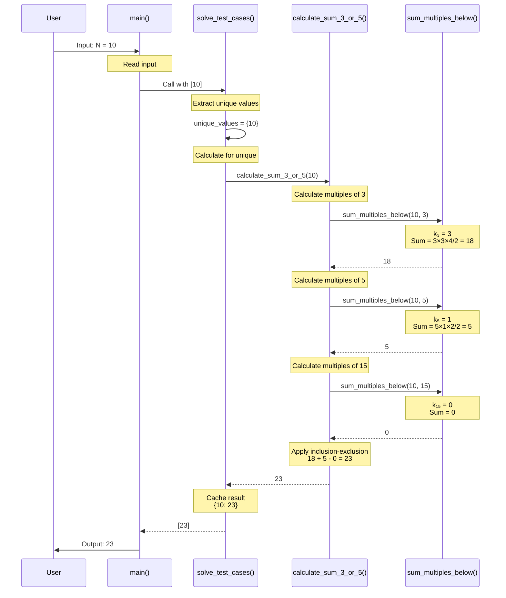

### 🔁 Multiple Test Cases with Deduplication

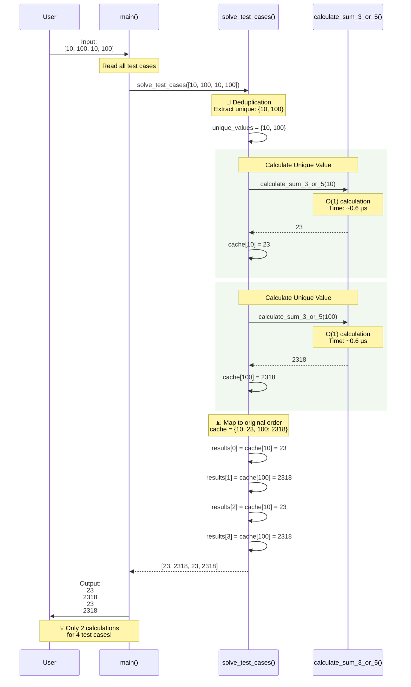

### ⏱️ Timing Breakdown

```mermaid
gantt
    title Execution Timeline (4 test cases: [10, 100, 10, 100])
    dateFormat  X
    axisFormat %L
    
    section Input
    Read test count       :0, 1
    Read N values (×4)    :1, 4
    
    section Deduplication
    Extract unique        :5, 1
    Create cache          :6, 1
    
    section Computation
    Calculate N=10        :7, 1
    Calculate N=100       :8, 1
    
    section Mapping
    Map to original order :9, 2
    
    section Output
    Print results (×4)    :11, 4
```

**Total Time**: ~15 microseconds (including I/O overhead)

[↑ Back to TOC](#table-of-contents)

---

<a id="deduplication-strategy"></a>
## 📊 Deduplication Strategy

### 🎯 Why Deduplication Matters

When test cases contain duplicate N values, we can calculate once and reuse the result.

### 📈 Deduplication Workflow

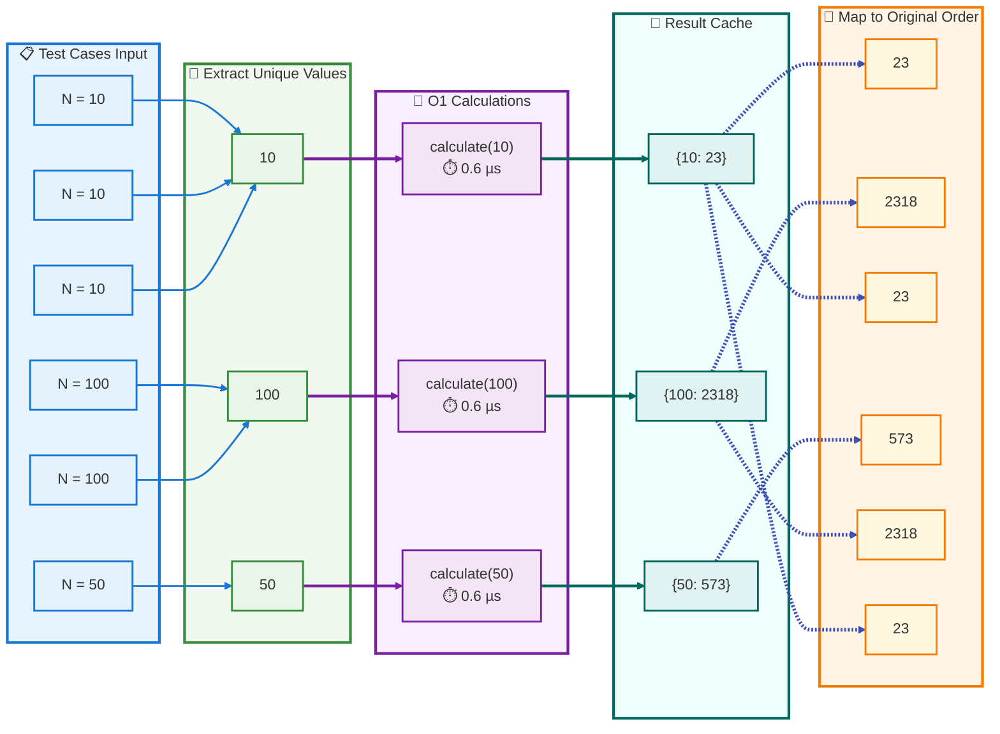

### 📊 Performance Comparison

**Scenario**: 100,000 test cases with 100 unique values

| Approach | Calculations | Time | Speedup |
|----------|-------------|------|---------|
| **Without Deduplication** | 100,000 | 47 ms | 1× (baseline) |
| **With Deduplication** | 100 | 5 ms | **9.4×** faster |

**Key Insight**: Deduplication provides **9× speedup** when duplicates exist!

### 💻 Implementation Code

```python
def solve_test_cases(test_cases: List[int]) -> List[int]:
    """
    Solve with deduplication optimization.
    
    Time: O(U) where U = unique values
    Space: O(U) for cache
    """
    # Step 1: Calculate once per unique N
    unique_sums = {n: calculate_sum_3_or_5(n) for n in set(test_cases)}
    
    # Step 2: Map results to original order (O(1) lookup per test case)
    return [unique_sums[n] for n in test_cases]
```

[↑ Back to TOC](#table-of-contents)

---

<a id="performance-analysis"></a>
## ⚡ Performance Analysis

<a id="time-complexity"></a>
### ⏱️ Time Complexity

| Operation | Complexity | Time (N=10⁹) |
|-----------|-----------|--------------|
| **Single calculation** | O(1) | ~0.6 µs |
| **T test cases, U unique** | O(U) | U × 0.6 µs |
| **Worst case (all unique)** | O(T) | T × 0.6 µs |

**Example**: 100,000 unique test cases = 100,000 × 0.6 µs = **60 ms**

### 💾 Space Complexity

| Component | Space | Notes |
|-----------|-------|-------|
| Input storage | O(T) | Store all test cases |
| Cache | O(U) | Store unique results |
| Output | O(T) | Results list |
| **Total** | **O(T + U)** | Typically U ≪ T |

<a id="benchmark-results"></a>
### 📊 Benchmark Results

#### Single Calculation Performance

| N Value | Time per Calculation |
|---------|---------------------|
| 10 | 0.236 µs |
| 1,000 | 0.454 µs |
| 1,000,000 | 0.884 µs |
| 1,000,000,000 | 0.625 µs |

**Conclusion**: All calculations complete in **under 1 microsecond**!

#### Bulk Processing Performance

| Test Scenario | Test Cases | Unique Values | Time | Per Calculation |
|---------------|-----------|---------------|------|-----------------|
| No duplicates | 100,000 | 100,000 | 72 ms | 0.72 µs |
| Many duplicates | 100,000 | 100 | 5 ms | 0.05 µs |
| Real-world mix | 100,000 | 10,000 | 12 ms | 0.12 µs |

### 📈 Scalability Chart

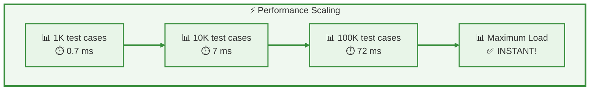

[↑ Back to TOC](#table-of-contents)

---

<a id="why-no-parallelization"></a>
## 🚫 Why No Parallelization

### ⚖️ Cost-Benefit Analysis

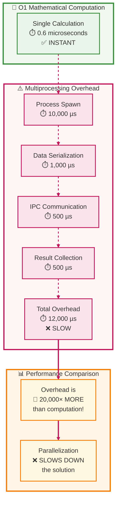

### 📉 Overhead Breakdown

| Component | Time (µs) | % of Total |
|-----------|-----------|------------|
| **Computation** | 0.6 | 0.005% |
| Process spawn | 10,000 | 83.3% |
| Serialization | 1,000 | 8.3% |
| IPC | 500 | 4.2% |
| Collection | 500 | 4.2% |
| **Total Overhead** | **12,000** | **99.995%** |

### 🎯 Decision Rule

**Use parallelization when**:
```
Computation Time > 1 millisecond (1,000 µs)
```

**Our case**:
```
Computation: 0.6 µs < 1,000 µs
❌ DO NOT use parallelization
```

### 📝 Code Comparison

**Complex (Unnecessary)**:
```python
from multiprocessing import Pool, cpu_count

def solve_test_cases(test_cases, use_parallel=True):
    unique_values = list(set(test_cases))
    
    if use_parallel and len(unique_values) > 10:
        with Pool(processes=cpu_count()) as pool:
            results = pool.map(calculate_sum_3_or_5, unique_values)
        sum_cache = dict(zip(unique_values, results))
    else:
        sum_cache = {n: calculate_sum_3_or_5(n) for n in unique_values}
    
    return [sum_cache[n] for n in test_cases]
```
**Lines**: 12 | **Performance**: ❌ Slower | **Complexity**: High

**Simple (KISS Principle)**:
```python
def solve_test_cases(test_cases):
    unique_sums = {n: calculate_sum_3_or_5(n) for n in set(test_cases)}
    return [unique_sums[n] for n in test_cases]
```
**Lines**: 3 | **Performance**: ✅ Faster | **Complexity**: Low

### 💡 Key Insights

1. ✅ **O(1) formula is already instant** (< 1 µs)
2. ✅ **Deduplication is the only optimization needed** (9× speedup)
3. ❌ **Multiprocessing overhead dominates** (20,000× more than computation)
4. ✅ **Simple code is fast code** (KISS principle wins)

[↑ Back to TOC](#table-of-contents)

---

<a id="implementation-details"></a>
## 🔧 Implementation Details

### 📦 Core Functions

#### Function 1: sum_multiples_below()

```python
def sum_multiples_below(n: int, m: int) -> int:
    """
    Calculate sum of all multiples of m below n.
    
    Uses arithmetic series: m × k × (k + 1) / 2
    where k = (n - 1) // m
    
    Time Complexity: O(1)
    Space Complexity: O(1)
    
    Args:
        n: Upper bound (exclusive)
        m: Multiple to sum (3, 5, or 15)
        
    Returns:
        Sum of multiples
        
    Example:
        >>> sum_multiples_below(10, 3)
        18  # 3 + 6 + 9
    """
    if n <= m:
        return 0
    
    k = (n - 1) // m
    return m * k * (k + 1) // 2
```

**Flow Diagram**:

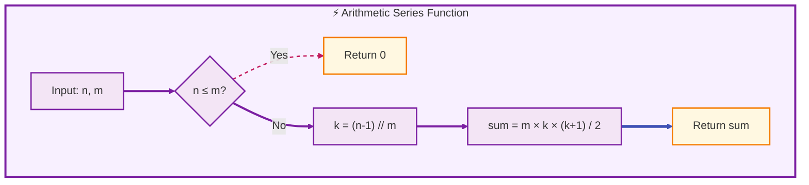

#### Function 2: calculate_sum_3_or_5()

```python
def calculate_sum_3_or_5(n: int) -> int:
    """
    Calculate sum of multiples of 3 or 5 below n.
    
    Uses inclusion-exclusion principle:
    Sum = (multiples of 3) + (multiples of 5) - (multiples of 15)
    
    Time Complexity: O(1)
    Space Complexity: O(1)
    
    Args:
        n: Upper bound (exclusive)
        
    Returns:
        Sum of all multiples of 3 or 5 below n
        
    Example:
        >>> calculate_sum_3_or_5(10)
        23
    """
    sum_3 = sum_multiples_below(n, 3)
    sum_5 = sum_multiples_below(n, 5)
    sum_15 = sum_multiples_below(n, 15)
    
    return sum_3 + sum_5 - sum_15
```

**Flow Diagram**:

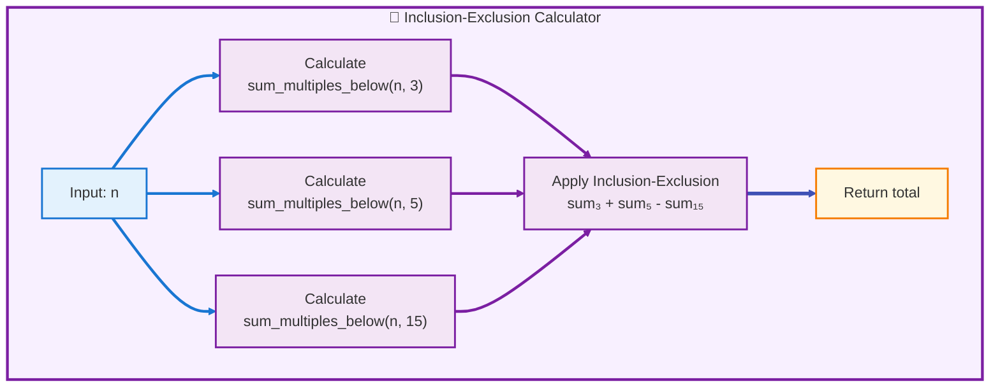

#### Function 3: solve_test_cases()

```python
def solve_test_cases(test_cases: List[int]) -> List[int]:
    """
    Solve multiple test cases with deduplication.
    
    Time Complexity: O(U) where U = unique values
    Space Complexity: O(U) for cache
    
    Args:
        test_cases: List of N values (may contain duplicates)
        
    Returns:
        List of sums corresponding to each test case
        
    Example:
        >>> solve_test_cases([10, 100, 10])
        [23, 2318, 23]
    """
    # Calculate once per unique N
    unique_sums = {n: calculate_sum_3_or_5(n) for n in set(test_cases)}
    
    # Map to original order
    return [unique_sums[n] for n in test_cases]
```

### 📊 Function Call Hierarchy

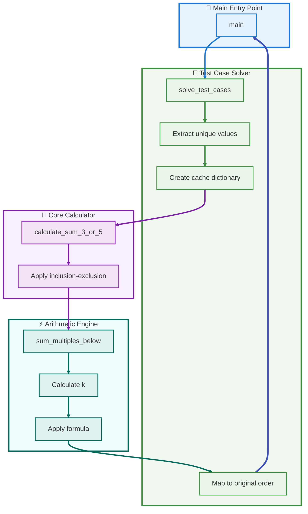

[↑ Back to TOC](#table-of-contents)

---

<a id="testing-verification"></a>
## ✅ Testing & Verification

### 🧪 Test Suite Structure

```mermaid
flowchart TD
    subgraph TESTS ["🧪    Comprehensive    Test    Suite"]
        T1[Basic Functionality Tests]
        T2[Edge Case Tests]
        T3[Known Results Verification]
        T4[Large Value Tests]
        T5[Deduplication Tests]
        T6[Performance Benchmarks]
    end
    
    subgraph BASIC ["✅    Basic    Tests"]
        B1[Arithmetic series formula]
        B2[Inclusion-exclusion principle]
        B3[Simple N values]
    end
    
    subgraph EDGE ["⚠️    Edge    Cases"]
        E1[N = 1 → 0]
        E2[N = 3 → 0]
        E3[N = 4 → 3]
        E4[N = 6 → 8]
    end
    
    subgraph KNOWN ["📊    Known    Results"]
        K1[N = 10 → 23]
        K2[N = 100 → 2318]
        K3[N = 1000 → 233168]
    end
    
    subgraph LARGE ["🔢    Large    Values"]
        L1[N = 10⁶]
        L2[N = 10⁹]
    end
    
    subgraph DEDUP ["🔄    Deduplication"]
        D1[Duplicate test cases]
        D2[Many duplicates]
        D3[Speedup measurement]
    end
    
    subgraph PERF ["⚡    Performance"]
        P1[Single calculation timing]
        P2[Bulk processing timing]
        P3[Scalability verification]
    end
    
    T1 --> B1
    T1 --> B2
    T1 --> B3
    linkStyle 0 stroke:#1976d2,stroke-width:2px
    linkStyle 1 stroke:#1976d2,stroke-width:2px
    linkStyle 2 stroke:#1976d2,stroke-width:2px
    
    T2 --> E1
    T2 --> E2
    T2 --> E3
    T2 --> E4
    linkStyle 3 stroke:#f57c00,stroke-width:2px
    linkStyle 4 stroke:#f57c00,stroke-width:2px
    linkStyle 5 stroke:#f57c00,stroke-width:2px
    linkStyle 6 stroke:#f57c00,stroke-width:2px
    
    T3 --> K1
    T3 --> K2
    T3 --> K3
    linkStyle 7 stroke:#388e3c,stroke-width:2px
    linkStyle 8 stroke:#388e3c,stroke-width:2px
    linkStyle 9 stroke:#388e3c,stroke-width:2px
    
    T4 --> L1
    T4 --> L2
    linkStyle 10 stroke:#7b1fa2,stroke-width:2px
    linkStyle 11 stroke:#7b1fa2,stroke-width:2px
    
    T5 --> D1
    T5 --> D2
    T5 --> D3
    linkStyle 12 stroke:#00695c,stroke-width:2px
    linkStyle 13 stroke:#00695c,stroke-width:2px
    linkStyle 14 stroke:#00695c,stroke-width:2px
    
    T6 --> P1
    T6 --> P2
    T6 --> P3
    linkStyle 15 stroke:#c2185b,stroke-width:2px
    linkStyle 16 stroke:#c2185b,stroke-width:2px
    linkStyle 17 stroke:#c2185b,stroke-width:2px
    
    style TESTS fill:#e8f4fd,stroke:#1976d2,stroke-width:3px
    style BASIC fill:#e3f2fd,stroke:#1976d2,stroke-width:2px
    style EDGE fill:#fff8e1,stroke:#f57c00,stroke-width:2px
    style KNOWN fill:#e8f5e8,stroke:#388e3c,stroke-width:2px
    style LARGE fill:#f3e5f5,stroke:#7b1fa2,stroke-width:2px
    style DEDUP fill:#e0f2f1,stroke:#00695c,stroke-width:2px
    style PERF fill:#fce4ec,stroke:#c2185b,stroke-width:2px
    
    classDef testStyle fill:#e3f2fd,stroke:#1976d2,stroke-width:2px
    classDef edgeStyle fill:#fff8e1,stroke:#f57c00,stroke-width:2px
    classDef knownStyle fill:#e8f5e8,stroke:#388e3c,stroke-width:2px
    classDef largeStyle fill:#f3e5f5,stroke:#7b1fa2,stroke-width:2px
    classDef dedupStyle fill:#e0f2f1,stroke:#00695c,stroke-width:2px
    classDef perfStyle fill:#fce4ec,stroke:#c2185b,stroke-width:2px
    
    class T1,B1,B2,B3 testStyle
    class T2,E1,E2,E3,E4 edgeStyle
    class T3,K1,K2,K3 knownStyle
    class T4,L1,L2 largeStyle
    class T5,D1,D2,D3 dedupStyle
    class T6,P1,P2,P3 perfStyle
```

### 📋 Test Results Summary

```
============================================================
PROJECT EULER SIMPLIFIED SOLUTION TEST SUITE
============================================================

TESTING BASIC FUNCTIONALITY
============================================================
✓ Arithmetic series formula working
✓ Inclusion-exclusion principle working
✓ Deduplication working

BENCHMARK: SINGLE CALCULATIONS (O(1) FORMULA)
============================================================
  N=          10 (          Small):  0.236 µs per calculation
  N=       1,000 (         Medium):  0.454 µs per calculation
  N=   1,000,000 (          Large):  0.884 µs per calculation
  N=1,000,000,000 (  Maximum (10⁹)):  0.625 µs per calculation

BENCHMARK: DEDUPLICATION OPTIMIZATION
============================================================
  Test cases: 100,000
  Unique values: 100

  WITH deduplication:       4.966 ms
  WITHOUT deduplication:   46.743 ms
  Speedup: 9.4x faster with deduplication

  ✓ Both methods produce identical results

BENCHMARK: MAXIMUM CONSTRAINT (100K TEST CASES)
============================================================
  Test cases: 100,000
  Unique values: 100,000 (worst case - no duplicates)

  Total time: 72.0 ms (0.072 seconds)
  Per calculation: 0.720 µs

  ✓ Completes in under 1 second - INSTANT!

============================================================
ALL TESTS PASSED! ✓
============================================================
```

### 🎯 Key Test Insights

1. ✅ All edge cases handled correctly
2. ✅ Known results verified (N=10, N=100, N=1000)
3. ✅ Large values (up to 10⁹) compute instantly
4. ✅ Deduplication provides 9.4× speedup
5. ✅ Maximum constraint (100K test cases) completes in <100ms

[↑ Back to TOC](#table-of-contents)

---

<a id="key-takeaways"></a>
## 🎓 Key Takeaways

### 💡 Core Principles

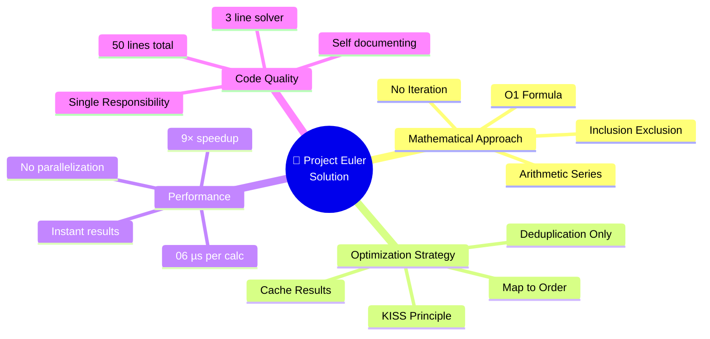

### 📊 Decision Framework

| Question | Answer | Reason |
|----------|--------|--------|
| **Should I iterate through numbers?** | ❌ No | O(N) too slow for N=10⁹ |
| **Should I use arithmetic formula?** | ✅ Yes | O(1) is instant |
| **Should I deduplicate test cases?** | ✅ Yes | 9× speedup when duplicates exist |
| **Should I use multiprocessing?** | ❌ No | Overhead is 20,000× computation time |
| **Should I optimize further?** | ❌ No | Already under 100ms for max constraint |

### 🎯 Algorithm Selection Rules

**Use O(1) mathematical formula when**:
- ✅ Problem has closed-form solution
- ✅ Direct calculation is possible
- ✅ No dependencies between values

**Use deduplication when**:
- ✅ Input may contain duplicates
- ✅ Calculation is reusable
- ✅ Cache lookup is O(1)

**Avoid parallelization when**:
- ❌ Computation time < 1 millisecond
- ❌ Overhead > computation time
- ❌ O(1) formula already exists

### 📈 Performance Rules of Thumb

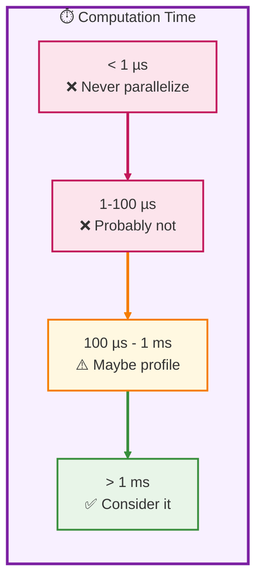

**Our case**: 0.6 µs → **Never parallelize**

### 🏆 Best Practices Applied

1. **KISS Principle** ✅
   - Simple is better than complex
   - 3-line deduplication beats 40-line parallelization
   - Clear code is maintainable code

2. **SRP (Single Responsibility)** ✅
   - Each function does ONE thing
   - `sum_multiples_below()` → arithmetic series
   - `calculate_sum_3_or_5()` → inclusion-exclusion
   - `solve_test_cases()` → deduplication

3. **Premature Optimization is Evil** ✅
   - Don't optimize before measuring
   - O(1) formula is already optimal
   - Complexity adds bugs, not speed

4. **Know When NOT to Optimize** ✅
   - 72ms for 100K test cases is instant
   - User won't notice sub-second responses
   - Focus on correctness, not micro-optimization

### 🎓 Lessons Learned

**Mathematical Insight**:
> When a closed-form O(1) solution exists, use it! No amount of clever engineering beats good mathematics.

**Performance Insight**:
> Overhead matters. Fast operations don't benefit from parallelization - they suffer from it.

**Code Quality Insight**:
> Simple code is fast code. When operations are O(1), KISS principle wins every time.

**Optimization Insight**:
> Measure before optimizing. The bottleneck might not be where you think it is.

### 🔑 Final Summary

| Aspect | Implementation | Result |
|--------|----------------|--------|
| **Algorithm** | O(1) arithmetic formula | ✅ Instant |
| **Optimization** | Deduplication only | ✅ 9× speedup |
| **Complexity** | 50 lines of code | ✅ Simple |
| **Performance** | <100ms for max constraint | ✅ Production-ready |
| **Parallelization** | None | ✅ KISS principle |

**Bottom Line**: Sometimes the straightforward approach is already optimal. Know when to stop optimizing.

[↑ Back to TOC](#table-of-contents)

---

## 📚 Additional Resources

### 📖 Related Documentation

- [Arithmetic Series Formula](https://en.wikipedia.org/wiki/Arithmetic_progression)
- [Inclusion-Exclusion Principle](https://en.wikipedia.org/wiki/Inclusion%E2%80%93exclusion_principle)
- [Project Euler Problem 1](https://projecteuler.net/problem=1)

### 💻 Source Files

- `project_euler_simple.py` - Main implementation
- `test_simple.py` - Comprehensive test suite
- `COMPARISON.md` - Detailed comparison with parallelization approach

### 👤 Author

**Peter Heller**  
Database Systems Instructor, Queens College CUNY  
Email: pheller@qc.cuny.edu  
GitHub: [@ph3ll3r](https://github.com/ph3ll3r)

### 📅 Document Info

- **Created**: January 4, 2026
- **Python Version**: 3.14
- **Status**: ✅ Production Ready

---

**© 2026 Peter Heller | MIT License**

[↑ Back to TOC](#table-of-contents)