# 🔢 Project Euler Problem 2: Even Fibonacci Numbers - Complete Guide

> **From Brute Force to Mathematical Elegance: A Teaching Journey**  
> *Author: Peter Heller | Date: January 4, 2026 | Python 3.14*

---

## 📑 Table of Contents

1. [🎯 Problem Statement](#problem-statement)
2. [🧠 Mathematical Foundation](#mathematical-foundation)
3. [✂️ Dedekind Cuts Approach](#dedekind-cuts-approach)
4. [🎓 Three Use Cases Analysis](#three-use-cases-analysis)
5. [⚡ Algorithm Comparison](#algorithm-comparison)
6. [🔧 Complete Implementations](#complete-implementations)
7. [📊 Performance Analysis](#performance-analysis)
8. [🧪 Testing & Verification](#testing-verification)
9. [🎓 Key Takeaways](#key-takeaways)

---

<a id="problem-statement"></a>
## 🎯 Problem Statement

### 📋 Original Problem

> Each new term in the Fibonacci sequence is generated by adding the previous two terms. By starting with 1 and 2, the first 10 terms will be:
> 
> **1, 2, 3, 5, 8, 13, 21, 34, 55, 89, ...**
>
> By considering the terms in the Fibonacci sequence whose values do not exceed four million, find the sum of the **even-valued** terms.

### 🎯 Extended Challenge

We'll solve **three variations**:

1. **Normal**: Sum of ALL Fibonacci numbers ≤ 4,000,000
2. **Even**: Sum of EVEN Fibonacci numbers ≤ 4,000,000 (original problem)
3. **Odd**: Sum of ODD Fibonacci numbers ≤ 4,000,000

### 🔢 Constraints

- **Upper Bound**: N ≤ 4,000,000
- **Starting Values**: F(1) = 1, F(2) = 2
- **Goal**: Algorithmic solutions (no brute force iteration)

[↑ Back to TOC](#table-of-contents)

---

<a id="mathematical-foundation"></a>
## 🧠 Mathematical Foundation

### 📐 Fibonacci Sequence Definition

The Fibonacci sequence is defined by the recurrence relation:

$$F_n = F_{n-1} + F_{n-2}$$

With initial conditions:

$$F_1 = 1, \quad F_2 = 2$$

**First 15 terms**:

$$1, 2, 3, 5, 8, 13, 21, 34, 55, 89, 144, 233, 377, 610, 987$$

### 🔍 Parity Pattern Discovery

Let's analyze the **even/odd pattern**:

```
Index:     1  2  3  4  5   6   7   8   9   10   11   12
Fibonacci: 1  2  3  5  8  13  21  34  55  89  144  233
Parity:    O  E  O  O  E   O   O   E   O   O    E    O
           └─────┘  └─────┘   └─────┘   └──────┘
           Pattern: O-E-O repeats every 3 terms
```

#### 💡 Mathematical Proof of Pattern

**Theorem**: Every 3rd Fibonacci number is even.

**Proof**: Let's denote odd as $O$ and even as $E$.

$$\begin{align}
F_1 &= 1 \quad (O) \\
F_2 &= 2 \quad (E) \\
F_3 &= F_1 + F_2 = O + E = O \\
F_4 &= F_2 + F_3 = E + O = O \\
F_5 &= F_3 + F_4 = O + O = E \\
F_6 &= F_4 + F_5 = O + E = O
\end{align}$$

**Pattern Rules**:
- $O + O = E$ (sum of two odds is even)
- $E + O = O$ (sum of even and odd is odd)
- $O + E = O$ (sum of odd and even is odd)

**Result**: Pattern $(O, E, O, O, E, O, O, E, \ldots)$ repeats with period 3.

$$\boxed{F_{3k+2} \text{ is even for } k = 0, 1, 2, \ldots}$$

### 📊 Visual Pattern Analysis

```mermaid
flowchart TD
    subgraph PATTERN ["🔄    Fibonacci    Parity    Pattern"]
        P1["F(1) = 1<br/>📍 ODD"]
        P2["F(2) = 2<br/>✅ EVEN"]
        P3["F(3) = 3<br/>📍 ODD"]
        P4["F(4) = 5<br/>📍 ODD"]
        P5["F(5) = 8<br/>✅ EVEN"]
        P6["F(6) = 13<br/>📍 ODD"]
        P7["Pattern repeats<br/>every 3 terms"]
    end
    
    P1 --> P2
    P2 --> P3
    P3 --> P4
    P4 --> P5
    P5 --> P6
    P6 --> P7
    P7 -.-> P1
    
    linkStyle 0 stroke:#1976d2,stroke-width:3px
    linkStyle 1 stroke:#7b1fa2,stroke-width:3px
    linkStyle 2 stroke:#388e3c,stroke-width:3px
    linkStyle 3 stroke:#1976d2,stroke-width:3px
    linkStyle 4 stroke:#7b1fa2,stroke-width:3px
    linkStyle 5 stroke:#388e3c,stroke-width:3px
    linkStyle 6 stroke:#c2185b,stroke-width:2px,stroke-dasharray:5
    
    style PATTERN fill:#f8f0ff,stroke:#7b1fa2,stroke-width:3px
    
    classDef oddStyle fill:#fce4ec,stroke:#c2185b,stroke-width:2px
    classDef evenStyle fill:#e8f5e8,stroke:#388e3c,stroke-width:2px
    classDef patternStyle fill:#f3e5f5,stroke:#7b1fa2,stroke-width:2px
    
    class P1,P3,P4,P6 oddStyle
    class P2,P5 evenStyle
    class P7 patternStyle
```



### ⚡ Direct Even Fibonacci Recurrence

**Key Discovery**: We can generate ONLY even Fibonacci numbers without computing all terms!

Let $E_n$ denote the $n$-th even Fibonacci number.

$$\begin{align}
E_1 &= 2 \\
E_2 &= 8 \\
E_3 &= 34 \\
E_4 &= 144
\end{align}$$

**Direct Recurrence**:

$$\boxed{E_n = 4E_{n-1} + E_{n-2}}$$

#### 🔬 Derivation

Since even terms occur at positions $3k+2$ in the standard Fibonacci sequence, we can derive:

Starting with $F_n = F_{n-1} + F_{n-2}$ and recognizing that every 3rd term is even:

$$E_k = F_{3k-1}$$

Through algebraic manipulation (skipping intermediate steps for brevity):

$$E_k = 4E_{k-1} + E_{k-2}$$

**Verification**:

$$\begin{align}
E_1 &= 2 \\
E_2 &= 8 \\
E_3 &= 4(8) + 2 = 34 \quad \checkmark \\
E_4 &= 4(34) + 8 = 144 \quad \checkmark \\
E_5 &= 4(144) + 34 = 610 \quad \checkmark
\end{align}$$

[↑ Back to TOC](#table-of-contents)

---

<a id="dedekind-cuts-approach"></a>
## ✂️ Dedekind Cuts Approach

### 🎓 GLB and LUB Theory

A **Dedekind cut** partitions a set into two subsets such that every element in one subset is less than every element in the other.

For our problem, we create a cut at **N = 4,000,000**:

$$\text{Lower Set: } L = \{F_i : F_i \leq 4{,}000{,}000\}$$
$$\text{Upper Set: } U = \{F_i : F_i > 4{,}000{,}000\}$$

**Greatest Lower Bound (GLB)**: $\sup(L) = \max\{F_i : F_i \leq 4{,}000{,}000\}$

**Least Upper Bound (LUB)**: $\inf(U) = \min\{F_i : F_i > 4{,}000{,}000\}$

### 📊 Dedekind Cut Visualization

```mermaid
flowchart LR
    subgraph LOWER ["📉    Lower    Set    L    GLB"]
        L1["F(1) = 1"]
        L2["F(2) = 2"]
        L3["F(3) = 3"]
        L4["..."]
        L5["F(n-1)"]
        L6["F(n)<br/>🎯 GLB"]
    end
    
    subgraph BOUNDARY ["✂️    Cut    at    4000000"]
        B1["N = 4,000,000<br/>📍 Boundary"]
    end
    
    subgraph UPPER ["📈    Upper    Set    U    LUB"]
        U1["F(n+1)<br/>🎯 LUB"]
        U2["F(n+2)"]
        U3["..."]
        U4["∞"]
    end
    
    L1 --> L2
    L2 --> L3
    L3 --> L4
    L4 --> L5
    L5 --> L6
    L6 --> B1
    B1 --> U1
    U1 --> U2
    U2 --> U3
    U3 --> U4
    
    linkStyle 0,1,2,3,4,5 stroke:#388e3c,stroke-width:3px
    linkStyle 6 stroke:#c2185b,stroke-width:4px
    linkStyle 7,8,9,10 stroke:#f57c00,stroke-width:3px
    
    style LOWER fill:#f0f8f0,stroke:#388e3c,stroke-width:3px
    style BOUNDARY fill:#fef7f7,stroke:#c2185b,stroke-width:3px
    style UPPER fill:#fff4e6,stroke:#f57c00,stroke-width:3px
    
    classDef lowerStyle fill:#e8f5e8,stroke:#388e3c,stroke-width:2px
    classDef boundaryStyle fill:#fce4ec,stroke:#c2185b,stroke-width:3px
    classDef upperStyle fill:#fff8e1,stroke:#f57c00,stroke-width:2px
    
    class L1,L2,L3,L4,L5,L6 lowerStyle
    class B1 boundaryStyle
    class U1,U2,U3,U4 upperStyle
```

### 🔍 Finding the Boundary

**Result for N = 4,000,000**:

| Metric | All Fibonacci | Even Fibonacci | Odd Fibonacci |
|--------|---------------|----------------|---------------|
| **GLB** | F₃₃ = 3,524,578 | E₁₁ = 3,524,578 | F₃₂ = 2,178,309 |
| **LUB** | F₃₄ = 5,702,887 | E₁₂ = 5,702,887 | F₃₄ = 5,702,887 |
| **Elements in L** | 33 | 11 | 22 |
| **Sum of L** | 9,227,464 | 4,613,732 | 4,613,732 |

**Key Insight**: 

$$\text{Sum(All)} = \text{Sum(Even)} + \text{Sum(Odd)}$$
$$9{,}227{,}464 = 4{,}613{,}732 + 4{,}613{,}732 \quad \checkmark$$

[↑ Back to TOC](#table-of-contents)

---

**Continue to Part 2 for complete implementations, testing, and analysis...**