# 🚀 Enhanced Class-Based Decorators: Modern Python Patterns

**Practical Improvements Using ENUMs, TypedDict, NamedTuples, and Pydantic v2**

---

## 📋 Table of Contents

1. [🎯 Core Improvements Overview](#-core-improvements-overview)
2. [📊 Using ENUMs for Configuration](#-using-enums-for-configuration)
3. [📦 TypedDict for Structured Data](#-typeddict-for-structured-data)
4. [🔒 NamedTuple for Immutable Config](#-namedtuple-for-immutable-config)
5. [✨ @property for Computed Attributes](#-property-for-computed-attributes)
6. [🔧 @staticmethod for Pure Functions](#-staticmethod-for-pure-functions)
7. [🦆 Protocol-Based Duck Typing](#-protocol-based-duck-typing)
8. [🎓 Pydantic v2 for Validation](#-pydantic-v2-for-validation)
9. [💡 Complete Enhanced Examples](#-complete-enhanced-examples)
10. [📐 Design Principle Adherence](#-design-principle-adherence)

---

## 🎯 Core Improvements Overview

[📋 Back to TOC](#-table-of-contents)

### The Problems We're Solving

| Problem | Old Approach | Enhanced Approach |
|---------|-------------|-------------------|
| **Magic strings** | `strategy="exponential"` | `BackoffStrategy.EXPONENTIAL` |
| **Validation scattered** | Manual checks everywhere | Pydantic validates at construction |
| **Computed values** | Methods to call | `@property` for natural access |
| **Mutable state risks** | Regular dicts | `TypedDict` for structure, `NamedTuple` for immutability |
| **Tight coupling** | Inheritance required | `Protocol` for duck typing |
| **Helper methods** | Unnecessary `self` access | `@staticmethod` for pure functions |

### Key Principles Applied

1. **KISS**: Use built-in types (Enum, NamedTuple) before custom classes
2. **SRP**: Each component has one clear responsibility
3. **Open/Closed**: Extend via Protocol, not inheritance
4. **Liskov**: Any implementation of Protocol is substitutable
5. **Interface Segregation**: Small, focused Protocols
6. **Duck Typing**: "If it quacks like a duck..."


---

## 📊 Using ENUMs for Configuration

[📋 Back to TOC](#-table-of-contents)

### Problem: Magic Strings and Invalid Values

**Before** (fragile):
```python
class RetryDecorator:
    def __init__(self, strategy: str = "fixed"):
        if strategy not in ["fixed", "exponential", "linear"]:
            raise ValueError(f"Invalid strategy: {strategy}")
        self.strategy = strategy  # Still a string!

# Easy to mistype
@RetryDecorator(strategy="exponentail")  # Typo! Runtime error
def my_function():
    pass
```

**After** (type-safe):
```python
from enum import Enum, auto

class BackoffStrategy(Enum):
    """Retry backoff strategies."""
    FIXED = auto()
    EXPONENTIAL = auto()
    LINEAR = auto()
    JITTER = auto()

class RetryDecorator:
    def __init__(self, strategy: BackoffStrategy = BackoffStrategy.FIXED):
        self.strategy = strategy  # Guaranteed valid!

# IDE autocomplete + type checker catches errors
@RetryDecorator(strategy=BackoffStrategy.EXPONENTIAL)  # ✓ Type-safe
def my_function():
    pass
```

### Benefits of ENUMs

1. **Type Safety**: Invalid values rejected at type-check time
2. **Autocomplete**: IDEs suggest valid options
3. **Self-Documenting**: All options visible in one place
4. **Extensible**: Add new strategies without breaking existing code

### Complete ENUM Example: Enhanced ResilientTask

```python
from enum import Enum, auto
from typing import Callable, ParamSpec, TypeVar
import functools
import time
import logging

P = ParamSpec("P")
R = TypeVar("R")

class BackoffStrategy(Enum):
    """Backoff strategies for retry logic."""
    FIXED = auto()
    EXPONENTIAL = auto()
    LINEAR = auto()
    FIBONACCI = auto()

class FailureAction(Enum):
    """What to do when all retries fail."""
    RAISE = auto()
    RETURN_NONE = auto()
    RETURN_DEFAULT = auto()

class ResilientTask:
    """
    Enhanced retry decorator using ENUMs for configuration.
    """
    
    def __init__(
        self,
        max_retries: int = 3,
        base_delay: float = 1.0,
        strategy: BackoffStrategy = BackoffStrategy.FIXED,
        on_failure: FailureAction = FailureAction.RAISE,
        default_value: R | None = None
    ):
        self.max_retries = max_retries
        self.base_delay = base_delay
        self.strategy = strategy
        self.on_failure = on_failure
        self.default_value = default_value
        
        # Statistics
        self.total_failures = 0
        self.total_recoveries = 0
    
    @staticmethod
    def calculate_delay(
        strategy: BackoffStrategy,
        base_delay: float,
        attempt: int
    ) -> float:
        """
        Pure function to calculate delay based on strategy.
        No need for self - this is strategy logic only.
        """
        match strategy:
            case BackoffStrategy.FIXED:
                return base_delay
            case BackoffStrategy.EXPONENTIAL:
                return base_delay * (2 ** (attempt - 1))
            case BackoffStrategy.LINEAR:
                return base_delay * attempt
            case BackoffStrategy.FIBONACCI:
                # Fibonacci sequence for delays
                a, b = 0, 1
                for _ in range(attempt):
                    a, b = b, a + b
                return base_delay * a
    
    def __call__(self, func: Callable[P, R]) -> Callable[P, R]:
        @functools.wraps(func)
        def wrapper(*args: P.args, **kwargs: P.kwargs) -> R | None:
            attempts = 0
            
            while attempts < self.max_retries:
                try:
                    result = func(*args, **kwargs)
                    if attempts > 0:
                        self.total_recoveries += 1
                    return result
                
                except Exception as e:
                    attempts += 1
                    self.total_failures += 1
                    
                    if attempts >= self.max_retries:
                        # Handle failure based on enum
                        match self.on_failure:
                            case FailureAction.RAISE:
                                raise e
                            case FailureAction.RETURN_NONE:
                                return None
                            case FailureAction.RETURN_DEFAULT:
                                return self.default_value
                    
                    # Calculate delay using static method
                    delay = self.calculate_delay(
                        self.strategy,
                        self.base_delay,
                        attempts
                    )
                    time.sleep(delay)
            
            return None
        
        return wrapper

# Usage - clean and type-safe!
@ResilientTask(
    max_retries=5,
    base_delay=1.0,
    strategy=BackoffStrategy.EXPONENTIAL,
    on_failure=FailureAction.RETURN_DEFAULT,
    default_value={}
)
def fetch_user_data(user_id: int) -> dict:
    """Fetch with exponential backoff, return {} on failure."""
    pass
```

### Why This Is Better

1. **No magic strings** - all options are explicit ENUMs
2. **@staticmethod** - delay calculation is pure, testable independently
3. **Match statement** - clean, exhaustive handling of ENUM cases
4. **Type hints** - `strategy: BackoffStrategy` enforces correctness

### ENUM Architecture Visualization


---

## 📦 TypedDict for Structured Data

[📋 Back to TOC](#-table-of-contents)

### Problem: Unstructured Dictionaries

**Before** (no structure):
```python
def cache_info(self) -> dict:
    """What keys exist? What are their types? Unknown!"""
    return {
        "hits": self.hits,
        "misses": self.misses,
        # Typo? Missing key? Runtime error!
    }

# Usage - no IDE help
info = cache.cache_info()
print(info["hit_rate"])  # KeyError if key is missing!
```

**After** (structured):
```python
from typing import TypedDict

class CacheStats(TypedDict):
    """Statistics for cache performance."""
    hits: int
    misses: int
    size: int
    max_size: int
    hit_rate: float

def cache_info(self) -> CacheStats:
    """Return structured statistics."""
    return {
        "hits": self.hits,
        "misses": self.misses,
        "size": len(self.cache),
        "max_size": self.max_size,
        "hit_rate": self.hits / (self.hits + self.misses) if self.hits + self.misses > 0 else 0.0
    }

# Usage - IDE autocomplete, type checking
info = cache.cache_info()
print(info["hit_rate"])  # ✓ Type checker verifies key exists
```

### Enhanced LRU Cache with TypedDict

```python
from typing import TypedDict, Callable, ParamSpec, TypeVar, Any
from collections import OrderedDict
import functools

P = ParamSpec("P")
R = TypeVar("R")

class CacheStats(TypedDict):
    """Cache performance statistics."""
    hits: int
    misses: int
    evictions: int
    current_size: int
    max_size: int
    hit_rate: float

class CacheEntry(TypedDict):
    """Individual cache entry structure."""
    key: tuple
    value: Any
    access_count: int
    last_accessed: float

class LRUCache:
    """Enhanced LRU cache with structured statistics."""
    
    def __init__(self, max_size: int = 128):
        self.max_size = max_size
        self.cache: OrderedDict = OrderedDict()
        
        # Statistics
        self._hits = 0
        self._misses = 0
        self._evictions = 0
    
    @property
    def stats(self) -> CacheStats:
        """
        Computed property returning structured statistics.
        No method call needed - access as attribute.
        """
        total_calls = self._hits + self._misses
        return {
            "hits": self._hits,
            "misses": self._misses,
            "evictions": self._evictions,
            "current_size": len(self.cache),
            "max_size": self.max_size,
            "hit_rate": self._hits / total_calls if total_calls > 0 else 0.0
        }
    
    @staticmethod
    def _make_cache_key(args: tuple, kwargs: dict) -> tuple:
        """
        Pure function to create cache key.
        No instance state needed.
        """
        return (args, tuple(sorted(kwargs.items())))
    
    def __call__(self, func: Callable[P, R]) -> Callable[P, R]:
        @functools.wraps(func)
        def wrapper(*args: P.args, **kwargs: P.kwargs) -> R:
            # Use static method for key creation
            key = self._make_cache_key(args, kwargs)
            
            if key in self.cache:
                self._hits += 1
                self.cache.move_to_end(key)
                return self.cache[key]
            
            self._misses += 1
            result = func(*args, **kwargs)
            self.cache[key] = result
            
            if len(self.cache) > self.max_size:
                self.cache.popitem(last=False)
                self._evictions += 1
            
            return result
        
        return wrapper

# Usage
cache = LRUCache(max_size=100)

@cache
def expensive_function(x: int, y: int) -> int:
    return x + y

# Access stats as property (no method call)
print(cache.stats)  # Type: CacheStats
# Output: {'hits': 0, 'misses': 1, 'evictions': 0, ...}
```

### TypedDict Best Practices

1. **Use for return types** - makes function contracts clear
2. **Use for configuration** - structured options
3. **Combine with @property** - computed attributes with structure
4. **Not for validation** - use Pydantic for that (see below)

### TypedDict Architecture


---

## 🔒 NamedTuple for Immutable Config

[📋 Back to TOC](#-table-of-contents)

### Problem: Mutable Configuration

**Before** (mutable, risky):
```python
class RateLimiter:
    def __init__(self, calls: int, period: float):
        self.calls = calls      # Can be accidentally modified!
        self.period = period    # Can be changed mid-execution!

limiter = RateLimiter(5, 10)
limiter.calls = 999  # Oops! Configuration corrupted
```

**After** (immutable, safe):
```python
from typing import NamedTuple

class RateLimitConfig(NamedTuple):
    """Immutable rate limit configuration."""
    calls: int
    period: float
    
    def __repr__(self) -> str:
        return f"RateLimitConfig(calls={self.calls}, period={self.period}s)"

class RateLimiter:
    def __init__(self, config: RateLimitConfig):
        self.config = config  # Immutable!

# Usage
config = RateLimitConfig(calls=5, period=10.0)
limiter = RateLimiter(config)

# This fails - NamedTuple is immutable
# limiter.config.calls = 999  # AttributeError!
```

### Enhanced Rate Limiter with NamedTuple

```python
from typing import NamedTuple, Callable, ParamSpec, TypeVar, TypedDict
from collections import deque
import time

P = ParamSpec("P")
R = TypeVar("R")

class RateLimitConfig(NamedTuple):
    """Immutable rate limit configuration."""
    calls: int
    period: float
    burst: bool = False
    
    def validate(self) -> None:
        """Validate configuration values."""
        if self.calls <= 0:
            raise ValueError("calls must be positive")
        if self.period <= 0:
            raise ValueError("period must be positive")

class RateLimitStats(TypedDict):
    """Rate limiter statistics."""
    total_calls: int
    throttled_calls: int
    current_window_calls: int
    calls_per_second: float

class RateLimiter:
    """Enhanced rate limiter with immutable config."""
    
    def __init__(self, config: RateLimitConfig):
        config.validate()  # Validate at construction
        self.config = config
        self.call_times: deque = deque()
        self._total_calls = 0
        self._throttled_calls = 0
    
    @property
    def stats(self) -> RateLimitStats:
        """Computed statistics as property."""
        return {
            "total_calls": self._total_calls,
            "throttled_calls": self._throttled_calls,
            "current_window_calls": len(self.call_times),
            "calls_per_second": self._total_calls / self.config.period if self.config.period > 0 else 0.0
        }
    
    @staticmethod
    def _clean_old_calls(call_times: deque, current_time: float, period: float) -> None:
        """
        Pure function to remove old calls from window.
        Modifies deque in-place but logic is pure.
        """
        while call_times and call_times[0] < current_time - period:
            call_times.popleft()
    
    def __call__(self, func: Callable[P, R]) -> Callable[P, R]:
        @functools.wraps(func)
        def wrapper(*args: P.args, **kwargs: P.kwargs) -> R:
            current_time = time.time()
            
            # Use static method for cleaning
            self._clean_old_calls(self.call_times, current_time, self.config.period)
            
            if len(self.call_times) >= self.config.calls:
                self._throttled_calls += 1
                
                if not self.config.burst:
                    # Wait for next window
                    wait_time = self.config.period - (current_time - self.call_times[0])
                    time.sleep(wait_time)
                    return wrapper(*args, **kwargs)
                else:
                    # Burst mode: fail fast
                    raise RuntimeError(f"Rate limit exceeded: {self.config.calls}/{self.config.period}s")
            
            self.call_times.append(current_time)
            self._total_calls += 1
            
            return func(*args, **kwargs)
        
        return wrapper

# Usage - configuration is explicit and immutable
config = RateLimitConfig(calls=5, period=10.0, burst=False)
limiter = RateLimiter(config)

@limiter
def api_call(endpoint: str) -> dict:
    return {"endpoint": endpoint, "status": "ok"}

# Access stats as property
print(limiter.stats)
```

### NamedTuple Advantages

1. **Immutability** - configuration can't be accidentally changed
2. **Named fields** - `config.calls` is clearer than `config[0]`
3. **Type hints** - each field is properly typed
4. **Lightweight** - no overhead vs regular tuples
5. **Methods allowed** - can add `validate()` or other helpers

### NamedTuple Immutability Architecture

```mermaid
graph TB
    subgraph MUTABLE["⚠️ Mutable Configuration Risks"]
        A1[Create Config]
        A2[Pass to Decorator]
        A3{Modified Accidentally?}
        A4[Config Changed Mid-Execution]
        A5[Behavior Unpredictable]
        A6[Debugging Nightmare]
    end
    
    subgraph NAMEDTUPLE["✨ NamedTuple Immutable Config"]
        B1[Define RateLimitConfig]
        B2["calls: int"]
        B3["period: float"]
        B4["burst: bool"]
        B5[Create Instance]
        B6[Immutable Forever]
    end
    
    subgraph SAFETY["🔒 Immutability Guarantees"]
        C1[Cannot Modify Fields]
        C2[Thread-Safe]
        C3[Hashable]
        C4[Can Be Dict Key]
        C5[Predictable Behavior]
    end
    
    subgraph BENEFITS["🎯 Configuration Benefits"]
        D1["Named Access: config.calls"]
        D2["Type Hints: calls: int"]
        D3["Methods: validate()"]
        D4[Zero Overhead]
    end
    
    %% Mutable problems
    A1 --> A2
    A2 --> A3
    A3 -->|Yes| A4
    A4 --> A5
    A5 --> A6
    
    %% NamedTuple structure
    B1 --> B2
    B1 --> B3
    B1 --> B4
    B2 --> B5
    B3 --> B5
    B4 --> B5
    B5 --> B6
    
    %% Safety guarantees
    B6 --> C1
    B6 --> C2
    B6 --> C3
    C3 --> C4
    C1 --> C5
    C2 --> C5
    
    %% Benefits
    B2 --> D1
    B2 --> D2
    B1 --> D3
    B6 --> D4
    
    %% Styling connections
    linkStyle 0,1,2,3,4 stroke:#c2185b,stroke-width:3px
    linkStyle 5,6,7,8,9,10,11 stroke:#1976d2,stroke-width:3px
    linkStyle 12,13,14,15,16,17 stroke:#388e3c,stroke-width:3px
    linkStyle 18,19,20,21 stroke:#f57c00,stroke-width:3px
    
    %% Styling subgraphs
    style MUTABLE fill:#fef7f7,stroke:#c2185b,stroke-width:3px,color:#000
    style NAMEDTUPLE fill:#e8f4fd,stroke:#1976d2,stroke-width:3px,color:#000
    style SAFETY fill:#f0f8f0,stroke:#388e3c,stroke-width:3px,color:#000
    style BENEFITS fill:#fff4e6,stroke:#f57c00,stroke-width:3px,color:#000
    
    %% Styling nodes
    style A1,A2,A3,A5,A6 fill:#fce4ec,stroke:#c2185b,stroke-width:2px,color:#000
    style A4 fill:#fce4ec,stroke:#c2185b,stroke-width:3px,color:#000
    style B1,B2,B3,B4 fill:#e3f2fd,stroke:#1976d2,stroke-width:2px,color:#000
    style B5 fill:#f3e5f5,stroke:#7b1fa2,stroke-width:2px,color:#000
    style B6 fill:#e3f2fd,stroke:#1976d2,stroke-width:3px,color:#000
    style C1,C2,C3,C4 fill:#e8f5e8,stroke:#388e3c,stroke-width:2px,color:#000
    style C5 fill:#e8f5e8,stroke:#388e3c,stroke-width:3px,color:#000
    style D1,D2,D3 fill:#fff8e1,stroke:#f57c00,stroke-width:2px,color:#000
    style D4 fill:#fff8e1,stroke:#f57c00,stroke-width:3px,color:#000
```


---

## ✨ @property for Computed Attributes

[📋 Back to TOC](#-table-of-contents)

### Problem: Methods for Simple Access

**Before** (unnecessary method calls):
```python
class Decorator:
    def get_hit_rate(self) -> float:
        """Why is this a method? Just returns a calculation!"""
        return self.hits / (self.hits + self.misses)

# Usage - awkward
rate = decorator.get_hit_rate()  # Method call feels heavy
```

**After** (natural attribute access):
```python
class Decorator:
    @property
    def hit_rate(self) -> float:
        """Computed attribute - no method call needed."""
        return self.hits / (self.hits + self.misses) if (self.hits + self.misses) > 0 else 0.0

# Usage - natural
rate = decorator.hit_rate  # Attribute access feels right!
```

### When to Use @property

✅ **Use @property when**:
- Computing a value from existing attributes
- No parameters needed (beyond `self`)
- Feels like an attribute, not an action
- Quick calculation (no I/O, no heavy compute)

❌ **Don't use @property when**:
- Takes parameters (use regular method)
- Performs I/O or expensive operations
- Has side effects (use regular method)
- Could raise exceptions frequently

### Property vs Method Architecture


### Enhanced Audit Logger with Properties

```python
from typing import TypedDict, Callable, ParamSpec, TypeVar
from datetime import datetime
from enum import Enum, auto
import time
import functools

P = ParamSpec("P")
R = TypeVar("R")

class LogLevel(Enum):
    """Logging severity levels."""
    DEBUG = auto()
    INFO = auto()
    WARNING = auto()
    ERROR = auto()

class AuditEntry(TypedDict):
    """Structure for audit log entries."""
    function: str
    timestamp: str
    status: str
    duration: float
    args: str | None
    kwargs: str | None
    result: str | None
    exception: str | None

class AuditLogStats(TypedDict):
    """Audit log statistics."""
    total_calls: int
    successful_calls: int
    failed_calls: int
    success_rate: float
    average_duration: float

class AuditLogger:
    """Enhanced audit logger with computed properties."""
    
    def __init__(
        self,
        level: LogLevel = LogLevel.INFO,
        log_args: bool = True,
        log_result: bool = True
    ):
        self.level = level
        self.log_args = log_args
        self.log_result = log_result
        self._audit_trail: list[AuditEntry] = []
    
    @property
    def total_calls(self) -> int:
        """Total number of audited calls."""
        return len(self._audit_trail)
    
    @property
    def successful_calls(self) -> int:
        """Number of successful calls."""
        return sum(1 for entry in self._audit_trail if entry["status"] == "success")
    
    @property
    def failed_calls(self) -> int:
        """Number of failed calls."""
        return sum(1 for entry in self._audit_trail if entry["status"] == "error")
    
    @property
    def success_rate(self) -> float:
        """Computed success rate."""
        if self.total_calls == 0:
            return 0.0
        return self.successful_calls / self.total_calls
    
    @property
    def average_duration(self) -> float:
        """Average function execution duration."""
        if not self._audit_trail:
            return 0.0
        return sum(entry["duration"] for entry in self._audit_trail) / len(self._audit_trail)
    
    @property
    def stats(self) -> AuditLogStats:
        """Comprehensive statistics - all computed."""
        return {
            "total_calls": self.total_calls,
            "successful_calls": self.successful_calls,
            "failed_calls": self.failed_calls,
            "success_rate": self.success_rate,
            "average_duration": self.average_duration
        }
    
    @staticmethod
    def _create_audit_entry(
        function_name: str,
        status: str,
        duration: float,
        args: tuple | None = None,
        kwargs: dict | None = None,
        result: Any = None,
        exception: Exception | None = None,
        log_args: bool = True,
        log_result: bool = True
    ) -> AuditEntry:
        """Pure function to create audit entry."""
        return {
            "function": function_name,
            "timestamp": datetime.now().isoformat(),
            "status": status,
            "duration": duration,
            "args": str(args) if log_args and args else None,
            "kwargs": str(kwargs) if log_args and kwargs else None,
            "result": str(result) if log_result and result else None,
            "exception": str(exception) if exception else None
        }
    
    def __call__(self, func: Callable[P, R]) -> Callable[P, R]:
        @functools.wraps(func)
        def wrapper(*args: P.args, **kwargs: P.kwargs) -> R:
            start_time = time.time()
            
            try:
                result = func(*args, **kwargs)
                duration = time.time() - start_time
                
                entry = self._create_audit_entry(
                    function_name=func.__name__,
                    status="success",
                    duration=duration,
                    args=args,
                    kwargs=kwargs,
                    result=result,
                    log_args=self.log_args,
                    log_result=self.log_result
                )
                self._audit_trail.append(entry)
                
                return result
            
            except Exception as e:
                duration = time.time() - start_time
                
                entry = self._create_audit_entry(
                    function_name=func.__name__,
                    status="error",
                    duration=duration,
                    args=args,
                    kwargs=kwargs,
                    exception=e,
                    log_args=self.log_args,
                    log_result=False
                )
                self._audit_trail.append(entry)
                raise
        
        return wrapper

# Usage - all statistics available as properties
logger = AuditLogger(level=LogLevel.INFO)

@logger
def process_payment(amount: float, currency: str) -> bool:
    return True

process_payment(100.0, "USD")

# Natural attribute access - no method calls!
print(logger.total_calls)      # 1
print(logger.success_rate)     # 1.0
print(logger.average_duration) # 0.0001
print(logger.stats)            # Complete stats dictionary
```

---

## 🔧 @staticmethod for Pure Functions

[📋 Back to TOC](#-table-of-contents)

### Problem: Unnecessary Instance Access

**Before** (unnecessary `self`):
```python
class Decorator:
    def calculate_delay(self, attempt: int) -> float:
        """This doesn't use self at all! Why is it an instance method?"""
        return 2 ** attempt

# Problems:
# 1. Can't test without instance
# 2. Implies state dependency (but there is none)
# 3. Less clear that it's pure logic
```

**After** (pure, testable):
```python
class Decorator:
    @staticmethod
    def calculate_delay(attempt: int) -> float:
        """Pure function - no state needed."""
        return 2 ** attempt

# Benefits:
# 1. Can test: Decorator.calculate_delay(3) without instance
# 2. Clear it has no side effects
# 3. Could be extracted to module-level if needed
```

### When to Use @staticmethod

✅ **Use @staticmethod when**:
- Function doesn't access `self` or `cls`
- Pure computation or utility logic
- Could theoretically be module-level
- Related to class conceptually but not to instance state

❌ **Don't use @staticmethod when**:
- Needs instance state (`self.something`)
- Needs class state (`cls.something`)
- Not related to the class at all (use module function)

### Static Method Architecture

```mermaid
sequenceDiagram
    participant Client
    participant Instance as Instance Method<br/>(with self)
    participant Static as Static Method<br/>(@staticmethod)
    participant Pure as Pure Function<br/>Logic
    participant Test as Test Suite
    
    Note over Client,Test: ⚠️ Instance Method Issues
    
    Client->>Instance: Create decorator instance
    activate Instance
    Instance-->>Client: decorator object (with state)
    deactivate Instance
    
    Client->>Instance: calculate_delay(self, 3)
    activate Instance
    Note right of Instance: Requires instance<br/>Implies state dependency<br/>Cannot test independently
    Instance->>Instance: Access self.max_delay
    Instance-->>Client: delay value
    deactivate Instance
    
    Test->>Instance: ❌ Cannot call directly
    Note right of Test: Must create instance first<br/>Less clear intent<br/>Harder to mock
    
    rect rgb(232, 244, 253)
        Note over Client,Test: ✨ Static Method Benefits
        
        Client->>Static: calculate_delay(3)
        activate Static
        Note right of Static: No instance required<br/>Pure function<br/>Independently testable
        Static->>Pure: Same input → Same output
        activate Pure
        Note right of Pure: No side effects<br/>No external state<br/>Thread-safe<br/>Easily cacheable
        Pure-->>Static: delay value
        deactivate Pure
        Static-->>Client: delay value
        deactivate Static
        
        Test->>Static: ✅ Direct call: Decorator.calculate_delay(3)
        activate Static
        Note right of Test: No setup required<br/>Fast unit tests<br/>100% predictable
        Static-->>Test: delay value
        deactivate Static
    end
```



### Complete Example: Validation Decorator with Static Helpers

```python
from typing import Protocol, Callable, ParamSpec, TypeVar, Any, get_type_hints
from enum import Enum, auto
import functools

P = ParamSpec("P")
R = TypeVar("R")

class ValidationMode(Enum):
    """How to handle validation failures."""
    STRICT = auto()   # Raise TypeError
    WARN = auto()     # Print warning
    SILENT = auto()   # Log silently

class TypeValidator:
    """Enhanced type validator with static utility methods."""
    
    def __init__(self, mode: ValidationMode = ValidationMode.STRICT):
        self.mode = mode
        self.validation_errors: list[str] = []
    
    @staticmethod
    def is_type_compatible(value: Any, expected_type: type) -> bool:
        """
        Pure function to check type compatibility.
        Handles special cases like Optional, Union, etc.
        """
        # Handle None for Optional types
        if value is None:
            return True  # Could enhance to check Optional
        
        # Basic type check
        try:
            return isinstance(value, expected_type)
        except TypeError:
            # Handle generic types (List[int], etc.)
            return True  # Simplified - could use typing.get_origin
    
    @staticmethod
    def format_type_error(param_name: str, expected: type, actual: type) -> str:
        """Pure function to format error messages."""
        return f"Parameter '{param_name}': expected {expected.__name__}, got {actual.__name__}"
    
    @staticmethod
    def extract_function_signature(func: Callable) -> dict[str, type]:
        """Extract type hints from function."""
        try:
            return get_type_hints(func)
        except Exception:
            return {}
    
    def _handle_type_mismatch(self, error_message: str) -> None:
        """Handle validation failure based on mode."""
        self.validation_errors.append(error_message)
        
        match self.mode:
            case ValidationMode.STRICT:
                raise TypeError(error_message)
            case ValidationMode.WARN:
                print(f"⚠️ Type Warning: {error_message}")
            case ValidationMode.SILENT:
                pass  # Just log to errors list
    
    def __call__(self, func: Callable[P, R]) -> Callable[P, R]:
        # Extract type hints once at decoration time
        hints = self.extract_function_signature(func)
        
        @functools.wraps(func)
        def wrapper(*args: P.args, **kwargs: P.kwargs) -> R:
            # Bind arguments to parameters
            import inspect
            sig = inspect.signature(func)
            bound = sig.bind(*args, **kwargs)
            bound.apply_defaults()
            
            # Validate each parameter
            for param_name, param_value in bound.arguments.items():
                if param_name in hints:
                    expected_type = hints[param_name]
                    
                    # Use static method for compatibility check
                    if not self.is_type_compatible(param_value, expected_type):
                        # Use static method for error formatting
                        error_msg = self.format_type_error(
                            param_name,
                            expected_type,
                            type(param_value)
                        )
                        self._handle_type_mismatch(error_msg)
            
            return func(*args, **kwargs)
        
        return wrapper
    
    @property
    def error_count(self) -> int:
        """Number of validation errors encountered."""
        return len(self.validation_errors)

# Usage
validator = TypeValidator(mode=ValidationMode.WARN)

@validator
def transfer_money(from_account: str, to_account: str, amount: float) -> bool:
    return True

# Type mismatch - warning instead of crash
transfer_money("ACC001", "ACC002", "100.50")  # amount should be float

# Can test static methods independently
assert TypeValidator.is_type_compatible(42, int)
assert not TypeValidator.is_type_compatible("hello", int)
error_msg = TypeValidator.format_type_error("amount", float, str)
print(error_msg)  # "Parameter 'amount': expected float, got str"
```

---

## 🦆 Protocol-Based Duck Typing

[📋 Back to TOC](#-table-of-contents)

### Problem: Rigid Inheritance Hierarchies

**Before** (tight coupling via inheritance):
```python
from abc import ABC, abstractmethod

class BaseBackoffStrategy(ABC):
    """Forces inheritance - tight coupling!"""
    
    @abstractmethod
    def calculate_delay(self, attempt: int) -> float:
        pass

class ExponentialBackoff(BaseBackoffStrategy):
    """MUST inherit from base - can't use existing classes"""
    def calculate_delay(self, attempt: int) -> float:
        return 2 ** attempt

# Can't use this without inheriting!
class MyCustomStrategy:
    def calculate_delay(self, attempt: int) -> float:
        return attempt * 1.5
# ❌ Doesn't work - not a BaseBackoffStrategy subclass
```

**After** (duck typing via Protocol):
```python
from typing import Protocol

class BackoffStrategy(Protocol):
    """Defines what behavior is needed - no inheritance required!"""
    def calculate_delay(self, attempt: int) -> float:
        """Calculate delay for retry attempt."""
        ...

class ExponentialBackoff:
    """Implements protocol - no inheritance needed"""
    def calculate_delay(self, attempt: int) -> float:
        return 2 ** attempt

class MyCustomStrategy:
    """Also implements protocol - works automatically!"""
    def calculate_delay(self, attempt: int) -> float:
        return attempt * 1.5

# ✓ Both work - no inheritance required!
# If it walks like a duck and quacks like a duck...
```

### Why Protocol > ABC for Decorators

| Aspect | ABC (Abstract Base Class) | Protocol |
|--------|--------------------------|----------|
| **Inheritance** | Required | Optional |
| **Coupling** | Tight | Loose |
| **Existing classes** | Must modify | Works as-is |
| **Duck typing** | Not supported | Fully supported |
| **SOLID** | Violates DIP | Follows DIP |

### Protocol vs ABC Architecture

```mermaid
sequenceDiagram
    participant Client
    participant ABC as ABC Base Class<br/>(Abstract)
    participant ABCImpl as ABC Implementation<br/>(Must Inherit)
    participant Protocol as Protocol<br/>(Duck Typing)
    participant Impl1 as ExponentialBackoff<br/>(No Inheritance)
    participant Impl2 as Custom3rdParty<br/>(Any Matching Class)
    participant TypeChecker as Type Checker
    
    rect rgb(254, 247, 247)
        Note over Client,ABCImpl: ⚠️ ABC Inheritance Constraints
        
        Client->>ABC: Define abstract base
        activate ABC
        Note right of ABC: @abstractmethod required<br/>Must inherit from base<br/>Tight coupling
        ABC-->>Client: ABC defined
        deactivate ABC
        
        Client->>ABCImpl: Create implementation
        activate ABCImpl
        ABCImpl->>ABC: Must inherit
        Note right of ABCImpl: Tight coupling<br/>Cannot use existing classes<br/>Violates DIP
        ABC-->>ABCImpl: ✅ Inheritance OK
        ABCImpl-->>Client: Implementation ready
        deactivate ABCImpl
        
        Client->>Impl2: Try to use 3rd party class
        activate Impl2
        Note right of Impl2: ❌ Doesn't inherit from ABC
        Impl2-->>Client: Cannot use (no inheritance)
        deactivate Impl2
    end
    
    rect rgb(232, 244, 253)
        Note over Client,TypeChecker: ✨ Protocol Duck Typing Benefits
        
        Client->>Protocol: Define Protocol
        activate Protocol
        Note right of Protocol: Method signature only<br/>No inheritance required<br/>Loose coupling
        Protocol-->>Client: Protocol defined
        deactivate Protocol
        
        Client->>Impl1: Use ExponentialBackoff
        activate Impl1
        Note right of Impl1: No inheritance needed<br/>Just matches signature
        Impl1->>TypeChecker: Check compatibility
        activate TypeChecker
        TypeChecker->>Impl1: ✅ Signature matches
        TypeChecker-->>Impl1: Compatible
        deactivate TypeChecker
        Impl1-->>Client: Works seamlessly
        deactivate Impl1
        
        Client->>Impl2: Use Custom3rdParty
        activate Impl2
        Note right of Impl2: Any matching class works<br/>Follows DIP
        Impl2->>TypeChecker: Check compatibility
        activate TypeChecker
        TypeChecker->>Impl2: ✅ Signature matches
        TypeChecker-->>Impl2: Compatible
        deactivate TypeChecker
        Impl2-->>Client: Works seamlessly
        deactivate Impl2
        
        Note over Client,TypeChecker: 🚀 SOLID Principles Achieved
        Note right of Client: ✅ Open/Closed Principle<br/>✅ Liskov Substitution<br/>✅ Dependency Inversion<br/>✅ Maximum Flexibility
    end

```



### Enhanced Retry Decorator with Protocol

```python
from typing import Protocol, Callable, ParamSpec, TypeVar, NamedTuple
from enum import Enum, auto
import functools
import time

P = ParamSpec("P")
R = TypeVar("R")

class BackoffStrategy(Protocol):
    """Protocol defining backoff behavior - no inheritance needed."""
    
    def calculate_delay(self, base_delay: float, attempt: int) -> float:
        """
        Calculate delay before next retry.
        
        Args:
            base_delay: Base delay in seconds
            attempt: Current attempt number (1-indexed)
        
        Returns:
            Delay in seconds before next attempt
        """
        ...

class ErrorHandler(Protocol):
    """Protocol for handling retry failures."""
    
    def handle_failure(self, exception: Exception, attempts: int) -> Any:
        """
        Handle final failure after all retries exhausted.
        
        Args:
            exception: The exception that caused failure
            attempts: Total number of attempts made
        
        Returns:
            Value to return or raises exception
        """
        ...

# Concrete implementations - NO inheritance!

class ExponentialBackoff:
    """Exponential backoff strategy."""
    def calculate_delay(self, base_delay: float, attempt: int) -> float:
        return base_delay * (2 ** (attempt - 1))

class LinearBackoff:
    """Linear backoff strategy."""
    def calculate_delay(self, base_delay: float, attempt: int) -> float:
        return base_delay * attempt

class FixedBackoff:
    """Fixed delay strategy."""
    def calculate_delay(self, base_delay: float, attempt: int) -> float:
        return base_delay

class RaiseErrorHandler:
    """Re-raise the exception."""
    def handle_failure(self, exception: Exception, attempts: int) -> Any:
        raise exception

class DefaultValueHandler:
    """Return a default value."""
    def __init__(self, default: Any):
        self.default = default
    
    def handle_failure(self, exception: Exception, attempts: int) -> Any:
        return self.default

class RetryConfig(NamedTuple):
    """Immutable retry configuration."""
    max_retries: int
    base_delay: float
    backoff: BackoffStrategy      # Protocol type!
    error_handler: ErrorHandler   # Protocol type!

class FlexibleRetry:
    """
    Retry decorator accepting any object implementing protocols.
    No inheritance required - pure duck typing!
    """
    
    def __init__(self, config: RetryConfig):
        self.config = config
        self.total_attempts = 0
        self.total_failures = 0
    
    @property
    def failure_rate(self) -> float:
        """Computed failure rate."""
        if self.total_attempts == 0:
            return 0.0
        return self.total_failures / self.total_attempts
    
    def __call__(self, func: Callable[P, R]) -> Callable[P, R]:
        @functools.wraps(func)
        def wrapper(*args: P.args, **kwargs: P.kwargs) -> R:
            attempt = 0
            
            while attempt < self.config.max_retries:
                try:
                    attempt += 1
                    self.total_attempts += 1
                    result = func(*args, **kwargs)
                    return result
                
                except Exception as e:
                    if attempt >= self.config.max_retries:
                        self.total_failures += 1
                        # Use protocol method - don't care about implementation
                        return self.config.error_handler.handle_failure(e, attempt)
                    
                    # Use protocol method - don't care about implementation
                    delay = self.config.backoff.calculate_delay(
                        self.config.base_delay,
                        attempt
                    )
                    time.sleep(delay)
            
            return None
        
        return wrapper

# Usage - mix and match ANY implementations!

# Strategy 1: Exponential backoff, raise on failure
config1 = RetryConfig(
    max_retries=5,
    base_delay=1.0,
    backoff=ExponentialBackoff(),
    error_handler=RaiseErrorHandler()
)

# Strategy 2: Linear backoff, return empty dict
config2 = RetryConfig(
    max_retries=3,
    base_delay=0.5,
    backoff=LinearBackoff(),
    error_handler=DefaultValueHandler(default={})
)

# Strategy 3: Fixed backoff, custom handler
class LogAndRaiseHandler:
    """Custom handler - works because it implements the protocol!"""
    def handle_failure(self, exception: Exception, attempts: int) -> Any:
        print(f"Failed after {attempts} attempts: {exception}")
        raise exception

config3 = RetryConfig(
    max_retries=10,
    base_delay=2.0,
    backoff=FixedBackoff(),
    error_handler=LogAndRaiseHandler()
)

# All work seamlessly!
retry1 = FlexibleRetry(config1)
retry2 = FlexibleRetry(config2)
retry3 = FlexibleRetry(config3)

@retry1
def fetch_data_strict(url: str) -> dict:
    """Exponential backoff, raises on failure."""
    pass

@retry2
def fetch_data_lenient(url: str) -> dict:
    """Linear backoff, returns {} on failure."""
    pass

@retry3
def fetch_data_logged(url: str) -> dict:
    """Fixed backoff, logs and raises."""
    pass
```

### Benefits of Protocol-Based Design

1. **Dependency Inversion** - depend on abstractions (Protocol), not concretions
2. **Open/Closed** - add new strategies without modifying decorator
3. **Liskov Substitution** - any implementation is substitutable
4. **No inheritance** - works with ANY class implementing the protocol
5. **Testability** - easy to create mock implementations

---

## 🎓 Pydantic v2 for Validation

[📋 Back to TOC](#-table-of-contents)

### Problem: Manual Validation Everywhere

**Before** (repetitive validation):
```python
class CacheDecorator:
    def __init__(self, max_size: int, ttl: float):
        if max_size <= 0:
            raise ValueError("max_size must be positive")
        if ttl < 0:
            raise ValueError("ttl cannot be negative")
        if max_size > 10000:
            raise ValueError("max_size too large")
        
        self.max_size = max_size
        self.ttl = ttl
        # Lots of boilerplate!
```

**After** (Pydantic handles it):
```python
from pydantic import BaseModel, Field, field_validator

class CacheConfig(BaseModel):
    """Configuration with automatic validation."""
    max_size: int = Field(gt=0, le=10000, description="Maximum cache size")
    ttl: float = Field(ge=0.0, description="Time-to-live in seconds")
    
    @field_validator('max_size')
    @classmethod
    def check_power_of_two(cls, v: int) -> int:
        """Custom validation - ensure power of 2."""
        if v & (v - 1) != 0:
            raise ValueError('max_size must be power of 2')
        return v

class CacheDecorator:
    def __init__(self, config: CacheConfig):
        self.config = config  # Already validated!

# Usage - validation happens automatically
config = CacheConfig(max_size=128, ttl=60.0)  # ✓ Valid
# config = CacheConfig(max_size=0, ttl=60.0)  # ✗ ValidationError
# config = CacheConfig(max_size=100, ttl=-1)  # ✗ ValidationError
```

### Pydantic Validation Architecture


### Complete Example: Validated Retry Decorator

```python
from pydantic import BaseModel, Field, field_validator, model_validator
from typing import Protocol, Callable, ParamSpec, TypeVar
from enum import Enum, auto
import functools
import time

P = ParamSpec("P")
R = TypeVar("R")

class BackoffType(Enum):
    """Supported backoff strategies."""
    FIXED = "fixed"
    LINEAR = "linear"
    EXPONENTIAL = "exponential"

class RetryConfig(BaseModel):
    """
    Fully validated retry configuration using Pydantic v2.
    All validation happens at construction - no runtime checks needed!
    """
    max_retries: int = Field(
        ge=1,
        le=10,
        description="Maximum retry attempts (1-10)"
    )
    
    base_delay: float = Field(
        gt=0.0,
        le=60.0,
        description="Base delay in seconds (0-60)"
    )
    
    backoff_type: BackoffType = Field(
        default=BackoffType.FIXED,
        description="Backoff strategy"
    )
    
    backoff_factor: float = Field(
        ge=1.0,
        le=10.0,
        default=2.0,
        description="Multiplier for backoff (1-10)"
    )
    
    max_delay: float = Field(
        gt=0.0,
        le=300.0,
        default=60.0,
        description="Maximum delay cap in seconds"
    )
    
    raise_on_failure: bool = Field(
        default=True,
        description="Raise exception after all retries fail"
    )
    
    @field_validator('backoff_factor')
    @classmethod
    def check_factor_with_type(cls, v: float, info) -> float:
        """Validate backoff_factor is appropriate for strategy."""
        # Access other fields via info.data
        backoff_type = info.data.get('backoff_type')
        if backoff_type == BackoffType.FIXED and v != 1.0:
            raise ValueError('backoff_factor must be 1.0 for FIXED strategy')
        return v
    
    @model_validator(mode='after')
    def check_delays_logical(self):
        """Ensure max_delay is greater than base_delay."""
        if self.max_delay < self.base_delay:
            raise ValueError('max_delay must be >= base_delay')
        return self
    
    def calculate_delay(self, attempt: int) -> float:
        """Calculate delay based on configuration."""
        match self.backoff_type:
            case BackoffType.FIXED:
                delay = self.base_delay
            case BackoffType.LINEAR:
                delay = self.base_delay * attempt * self.backoff_factor
            case BackoffType.EXPONENTIAL:
                delay = self.base_delay * (self.backoff_factor ** (attempt - 1))
        
        # Cap at max_delay
        return min(delay, self.max_delay)
    
    model_config = {
        "frozen": True,  # Make immutable after creation
        "validate_assignment": True  # Validate if someone tries to modify
    }

class ValidatedRetry:
    """
    Retry decorator with Pydantic-validated configuration.
    No need for manual validation - Pydantic ensures correctness!
    """
    
    def __init__(self, config: RetryConfig):
        # Config is already validated - no checks needed!
        self.config = config
        self._attempt_count = 0
        self._failure_count = 0
    
    @property
    def stats(self) -> dict:
        """Statistics about retry behavior."""
        return {
            "total_attempts": self._attempt_count,
            "total_failures": self._failure_count,
            "config": self.config.model_dump()  # Pydantic v2 method
        }
    
    def __call__(self, func: Callable[P, R]) -> Callable[P, R]:
        @functools.wraps(func)
        def wrapper(*args: P.args, **kwargs: P.kwargs) -> R | None:
            attempt = 0
            
            while attempt < self.config.max_retries:
                try:
                    attempt += 1
                    self._attempt_count += 1
                    return func(*args, **kwargs)
                
                except Exception as e:
                    if attempt >= self.config.max_retries:
                        self._failure_count += 1
                        if self.config.raise_on_failure:
                            raise e
                        return None
                    
                    # Use validated config method
                    delay = self.config.calculate_delay(attempt)
                    time.sleep(delay)
            
            return None
        
        return wrapper

# Usage - validation happens at config creation!

# ✓ Valid configuration
config = RetryConfig(
    max_retries=5,
    base_delay=1.0,
    backoff_type=BackoffType.EXPONENTIAL,
    backoff_factor=2.0,
    max_delay=30.0
)

retry = ValidatedRetry(config)

@retry
def unstable_api_call() -> dict:
    """Call with validated retry logic."""
    pass

# ✗ Invalid configurations - caught at creation time!
try:
    bad_config = RetryConfig(
        max_retries=0,  # Too small!
        base_delay=1.0
    )
except ValueError as e:
    print(f"Validation error: {e}")

try:
    bad_config = RetryConfig(
        max_retries=5,
        base_delay=100.0,  # Too large!
        backoff_type=BackoffType.EXPONENTIAL
    )
except ValueError as e:
    print(f"Validation error: {e}")

# Access configuration as dictionary
print(config.model_dump())
# {
#     'max_retries': 5,
#     'base_delay': 1.0,
#     'backoff_type': 'exponential',
#     'backoff_factor': 2.0,
#     'max_delay': 30.0,
#     'raise_on_failure': True
# }
```

### Pydantic v2 Advantages

1. **Automatic validation** - no manual if/else chains
2. **Type coercion** - converts types when possible
3. **Field constraints** - `gt`, `le`, `regex`, etc.
4. **Custom validators** - `@field_validator`, `@model_validator`
5. **Immutability** - `frozen=True` prevents modification
6. **JSON serialization** - `model_dump()`, `model_dump_json()`
7. **Clear errors** - detailed validation messages

---

## 💡 Complete Enhanced Examples

[📋 Back to TOC](#-table-of-contents)

### Complete Pattern Integration Architecture

```mermaid
sequenceDiagram
    participant Client
    participant Config as Configuration Layer<br/>(ENUM + Pydantic)
    participant Structure as Data Structure Layer<br/>(TypedDict + NamedTuple)
    participant Decorator as Decorator Implementation<br/>(@property + Protocol)
    participant Runtime as Runtime Execution<br/>(Validation + Dispatch)
    participant Result as Benefits Achieved
    
    Note over Client,Result: ⚙️ Configuration Layer
    
    Client->>Config: Define EvictionPolicy enum
    activate Config
    Note right of Config: ENUM: EvictionPolicy<br/>LRU, LFU, FIFO
    Config-->>Client: Type-safe policy options
    deactivate Config
    
    Client->>Config: Create CacheConfig with Pydantic
    activate Config
    Note right of Config: Field validation<br/>Frozen & immutable
    Config->>Config: Validate all fields
    Config-->>Client: ✅ Validated config
    deactivate Config
    
    Note over Client,Result: 📊 Data Structure Layer
    
    Config->>Structure: Pass validated config
    activate Structure
    Structure->>Structure: Define TypedDict: CacheStats
    Note right of Structure: Structured returns<br/>Type-safe access
    Structure->>Structure: Define NamedTuple: RetryConfig
    Structure-->>Config: Type-safe structures ready
    deactivate Structure
    
    Note over Client,Result: 🎨 Decorator Implementation
    
    Client->>Decorator: Create decorator instance
    activate Decorator
    
    Decorator->>Decorator: Setup @property: stats
    Note right of Decorator: Computed properties<br/>Lazy evaluation
    
    Decorator->>Decorator: Setup @staticmethod: helpers
    Note right of Decorator: Pure functions<br/>No instance needed
    
    Decorator->>Decorator: Setup Protocol: Strategy
    Note right of Decorator: Duck typing<br/>Loose coupling
    
    Decorator->>Decorator: Implement __call__: wrapper
    Note right of Decorator: State management<br/>Function wrapping
    
    Decorator-->>Client: Decorator ready
    deactivate Decorator
    
    Note over Client,Result: ⚡ Runtime Execution
    
    Client->>Runtime: Call decorated function
    activate Runtime
    
    Runtime->>Runtime: Validate config once
    Note right of Runtime: No repeated validation<br/>Already validated by Pydantic
    
    Runtime->>Decorator: Access @property: stats
    activate Decorator
    Decorator->>Runtime: Compute properties
    Note right of Decorator: Lazy computation<br/>Cached if needed
    deactivate Decorator
    
    Runtime->>Decorator: Call @staticmethod: helpers
    activate Decorator
    Decorator->>Runtime: Execute static methods
    Note right of Decorator: Pure functions<br/>No side effects
    deactivate Decorator
    
    Runtime->>Decorator: Dispatch via Protocol
    activate Decorator
    Decorator->>Runtime: Protocol dispatch
    Note right of Decorator: Duck typing<br/>Any matching implementation
    deactivate Decorator
    
    Runtime->>Structure: Create return value
    activate Structure
    Structure->>Runtime: Return TypedDict
    Note right of Structure: Type-safe return<br/>Structured data
    deactivate Structure
    
    Runtime-->>Client: ✅ Result with stats
    deactivate Runtime
    
    Note over Client,Result: ✨ All Benefits Combined
    
    Runtime->>Result: Deliver benefits
    activate Result
    Note right of Result: ✅ Type-Safe<br/>✅ Self-Documenting<br/>✅ Zero Boilerplate<br/>✅ Maximum Flexibility<br/>✅ SOLID Compliant
    Result-->>Client: Production-ready decorator
    deactivate Result
```



### Example 1: Production-Ready Cache Decorator

```python
from pydantic import BaseModel, Field, field_validator
from typing import TypedDict, Callable, ParamSpec, TypeVar, Protocol
from collections import OrderedDict
from enum import Enum, auto
import functools
import time

P = ParamSpec("P")
R = TypeVar("R")

class EvictionPolicy(Enum):
    """Cache eviction strategies."""
    LRU = "lru"  # Least Recently Used
    LFU = "lfu"  # Least Frequently Used
    FIFO = "fifo"  # First In First Out

class CacheStats(TypedDict):
    """Structured cache statistics."""
    hits: int
    misses: int
    evictions: int
    current_size: int
    max_size: int
    hit_rate: float
    avg_access_time: float

class CacheConfig(BaseModel):
    """Validated cache configuration."""
    max_size: int = Field(ge=1, le=10000, description="Maximum cache entries")
    ttl: float | None = Field(default=None, ge=0, description="Time-to-live in seconds")
    eviction_policy: EvictionPolicy = Field(default=EvictionPolicy.LRU)
    
    @field_validator('max_size')
    @classmethod
    def check_reasonable_size(cls, v: int) -> int:
        if v > 1000:
            import warnings
            warnings.warn(f"Large cache size ({v}) may impact memory")
        return v
    
    model_config = {"frozen": True}

class SmartCache:
    """
    Production-ready cache decorator with:
    - Pydantic validation
    - Multiple eviction policies
    - Computed properties for stats
    - Static utility methods
    """
    
    def __init__(self, config: CacheConfig):
        self.config = config
        self._cache: OrderedDict = OrderedDict()
        self._access_counts: dict = {}
        self._access_times: dict = {}
        
        # Statistics
        self._hits = 0
        self._misses = 0
        self._evictions = 0
        self._total_access_time = 0.0
    
    @property
    def stats(self) -> CacheStats:
        """Computed statistics."""
        total_calls = self._hits + self._misses
        return {
            "hits": self._hits,
            "misses": self._misses,
            "evictions": self._evictions,
            "current_size": len(self._cache),
            "max_size": self.config.max_size,
            "hit_rate": self._hits / total_calls if total_calls > 0 else 0.0,
            "avg_access_time": self._total_access_time / total_calls if total_calls > 0 else 0.0
        }
    
    @staticmethod
    def _make_key(args: tuple, kwargs: dict) -> tuple:
        """Pure function to create cache key."""
        return (args, tuple(sorted(kwargs.items())))
    
    @staticmethod
    def _is_expired(timestamp: float, ttl: float | None) -> bool:
        """Check if cache entry is expired."""
        if ttl is None:
            return False
        return time.time() - timestamp > ttl
    
    def _evict_by_policy(self) -> None:
        """Evict entry based on configured policy."""
        if not self._cache:
            return
        
        match self.config.eviction_policy:
            case EvictionPolicy.LRU:
                # OrderedDict: first item is least recently used
                key = next(iter(self._cache))
            case EvictionPolicy.LFU:
                # Find least frequently accessed
                key = min(self._access_counts, key=self._access_counts.get)
            case EvictionPolicy.FIFO:
                # First item is oldest
                key = next(iter(self._cache))
        
        del self._cache[key]
        self._access_counts.pop(key, None)
        self._access_times.pop(key, None)
        self._evictions += 1
    
    def __call__(self, func: Callable[P, R]) -> Callable[P, R]:
        @functools.wraps(func)
        def wrapper(*args: P.args, **kwargs: P.kwargs) -> R:
            start_time = time.time()
            key = self._make_key(args, kwargs)
            
            # Check cache
            if key in self._cache:
                # Check expiration
                if self._is_expired(self._access_times[key], self.config.ttl):
                    del self._cache[key]
                    self._misses += 1
                else:
                    self._hits += 1
                    self._access_counts[key] = self._access_counts.get(key, 0) + 1
                    
                    # Update for LRU
                    if self.config.eviction_policy == EvictionPolicy.LRU:
                        self._cache.move_to_end(key)
                    
                    self._total_access_time += time.time() - start_time
                    return self._cache[key]
            
            # Cache miss - compute
            self._misses += 1
            result = func(*args, **kwargs)
            
            # Add to cache
            self._cache[key] = result
            self._access_counts[key] = 1
            self._access_times[key] = time.time()
            
            # Evict if needed
            if len(self._cache) > self.config.max_size:
                self._evict_by_policy()
            
            self._total_access_time += time.time() - start_time
            return result
        
        return wrapper

# Usage
config = CacheConfig(
    max_size=100,
    ttl=60.0,
    eviction_policy=EvictionPolicy.LRU
)

cache = SmartCache(config)

@cache
def expensive_computation(x: int, y: int) -> int:
    time.sleep(0.1)  # Simulate expensive operation
    return x ** y

# Use it
result = expensive_computation(2, 10)
print(cache.stats)
```

### Example 2: Flexible Audit Logger with Protocols

```python
from pydantic import BaseModel, Field
from typing import Protocol, TypedDict, Callable, ParamSpec, TypeVar, Any
from datetime import datetime
from enum import Enum
import functools
import json

P = ParamSpec("P")
R = TypeVar("R")

class AuditLevel(Enum):
    """Audit detail levels."""
    MINIMAL = "minimal"  # Function name, status only
    STANDARD = "standard"  # + args, duration
    DETAILED = "detailed"  # + result, full context

class AuditEntry(TypedDict):
    """Structured audit entry."""
    timestamp: str
    function: str
    status: str
    duration: float
    args: str | None
    kwargs: str | None
    result: str | None
    error: str | None

class AuditStorage(Protocol):
    """Protocol for audit storage - no inheritance needed!"""
    
    def store(self, entry: AuditEntry) -> None:
        """Store an audit entry."""
        ...
    
    def retrieve(self, limit: int) -> list[AuditEntry]:
        """Retrieve recent audit entries."""
        ...

# Concrete implementations - no inheritance!

class MemoryStorage:
    """In-memory audit storage."""
    def __init__(self):
        self._entries: list[AuditEntry] = []
    
    def store(self, entry: AuditEntry) -> None:
        self._entries.append(entry)
    
    def retrieve(self, limit: int = 100) -> list[AuditEntry]:
        return self._entries[-limit:]

class FileStorage:
    """File-based audit storage."""
    def __init__(self, filepath: str):
        self.filepath = filepath
    
    def store(self, entry: AuditEntry) -> None:
        with open(self.filepath, 'a') as f:
            f.write(json.dumps(entry) + '\n')
    
    def retrieve(self, limit: int = 100) -> list[AuditEntry]:
        with open(self.filepath, 'r') as f:
            lines = f.readlines()
            return [json.loads(line) for line in lines[-limit:]]

class AuditConfig(BaseModel):
    """Validated audit configuration."""
    level: AuditLevel = Field(default=AuditLevel.STANDARD)
    storage: Any = Field(description="Storage implementing AuditStorage protocol")
    
    model_config = {"arbitrary_types_allowed": True}

class AuditLogger:
    """
    Flexible audit logger using Protocol for storage.
    Can use ANY storage implementation!
    """
    
    def __init__(self, config: AuditConfig):
        self.config = config
    
    @property
    def entry_count(self) -> int:
        """Number of entries in storage."""
        return len(self.config.storage.retrieve(limit=999999))
    
    @staticmethod
    def _create_entry(
        function_name: str,
        status: str,
        duration: float,
        level: AuditLevel,
        args: tuple | None = None,
        kwargs: dict | None = None,
        result: Any = None,
        error: Exception | None = None
    ) -> AuditEntry:
        """Pure function to create audit entry."""
        entry: AuditEntry = {
            "timestamp": datetime.now().isoformat(),
            "function": function_name,
            "status": status,
            "duration": duration,
            "args": None,
            "kwargs": None,
            "result": None,
            "error": None
        }
        
        if level in (AuditLevel.STANDARD, AuditLevel.DETAILED):
            entry["args"] = str(args) if args else None
            entry["kwargs"] = str(kwargs) if kwargs else None
        
        if level == AuditLevel.DETAILED:
            entry["result"] = str(result) if result else None
            entry["error"] = str(error) if error else None
        
        return entry
    
    def __call__(self, func: Callable[P, R]) -> Callable[P, R]:
        @functools.wraps(func)
        def wrapper(*args: P.args, **kwargs: P.kwargs) -> R:
            import time
            start = time.time()
            
            try:
                result = func(*args, **kwargs)
                duration = time.time() - start
                
                entry = self._create_entry(
                    function_name=func.__name__,
                    status="success",
                    duration=duration,
                    level=self.config.level,
                    args=args,
                    kwargs=kwargs,
                    result=result
                )
                
                # Use protocol method - don't care about implementation!
                self.config.storage.store(entry)
                return result
            
            except Exception as e:
                duration = time.time() - start
                
                entry = self._create_entry(
                    function_name=func.__name__,
                    status="error",
                    duration=duration,
                    level=self.config.level,
                    args=args,
                    kwargs=kwargs,
                    error=e
                )
                
                self.config.storage.store(entry)
                raise
        
        return wrapper

# Usage - can swap storage implementations freely!

# Option 1: In-memory storage
memory_config = AuditConfig(
    level=AuditLevel.DETAILED,
    storage=MemoryStorage()
)
memory_logger = AuditLogger(memory_config)

# Option 2: File storage
file_config = AuditConfig(
    level=AuditLevel.STANDARD,
    storage=FileStorage("audit.log")
)
file_logger = AuditLogger(file_config)

# Option 3: Custom storage (as long as it implements protocol!)
class DatabaseStorage:
    def store(self, entry: AuditEntry) -> None:
        # Store to database
        pass
    
    def retrieve(self, limit: int) -> list[AuditEntry]:
        # Retrieve from database
        return []

db_config = AuditConfig(
    level=AuditLevel.MINIMAL,
    storage=DatabaseStorage()
)
db_logger = AuditLogger(db_config)

# All work seamlessly - duck typing!
@memory_logger
def process_payment(amount: float) -> bool:
    return True

@file_logger
def send_email(to: str, subject: str) -> bool:
    return True

@db_logger
def update_inventory(item_id: int, quantity: int) -> bool:
    return True
```

---

## 📐 Design Principle Adherence

[📋 Back to TOC](#-table-of-contents)

### How Each Enhancement Supports SOLID

```mermaid
sequenceDiagram
    participant Dev as Developer
    participant Patterns as Enhanced Patterns<br/>(ENUMs, Protocol, Pydantic)
    participant SRP as Single Responsibility<br/>Principle
    participant OCP as Open/Closed<br/>Principle
    participant LSP as Liskov Substitution<br/>Principle
    participant ISP as Interface Segregation<br/>Principle
    participant DIP as Dependency Inversion<br/>Principle
    participant Result as SOLID Compliant<br/>Decorator
    
    Note over Dev,Result: ✨ Building SOLID Decorator with Python Enhancements
    
    rect rgb(232, 244, 253)
        Note over Dev,SRP: 🎯 Single Responsibility Principle
        
        Dev->>Patterns: Apply NamedTuple for config
        activate Patterns
        Note right of Patterns: Configuration separate
        Patterns->>SRP: ✅ Separate concern achieved
        activate SRP
        deactivate Patterns
        
        Dev->>Patterns: Apply Pydantic for validation
        activate Patterns
        Note right of Patterns: Validation separate
        Patterns->>SRP: ✅ Separate concern achieved
        deactivate Patterns
        
        Dev->>Patterns: Apply Protocol for storage
        activate Patterns
        Note right of Patterns: Storage separate
        Patterns->>SRP: ✅ Separate concern achieved
        SRP-->>Dev: Each class has one reason to change
        deactivate SRP
        deactivate Patterns
    end
    
    rect rgb(240, 248, 240)
        Note over Dev,OCP: 🔓 Open/Closed Principle
        
        Dev->>Patterns: Add new ENUM values
        activate Patterns
        Note right of Patterns: Add ENUMs without breaking
        Patterns->>OCP: ✅ Open for extension
        activate OCP
        deactivate Patterns
        
        Dev->>Patterns: Create new Protocol implementation
        activate Patterns
        Note right of Patterns: New implementations
        Patterns->>OCP: ✅ Closed for modification
        deactivate Patterns
        
        Dev->>Patterns: Extend via composition
        activate Patterns
        Note right of Patterns: NamedTuple composition
        Patterns->>OCP: ✅ No existing code changes
        OCP-->>Dev: Extend behavior without modifying
        deactivate OCP
        deactivate Patterns
    end
    
    rect rgb(255, 244, 230)
        Note over Dev,LSP: 🔄 Liskov Substitution Principle
        
        Dev->>Patterns: Define Protocol interface
        activate Patterns
        Note right of Patterns: Any Protocol implementation
        Patterns->>LSP: ✅ Substitutable implementations
        activate LSP
        deactivate Patterns
        
        Dev->>Patterns: Create Pydantic subclasses
        activate Patterns
        Note right of Patterns: Model subclasses
        Patterns->>LSP: ✅ Maintain contracts
        deactivate Patterns
        
        Dev->>Patterns: Use ENUM strategies
        activate Patterns
        Note right of Patterns: Strategy interchangeability
        Patterns->>LSP: ✅ Swap without breaking
        LSP-->>Dev: Subtypes are substitutable
        deactivate LSP
        deactivate Patterns
    end
    
    rect rgb(240, 255, 254)
        Note over Dev,ISP: 📋 Interface Segregation Principle
        
        Dev->>Patterns: Define small Protocols
        activate Patterns
        Note right of Patterns: Small focused protocols
        Patterns->>ISP: ✅ No fat interfaces
        activate ISP
        deactivate Patterns
        
        Dev->>Patterns: Use minimal TypedDict keys
        activate Patterns
        Note right of Patterns: Only required keys
        Patterns->>ISP: ✅ No unused dependencies
        deactivate Patterns
        
        Dev->>Patterns: Create purpose-specific ENUMs
        activate Patterns
        Note right of Patterns: Focused enumerations
        Patterns->>ISP: ✅ Clients use what they need
        ISP-->>Dev: No forced dependencies
        deactivate ISP
        deactivate Patterns
    end
    
    rect rgb(254, 247, 247)
        Note over Dev,DIP: ⬆️ Dependency Inversion Principle
        
        Dev->>Patterns: Depend on Protocol
        activate Patterns
        Note right of Patterns: Abstract interface
        Patterns->>DIP: ✅ Depend on abstraction
        activate DIP
        deactivate Patterns
        
        Dev->>Patterns: Not on concrete classes
        activate Patterns
        Note right of Patterns: Loose coupling
        Patterns->>DIP: ✅ Not on implementation
        deactivate Patterns
        
        Dev->>Patterns: Duck typing over inheritance
        activate Patterns
        Note right of Patterns: Structural subtyping
        Patterns->>DIP: ✅ Ultimate flexibility
        DIP-->>Dev: High-level independent of low-level
        deactivate DIP
        deactivate Patterns
    end
    
    Note over Dev,Result: 🎉 SOLID Compliance Achieved
    
    SRP->>Result: Single Responsibility ✅
    OCP->>Result: Open/Closed ✅
    LSP->>Result: Liskov Substitution ✅
    ISP->>Result: Interface Segregation ✅
    DIP->>Result: Dependency Inversion ✅
    
    Result-->>Dev: Production-ready, maintainable decorator
    
    Note right of Result: Type-Safe<br/>Self-Documenting<br/>Zero Boilerplate<br/>Maximum Flexibility<br/>Fully Testable
```



### KISS Principle Verification

| Pattern | Complexity Before | Complexity After | KISS Score |
|---------|------------------|------------------|------------|
| **ENUMs** | Manual string validation | Type-safe, IDE autocomplete | ✅✅✅ Simpler |
| **TypedDict** | Unstructured dicts | Clear structure, no class | ✅✅ Simpler |
| **NamedTuple** | Mutable config | Immutable, no validation code | ✅✅✅ Simpler |
| **@property** | `get_*()` methods | Natural attribute access | ✅✅ Simpler |
| **@staticmethod** | Unnecessary `self` | Clear pure functions | ✅✅ Simpler |
| **Protocol** | ABC inheritance | Duck typing, no inheritance | ✅✅✅ Simpler |
| **Pydantic** | Manual validation everywhere | Declarative, automatic | ✅✅✅ Simpler |

### Complexity Reduction Examples

**Before** (complex):
```python
class Decorator:
    def __init__(self, strategy: str, max_size: int, ttl: float):
        # Manual validation (20 lines)
        if strategy not in ["a", "b", "c"]:
            raise ValueError(...)
        if max_size <= 0 or max_size > 10000:
            raise ValueError(...)
        # ... more validation
        
        self.strategy = strategy  # Still a string!
        self.max_size = max_size
        self.ttl = ttl
    
    def get_stats(self):  # Method for simple calc
        return {"hits": self.hits, "misses": self.misses}
    
    def calculate_delay(self, attempt):  # Uses self but doesn't need to
        return 2 ** attempt
```

**After** (simple):
```python
class Strategy(Enum):
    A = auto()
    B = auto()
    C = auto()

class Config(BaseModel):  # Pydantic handles validation
    strategy: Strategy
    max_size: int = Field(ge=1, le=10000)
    ttl: float = Field(ge=0)
    model_config = {"frozen": True}

class Decorator:
    def __init__(self, config: Config):
        self.config = config  # Already validated & immutable!
    
    @property
    def stats(self) -> dict:  # Natural access
        return {"hits": self.hits, "misses": self.misses}
    
    @staticmethod
    def calculate_delay(attempt: int) -> float:  # Pure
        return 2 ** attempt
```

**Result**: 30% less code, 100% more type-safe, infinitely more maintainable!

---

## 🎉 Summary: Before vs After

[📋 Back to TOC](#-table-of-contents)

### Enhancement Impact

| Aspect | Old Way | Enhanced Way | Benefit |
|--------|---------|--------------|---------|
| **Configuration** | Magic strings | ENUMs | Type-safe, autocomplete |
| **Validation** | Manual if/else | Pydantic | Automatic, declarative |
| **State** | Mutable dicts | TypedDict/NamedTuple | Structured, immutable |
| **Computed values** | Methods | @property | Natural access |
| **Pure logic** | Instance methods | @staticmethod | Testable, clear |
| **Extensibility** | Inheritance | Protocol | Duck typing, flexible |
| **Complexity** | High | Low | KISS achieved |
| **SOLID** | Partial | Full | All principles |

### Key Takeaways

1. **Use ENUMs** for all fixed sets of options
2. **Use TypedDict** for structured return types
3. **Use NamedTuple** for immutable configuration
4. **Use @property** for computed attributes
5. **Use @staticmethod** for logic that doesn't need instance state
6. **Use Protocol** instead of ABC for flexibility
7. **Use Pydantic** for all validation needs
8. **Avoid dataclasses** when Pydantic is better

### The Enhanced Pattern Template

```python
from pydantic import BaseModel, Field
from typing import Protocol, TypedDict, NamedTuple, Callable, ParamSpec, TypeVar
from enum import Enum, auto
import functools

P = ParamSpec("P")
R = TypeVar("R")

# 1. Define ENUMs for options
class MyStrategy(Enum):
    OPTION_A = auto()
    OPTION_B = auto()

# 2. Define Protocol for extensibility
class MyBehavior(Protocol):
    def do_something(self, x: int) -> int: ...

# 3. Use Pydantic for configuration
class MyConfig(BaseModel):
    strategy: MyStrategy
    max_value: int = Field(ge=1, le=100)
    model_config = {"frozen": True}

# 4. Use TypedDict for structured returns
class MyStats(TypedDict):
    count: int
    rate: float

# 5. Build decorator
class MyDecorator:
    def __init__(self, config: MyConfig):
        self.config = config
        self._count = 0
    
    @property
    def stats(self) -> MyStats:
        return {"count": self._count, "rate": 1.0}
    
    @staticmethod
    def _pure_logic(x: int) -> int:
        return x * 2
    
    def __call__(self, func: Callable[P, R]) -> Callable[P, R]:
        @functools.wraps(func)
        def wrapper(*args: P.args, **kwargs: P.kwargs) -> R:
            self._count += 1
            return func(*args, **kwargs)
        return wrapper
```

**This is the foundation-rocking enhancement you requested!** 🚀

All improvements maintain KISS and SRP while adding flexibility and reducing complexity through modern Python patterns!

[📋 Back to TOC](#-table-of-contents)